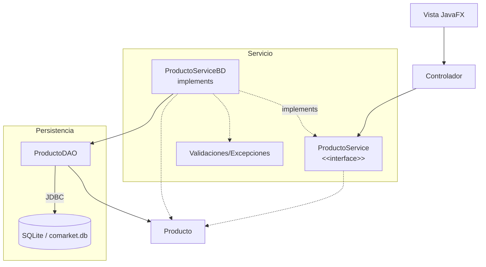

# S12 - Evaluación de la unidad 2

## 1. Introducción

Tiempo: 20 min.

### 1.1 Propósito

Validar la aplicación de escritorio con GUI, controladores, servicios, entidades, DAO, SQLite, validaciones y pruebas del flujo principal.

### 1.2 Resultado de aprendizaje

El estudiante demuestra qué puede construir, ejecutar, probar y defender una aplicación JavaFX con persistencia relacional y CRUD funcional desde la interfaz gráfica.

### 1.3 Producto de sesión

Producto U2 integrado: GUI JavaFX, controladores, contrato de servicio, implementación persistente, DAO, SQLite, validaciones y evidencia de pruebas.

### 1.4 Motivación de la sesión

Una aplicación de escritorio se evalua por el flujo completo: el usuario opera una pantalla, el controlador delega, el servicio coordina, el DAO persiste y la tabla refleja los cambios.

Preguntas para los estudiantes:

1. Qué evidencia demuestra qué la GUI funciona integrada con SQLite?
2. Qué parte puedes defender individualmente?
3. Qué revisas cuándo un dato no aparece en la tabla?

### 1.5 Ubicación en el curso

- Unidad: U2 - Aplicación de escritorio con persistencia de datos.
- Producto de unidad: aplicación JavaFX con CRUD persistente.
- Avance de sesión: evaluación integradora antes del refinamiento final en U3.

## 2. Explica

Tiempo: 15 min.

### 2.1 Conceptos clave

- Integración GUI-persistencia.
- Evidencia individual.
- Diagnóstico del flujo Vista-Controlador-Servicio-DAO-BD.
- Validaciones y excepciones controladas.
- Pruebas manuales.

### 2.2 Arquitectura del producto U2



### 2.3 Criterios mínimos de revisión

- GUI operativa.
- Controladores conectados.
- Servicios CRUD funcionales.
- Entidades coherentes.
- DAO funcional.
- SQLite con datos persistentes.
- Validaciones.
- Pruebas del flujo principal.

## 3. Aplica: evaluación practica

Tiempo: 3h.

### 3.1 Preparar demostracion

Orden recomendado:

1. Abrir el proyecto.
2. Mostrar estructura de capas.
3. Ejecutar la aplicación JavaFX.
4. Demostrar CRUD persistente.
5. Verificar registros en SQLite.
6. Mostrar matriz de pruebas.
7. Explicar una decisión técnica.

### 3.2 Ejecutar pruebas base

El estudiante demuestra:

1. Registro desde GUI.
2. Listado en tabla.
3. Edición.
4. Eliminación.
5. Persistencia en SQLite.
6. Validaciones.
7. Manejo básico de errores.

### 3.3 Demostracion individual

Cada integrante debe poder responder:

- Qué parte implemento.
- Qué clase o archivo modifico.
- Qué prueba ejecuto.
- Qué error diagnóstico.

## 4. Crea: evidencia individual

Tiempo: 4h fuera del aula.

### 4.1 Plantilla de evidencia individual

Entrega un PDF con el siguiente nombre:

```text
S12_Equipo##_ApellidoNombre.pdf
```

#### 4.1.1 Datos del estudiante

- Nombre:
- Equipo:
- Sesión: S12 - Evaluación U2
- Rol o aporte realizado:
- Link de GitHub:

#### 4.1.2 Trabajo autonomo realizado

1. Ordenar evidencias de U2.
2. Registrar aporte individual.
3. Corregir observaciones.
4. Preparar defensa técnica.
5. Documentar flujo integrado.

#### 4.1.3 Evidencia técnica

- Capturas de GUI.
- Evidencia de registros en SQLite.
- Código o descripción del DAO.
- Código o descripción de la interface del servicio y su implementación persistente.
- Matriz mínima de pruebas.
- Aporte individual.

#### 4.1.4 Error o hallazgo

Describe un problema de integración GUI-persistencia y cómo lo diagnosticaste.

#### 4.1.5 Reflexión técnica breve

Explica cómo fluye una operación desde la vista hasta SQLite.

### 4.2 Criterios mínimos de aceptación

- PDF con nombre correcto.
- Evidencia de aplicación JavaFX funcionando.
- CRUD persistente demostrado.
- Validaciones demostradas.
- Aporte individual verificable.

## 5. Cierre evaluativo

Tiempo: 20 min.

### 5.1 Resultados esperados

- Producto U2 ejecutado.
- CRUD persistente demostrado.
- Flujo por capas explicado.
- Validaciones y pruebas documentadas.
- Evidencia individual entregada.

### 5.2 Evidencia del producto de sesión

Cada estudiante entrega un PDF individual siguiendo la plantilla de la seccion 4.1.

Nombre del archivo:

```text
S12_Equipo##_ApellidoNombre.pdf
```

### 5.3 Preguntas de defensa y reflexión

1. Cómo fluye una operación desde la vista hasta SQLite?
2. Qué responsabilidad tiene el controlador?
3. Qué responsabilidad tiene la interface del servicio?
4. Qué responsabilidad tiene el DAO?
5. Qué validación evita un error frecuente?
6. Qué mejoraras en U3?

### 5.4 Rúbrica de evaluación

| Dimension | Peso | 3 - Logro destacado | 2 - Logro | 1 - Proceso | 0 - Inicio | Puntuacion obtenida |
|---|---:|---|---|---|---|---:|
| 1. GUI funcional | 2 | GUI completa, clara y conectada al flujo principal. | GUI principal funcional. | GUI parcial o inestable. | No ejecuta GUI. | |
| 2. Capas y responsabilidades | 2 | Vista, controlador, servicio, entidades y DAO bien separados. | Separacion suficiente. | Mezclas importantes de responsabilidades. | No hay separacion clara. | |
| 3. DAO y persistencia | 2 | CRUD persistente completo y verificable en SQLite. | Persistencia principal funcional. | Persistencia incompleta. | No persiste datos. | |
| 4. Validaciones y pruebas | 2 | Validaciones y matriz de pruebas completas. | Validaciones principales presentes. | Validaciones parciales. | No evidencia validaciones. | |
| 5. Evidencia individual | 1 | Evidencia clara, ordenada y verificable. | Evidencia suficiente. | Evidencia incompleta. | No entrega evidencia. | |
| 6. Defensa técnica | 1 | Responde con precision y criterio. | Responde adecuadamente. | Responde parcialmente. | No sustenta. | |

Puntuacion acumulada = suma de (`Peso` * `Puntuacion obtenida`) = ____.

Nota final = (`Puntuacion acumulada` / 30) * 20 = ____.

Para usar la rúbrica con IA, solicita:

```text
Evalua el PDF usando la rúbrica de la sesión.
Para cada dimension selecciona la puntuacion obtenida usando la escala Inicio=0, Proceso=1, Logro=2, Logro destacado=3.
Justifica brevemente cada puntuacion.
Calcula la puntuacion acumulada con la formula: suma de (Peso * Puntuacion obtenida).
Calcula la nota final sobre 20 con la formula: (Puntuacion acumulada / 30) * 20.
Indica 2 fortalezas y 2 recomendaciones.
```

