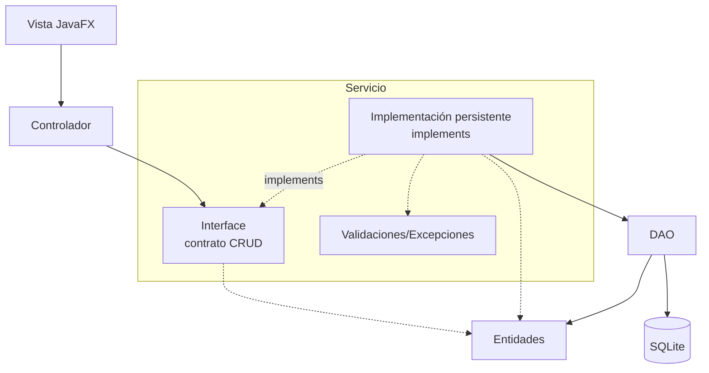

# S12 - Evaluación de la unidad 2

## 1. Introducción

Tiempo: 15 min.

### 1.1 Propósito

Evaluar la aplicación de escritorio con GUI, controladores, servicios, entidades, DAO, SQLite, validaciones y pruebas del flujo principal.

### 1.2 Resultado de aprendizaje

El estudiante demuestra que puede construir una aplicación JavaFX con persistencia relacional y CRUD funcional desde la interfaz gráfica.

### 1.3 Producto de sesión

Producto U2 validado con arquitectura por capas, persistencia e interfaz gráfica.

### 1.4 Ubicación en el curso

- Cierre de U2.
- Base técnica para integrar y refinar el proyecto final en U3.

## 2. Explica

Tiempo: 15 min.

### 2.1 Criterios de revisión

- GUI operativa.
- Controladores conectados.
- Servicios CRUD funcionales.
- Entidades coherentes.
- DAO funcional.
- SQLite con datos persistentes.
- Validaciones.
- Pruebas del flujo principal.

### 2.2 Producto esperado

## 3. Aplica: evaluación práctica

Tiempo: 2h.

El estudiante demuestra:

1. Registro desde GUI.
2. Listado en tabla.
3. Edición.
4. Eliminación.
5. Persistencia en SQLite.
6. Validaciones.
7. Manejo básico de errores.

## 4. Crea: evidencia individual

Tiempo: fuera del aula, si corresponde.

Entrega evidencia breve con:

- Capturas de GUI.
- Evidencia de registros en SQLite.
- Código o descripción del DAO.
- Código o descripción de la interface del servicio y su implementación persistente.
- Matriz mínima de pruebas.
- Reflexión técnica.

## 5. Cierre evaluativo

Tiempo: 30 min.

### 5.1 Preguntas de defensa

1. ¿Cómo fluye una operación desde la vista hasta SQLite?
2. ¿Qué responsabilidad tiene el controlador?
3. ¿Qué responsabilidad tiene la interface del servicio y qué responsabilidad tiene la implementación?
4. ¿Qué responsabilidad tiene el DAO?
5. ¿Qué validación evita un error frecuente?
6. ¿Qué mejorarás en U3?

### 5.2 Rúbrica breve

| Criterio | Peso |
|---|---:|
| GUI funcional | 4 |
| Controladores, servicios y entidades | 4 |
| DAO y persistencia | 5 |
| Validaciones y pruebas | 4 |
| Evidencia y sustentación | 3 |
