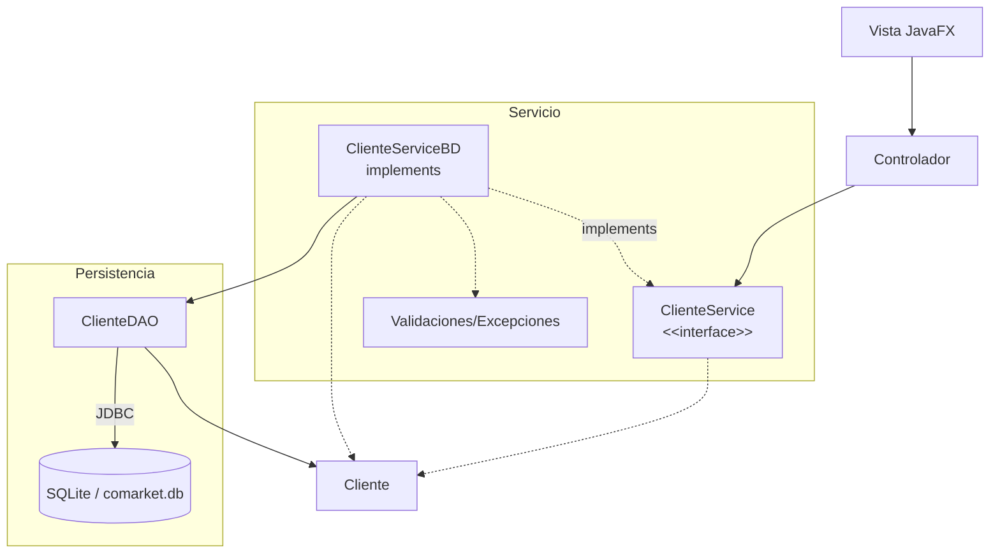

# S12 - Evaluacion de la unidad 2

## 1. Introduccion

Tiempo: 20 min.

### 1.1 Proposito

Validar la aplicacion de escritorio con GUI, controladores, servicios, entidades, DAO, SQLite, validaciones y pruebas del flujo principal.

### 1.2 Resultado de aprendizaje

El estudiante demuestra que puede construir, ejecutar, probar y defender una aplicacion JavaFX con persistencia relacional y CRUD funcional desde la interfaz grafica.

### 1.3 Producto de sesion

Producto U2 integrado: GUI JavaFX, controladores, contrato de servicio, implementacion persistente, DAO, SQLite, validaciones y evidencia de pruebas.

### 1.4 Motivacion de la sesion

Una aplicacion de escritorio se evalua por el flujo completo: el usuario opera una pantalla, el controlador delega, el servicio coordina, el DAO persiste y la tabla refleja los cambios.

Preguntas para los estudiantes:

1. Que evidencia demuestra que la GUI funciona integrada con SQLite?
2. Que parte puedes defender individualmente?
3. Que revisas cuando un dato no aparece en la tabla?

### 1.5 Ubicacion en el curso

- Unidad: U2 - Aplicacion de escritorio con persistencia de datos.
- Producto de unidad: aplicacion JavaFX con CRUD persistente.
- Avance de sesion: evaluacion integradora antes del refinamiento final en U3.

## 2. Explica

Tiempo: 15 min.

### 2.1 Conceptos clave

- Integracion GUI-persistencia.
- Evidencia individual.
- Diagnostico del flujo Vista-Controlador-Servicio-DAO-BD.
- Validaciones y excepciones controladas.
- Pruebas manuales.

### 2.2 Arquitectura del producto U2



### 2.3 Criterios minimos de revision

- GUI operativa.
- Controladores conectados.
- Servicios CRUD funcionales.
- Entidades coherentes.
- DAO funcional.
- SQLite con datos persistentes.
- Validaciones.
- Pruebas del flujo principal.

## 3. Aplica: evaluacion practica

Tiempo: 3h.

### 3.1 Preparar demostracion

Orden recomendado:

1. Abrir el proyecto.
2. Mostrar estructura de capas.
3. Ejecutar la aplicacion JavaFX.
4. Demostrar CRUD persistente.
5. Verificar registros en SQLite.
6. Mostrar matriz de pruebas.
7. Explicar una decision tecnica.

### 3.2 Ejecutar pruebas base

El estudiante demuestra:

1. Registro desde GUI.
2. Listado en tabla.
3. Edicion.
4. Eliminacion.
5. Persistencia en SQLite.
6. Validaciones.
7. Manejo basico de errores.

### 3.3 Demostracion individual

Cada integrante debe poder responder:

- Que parte implemento.
- Que clase o archivo modifico.
- Que prueba ejecuto.
- Que error diagnostico.

## 4. Crea: evidencia individual

Tiempo: 4h fuera del aula.

### 4.1 Plantilla de evidencia individual

Entrega un PDF con el siguiente nombre:

```text
S12_Equipo##_ApellidoNombre.pdf
```

#### 4.1.1 Datos del estudiante

- Nombre:
- Equipo:
- Sesion: S12 - Evaluacion U2
- Rol o aporte realizado:
- Link de GitHub:

#### 4.1.2 Trabajo autonomo realizado

1. Ordenar evidencias de U2.
2. Registrar aporte individual.
3. Corregir observaciones.
4. Preparar defensa tecnica.
5. Documentar flujo integrado.

#### 4.1.3 Evidencia tecnica

- Capturas de GUI.
- Evidencia de registros en SQLite.
- Codigo o descripcion del DAO.
- Codigo o descripcion de la interface del servicio y su implementacion persistente.
- Matriz minima de pruebas.
- Aporte individual.

#### 4.1.4 Error o hallazgo

Describe un problema de integracion GUI-persistencia y como lo diagnosticaste.

#### 4.1.5 Reflexion tecnica breve

Explica como fluye una operacion desde la vista hasta SQLite.

### 4.2 Criterios minimos de aceptacion

- PDF con nombre correcto.
- Evidencia de aplicacion JavaFX funcionando.
- CRUD persistente demostrado.
- Validaciones demostradas.
- Aporte individual verificable.

## 5. Cierre evaluativo

Tiempo: 20 min.

### 5.1 Resultados esperados

- Producto U2 ejecutado.
- CRUD persistente demostrado.
- Flujo por capas explicado.
- Validaciones y pruebas documentadas.
- Evidencia individual entregada.

### 5.2 Evidencia del producto de sesion

Cada estudiante entrega un PDF individual siguiendo la plantilla de la seccion 4.1.

Nombre del archivo:

```text
S12_Equipo##_ApellidoNombre.pdf
```

### 5.3 Preguntas de defensa y reflexion

1. Como fluye una operacion desde la vista hasta SQLite?
2. Que responsabilidad tiene el controlador?
3. Que responsabilidad tiene la interface del servicio?
4. Que responsabilidad tiene el DAO?
5. Que validacion evita un error frecuente?
6. Que mejoraras en U3?

### 5.4 Rubrica de evaluacion

| Dimension | Peso | 3 - Logro destacado | 2 - Logro | 1 - Proceso | 0 - Inicio | Puntuacion obtenida |
|---|---:|---|---|---|---|---:|
| 1. GUI funcional | 2 | GUI completa, clara y conectada al flujo principal. | GUI principal funcional. | GUI parcial o inestable. | No ejecuta GUI. | |
| 2. Capas y responsabilidades | 2 | Vista, controlador, servicio, entidades y DAO bien separados. | Separacion suficiente. | Mezclas importantes de responsabilidades. | No hay separacion clara. | |
| 3. DAO y persistencia | 2 | CRUD persistente completo y verificable en SQLite. | Persistencia principal funcional. | Persistencia incompleta. | No persiste datos. | |
| 4. Validaciones y pruebas | 2 | Validaciones y matriz de pruebas completas. | Validaciones principales presentes. | Validaciones parciales. | No evidencia validaciones. | |
| 5. Evidencia individual | 1 | Evidencia clara, ordenada y verificable. | Evidencia suficiente. | Evidencia incompleta. | No entrega evidencia. | |
| 6. Defensa tecnica | 1 | Responde con precision y criterio. | Responde adecuadamente. | Responde parcialmente. | No sustenta. | |

Puntuacion acumulada = suma de (`Peso` * `Puntuacion obtenida`) = ____.

Nota final = (`Puntuacion acumulada` / 30) * 20 = ____.

Para usar la rubrica con IA, solicita:

```text
Evalua el PDF usando la rubrica de la sesion.
Para cada dimension selecciona la puntuacion obtenida usando la escala Inicio=0, Proceso=1, Logro=2, Logro destacado=3.
Justifica brevemente cada puntuacion.
Calcula la puntuacion acumulada con la formula: suma de (Peso * Puntuacion obtenida).
Calcula la nota final sobre 20 con la formula: (Puntuacion acumulada / 30) * 20.
Indica 2 fortalezas y 2 recomendaciones.
```
