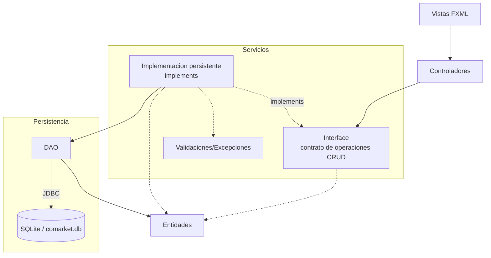

# S13 - Integracion del sistema

## 1. Introduccion

Tiempo: 20 min.

### 1.1 Proposito

Integrar los modulos construidos en U1 y U2 en una version coherente del producto final, eliminando duplicidades y dejando un flujo principal ejecutable.

### 1.2 Resultado de aprendizaje

El estudiante consolida pantallas, controladores, servicios, entidades, DAO, base de datos, recursos y dependencias en una sola aplicacion.

### 1.3 Producto de sesion

Producto integrado con flujo principal funcional y preparacion para empaquetado final.

### 1.4 Motivacion de la sesion

Despues de varias sesiones, el proyecto puede tener clases duplicadas, nombres distintos, pantallas sueltas o servicios incompletos. Integrar significa dejar una sola version funcional y defendible.

Pregunta guia:

```text
Que debe quedar unido para que el producto funcione como aplicacion final?
```

### 1.5 Ubicacion en el curso

- Unidad: U3 - Proyecto integrador.
- Avance de sesion: ensamblaje del producto final.

## 2. Explica

Tiempo: 25 min.

### 2.1 Conceptos clave

- Integracion de modulos.
- Consistencia de paquetes.
- Flujo principal.
- Dependencias Maven.
- Recursos FXML.
- Base de datos.
- Preparacion para ejecutable nativo.

Regla metodologica de la sesion:

```text
Integrar no es agregar mas clases.
Integrar es dejar una sola ruta funcional desde la GUI hasta la base de datos.
Si hay dos clases que hacen lo mismo, se decide una y se elimina la duplicidad.
```

### 2.2 Arquitectura integrada



## 3. Aplica: actividad practica guiada

Tiempo: 2h.

1. Revisar estructura de paquetes.
2. Identificar clases duplicadas o con nombres inconsistentes.
3. Integrar pantallas y controladores.
4. Revisar interface de servicio e implementacion persistente.
5. Revisar entidades usadas por GUI, servicio y DAO.
6. Verificar conexion con SQLite.
7. Ejecutar el flujo principal de punta a punta.
8. Revisar configuracion Maven y recursos.
9. Registrar problemas encontrados y correcciones.

## 4. Crea: actividad autonoma

Tiempo: 3h fuera del aula.

Integra una funcionalidad pendiente o corrige una inconsistencia del proyecto.

Entrega evidencia breve con:

- Antes/despues del cambio.
- Flujo probado.
- Archivos modificados.
- Error encontrado y solucion.
- Captura de la aplicacion integrada.

## 5. Cierre evaluativo

Tiempo: 20 min.

### 5.1 Resultados esperados

- Proyecto integrado.
- Flujo principal ejecutable.
- Paquetes y nombres consistentes.
- Persistencia operativa.
- Observaciones registradas para refinamiento.

### 5.2 Preguntas de defensa

1. Que modulo integraste?
2. Que duplicidad o inconsistencia corregiste?
3. Como verificaste el flujo principal?
4. Que falta estabilizar antes de sustentar?
5. Que archivo consideras mas critico en tu modulo?
