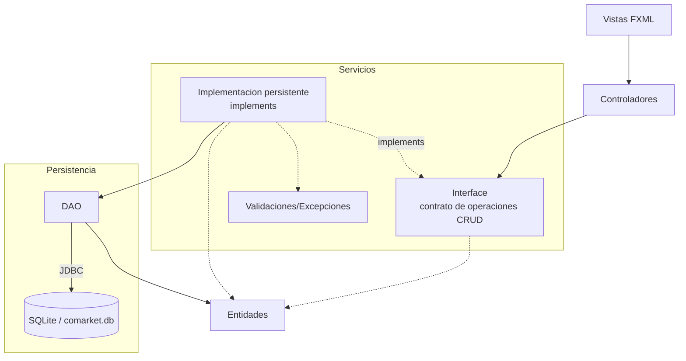

# S13 - Integración del sistema

## 1. Introducción

Tiempo: 20 min.

### 1.1 Propósito

Integrar los módulos construidos en U1 y U2 en una versión coherente del producto final, eliminando duplicidades y dejando un flujo principal ejecutable.

### 1.2 Resultado de aprendizaje

El estudiante consolida pantallas, controladores, servicios, entidades, DAO, base de datos, recursos y dependencias en una sola aplicación.

### 1.3 Producto de sesión

Producto integrado con flujo principal funcional y preparación para empaquetado final.

### 1.4 Motivación de la sesión

Después de varias sesiónes, el proyecto puede tener clases duplicadas, nombres distintos, pantallas sueltas o servicios incompletos. Integrar significa dejar una sola versión funcional y defendible.

Pregunta guía:

```text
Qué debe quedar unido para que el producto funcione como aplicación final?
```

### 1.5 Ubicación en el curso

- Unidad: U3 - Proyecto integrador.
- Avance de sesión: ensamblaje del producto final.

## 2. Explica

Tiempo: 25 min.

### 2.1 Conceptos clave

- Integración de módulos.
- Consistencia de paquetes.
- Flujo principal.
- Dependencias Maven.
- Recursos FXML.
- Base de datos.
- Preparación para ejecutable nativo.

Regla métodológica de la sesión:

```text
Integrar no es agregar más clases.
Integrar es dejar una sola ruta funcional desde la GUI hasta la base de datos.
Si hay dos clases que hacen lo mismo, se decide una y se elimina la duplicidad.
```

### 2.2 Arquitectura integrada



## 3. Aplica: actividad practica guíada

Tiempo: 2h.

1. Revisar estructura de paquetes.
2. Identificar clases duplicadas o con nombres inconsistentes.
3. Integrar pantallas y controladores.
4. Revisar interface de servicio e implementacion persistente.
5. Revisar entidades usadas por GUI, servicio y DAO.
6. Verificar conexión con SQLite.
7. Ejecutar el flujo principal de punta a punta.
8. Revisar configuración Maven y recursos.
9. Registrar problemás encontrados y correcciones.

## 4. Crea: actividad autónoma

Tiempo: 3h fuera del aula.

Integra una funcionalidad pendiente o corrige una inconsistencia del proyecto.

Entrega evidencia breve con:

- Antes/después del cambio.
- Flujo probado.
- Archivos modificados.
- Error encontrado y solución.
- Captura de la aplicación integrada.

## 5. Cierre evaluativo

Tiempo: 20 min.

### 5.1 Resultados esperados

- Proyecto integrado.
- Flujo principal ejecutable.
- Paquetes y nombres consistentes.
- Persistencia operativa.
- Observaciones registradas para refinamiento.

### 5.2 Preguntas de defensa

1. Qué módulo integraste?
2. Qué duplicidad o inconsistencia corregiste?
3. Cómo verificaste el flujo principal?
4. Qué falta estabilizar antes de sustentar?
5. Qué archivo consideras más crítico en tu módulo?
