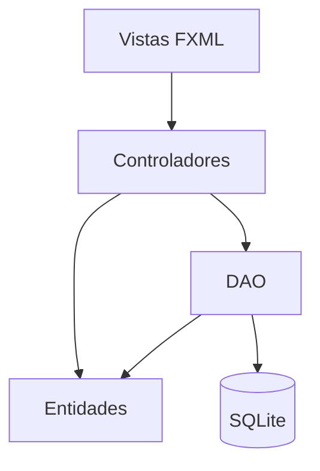

# S13 - Integración del sistema

## 1. Introducción

Tiempo: 20 min.

### 1.1 Propósito

Integrar los módulos construidos en U1 y U2 en una versión coherente del proyecto CoMarket.

### 1.2 Resultado de aprendizaje

El estudiante consolida pantallas, controladores, entidades, DAO, base de datos, recursos y dependencias en una sola aplicación ejecutable.

### 1.3 Producto de sesión

CoMarket ensamblado con flujo principal integrado y preparación inicial para ejecutable nativo.

### 1.4 Motivación de la sesión

Después de varias sesiones, el proyecto puede tener clases duplicadas, nombres distintos o pantallas sueltas. Integrar significa dejar una sola versión funcional.

Pregunta guía:

```text
¿Qué debe quedar unido para que CoMarket funcione como un producto?
```

### 1.5 Ubicación en el curso

- Unidad: U3 - Proyecto Integrador CoMarket.
- Avance de sesión: ensamblaje del producto final.

## 2. Explica

Tiempo: 25 min.

### 2.1 Conceptos clave

- Integración de módulos.
- Consistencia de paquetes.
- Flujo principal.
- Dependencias Maven.
- Recursos FXML.
- Base de datos.
- Preparación para ejecutable nativo.

### 2.2 Arquitectura integrada



## 3. Aplica: actividad práctica guiada

Tiempo: 2h.

1. Revisar estructura de paquetes.
2. Eliminar duplicidades.
3. Integrar pantallas y controladores.
4. Revisar entidades usadas por la GUI y el DAO.
5. Verificar conexión con SQLite.
6. Ejecutar el flujo principal de punta a punta.
7. Revisar configuración Maven y recursos.
8. Preparar condiciones iniciales para ejecutable nativo.

## 4. Crea: actividad autónoma

Tiempo: 3h fuera del aula.

Integra una funcionalidad pendiente o corrige una inconsistencia del proyecto.

Entrega evidencia breve con:

- Antes/después del cambio.
- Flujo probado.
- Archivos modificados.
- Error encontrado y solución.

## 5. Cierre evaluativo

Tiempo: 20 min.

### 5.1 Resultados esperados

- Proyecto integrado.
- Flujo principal ejecutable.
- Paquetes y nombres consistentes.
- Persistencia operativa.
- Preparación inicial para ejecutable nativo.

### 5.2 Preguntas de defensa

1. ¿Qué módulo integraste?
2. ¿Qué duplicidad o inconsistencia corregiste?
3. ¿Cómo verificaste el flujo principal?
4. ¿Qué falta estabilizar antes de sustentar?

