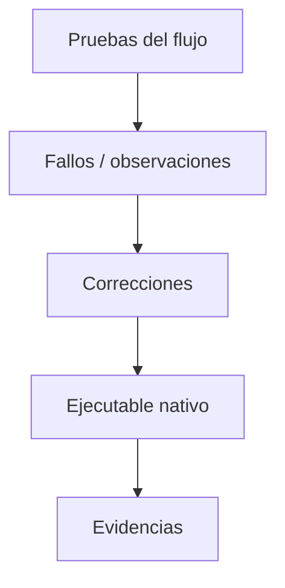

# S14 - Validación y refinamiento

## 1. Introducción

Tiempo: 20 min.

### 1.1 Propósito

Refinar CoMarket, corregir observaciones, validar el flujo crítico y generar el ejecutable nativo final.

### 1.2 Resultado de aprendizaje

El estudiante estabiliza una aplicación de escritorio, mejora organización y mensajes, verifica el flujo crítico y prepara la entrega ejecutable.

### 1.3 Producto de sesión

CoMarket refinado, validado y con ejecutable nativo preparado.

### 1.4 Motivación de la sesión

Un producto no solo debe funcionar una vez. Debe ser comprensible, estable, presentable y ejecutable en otro equipo.

Pregunta guía:

```text
¿Qué falta para que CoMarket pueda presentarse como producto final?
```

### 1.5 Ubicación en el curso

- Unidad: U3.
- Avance de sesión: versión candidata a sustentación.

## 2. Explica

Tiempo: 25 min.

### 2.1 Conceptos clave

- Corrección de fallos.
- Limpieza de código.
- Consistencia visual.
- Validaciones finales.
- Flujo crítico.
- Empaquetado.
- Ejecutable nativo con GraalVM.

### 2.2 Flujo de refinamiento



## 3. Aplica: actividad práctica guiada

Tiempo: 2h.

1. Ejecutar el flujo crítico.
2. Registrar fallos.
3. Corregir validaciones, mensajes o navegación.
4. Revisar nombres, paquetes y responsabilidades.
5. Verificar persistencia.
6. Generar o preparar el ejecutable nativo.
7. Registrar evidencias.

## 4. Crea: actividad autónoma

Tiempo: 3h fuera del aula.

Entrega una versión candidata del proyecto final.

Incluye:

- Flujo crítico probado.
- Lista de correcciones.
- Evidencia del ejecutable o preparación de empaquetado.
- Capturas finales.
- Observaciones pendientes.

## 5. Cierre evaluativo

Tiempo: 20 min.

### 5.1 Resultados esperados

- Producto estable.
- Errores principales corregidos.
- Flujo crítico validado.
- Ejecutable nativo preparado.
- Evidencias listas para sustentación.

### 5.2 Preguntas de defensa

1. ¿Qué fallos corregiste?
2. ¿Cuál es el flujo crítico?
3. ¿Cómo generaste o preparaste el ejecutable?
4. ¿Qué evidencia demuestra estabilidad?

