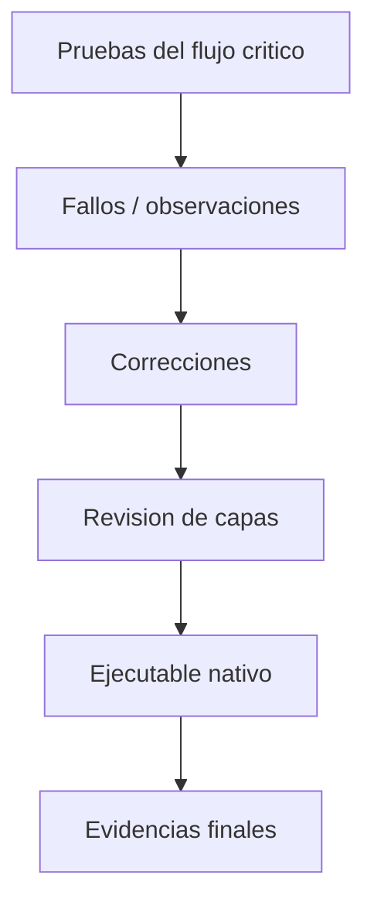

# S14 - Validacion, refinamiento y ejecutable nativo

## 1. Introduccion

Tiempo: 20 min.

### 1.1 Proposito

Refinar el producto, corregir observaciones, validar el flujo critico y preparar el ejecutable nativo final.

### 1.2 Resultado de aprendizaje

El estudiante estabiliza una aplicacion de escritorio, mejora organizacion y mensajes, verifica el flujo critico y prepara la entrega ejecutable.

### 1.3 Producto de sesion

Producto refinado, validado y con evidencia de preparacion o generacion de ejecutable nativo.

### 1.4 Motivacion de la sesion

Un producto no solo debe funcionar una vez. Debe ser comprensible, estable, presentable y ejecutable en otro equipo.

Pregunta guia:

```text
Que falta para que el producto pueda presentarse como version final?
```

### 1.5 Ubicacion en el curso

- Unidad: U3.
- Avance de sesion: version candidata a sustentacion.

## 2. Explica

Tiempo: 25 min.

### 2.1 Conceptos clave

- Correccion de fallos.
- Limpieza de codigo.
- Consistencia visual.
- Validaciones finales.
- Flujo critico.
- Empaquetado.
- Ejecutable nativo con GraalVM.

Regla metodologica de la sesion:

```text
Primero se prueba el flujo critico.
Luego se corrigen fallos reales.
Despues se prepara el ejecutable.
El ejecutable no compensa una arquitectura rota.
```

### 2.2 Flujo de refinamiento



## 3. Aplica: actividad practica guiada

Tiempo: 2h.

1. Ejecutar el flujo critico.
2. Registrar fallos.
3. Corregir validaciones, mensajes o navegacion.
4. Revisar nombres, paquetes y responsabilidades.
5. Verificar persistencia.
6. Revisar recursos FXML.
7. Preparar o generar ejecutable nativo.
8. Registrar evidencias.

## 4. Crea: actividad autonoma

Tiempo: 3h fuera del aula.

Entrega una version candidata del proyecto final.

Incluye:

- Flujo critico probado.
- Lista de correcciones.
- Evidencia del ejecutable o preparacion de empaquetado.
- Capturas finales.
- Observaciones pendientes.

## 5. Cierre evaluativo

Tiempo: 20 min.

### 5.1 Resultados esperados

- Producto estable.
- Errores principales corregidos.
- Flujo critico validado.
- Ejecutable nativo preparado.
- Evidencias listas para sustentacion.

### 5.2 Preguntas de defensa

1. Que fallos corregiste?
2. Cual es el flujo critico?
3. Como generaste o preparaste el ejecutable?
4. Que evidencia demuestra estabilidad?
5. Que riesgo queda pendiente?
