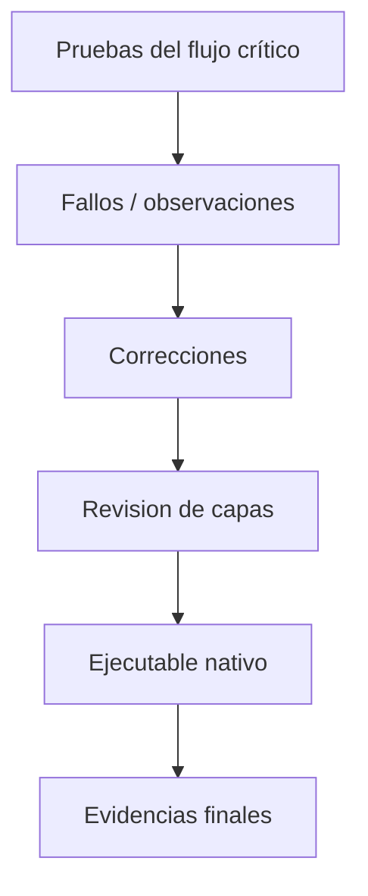

# S14 - Validación, refinamiento y ejecutable nativo

## 1. Introducción

Tiempo: 20 min.

### 1.1 Propósito

Refinar el producto, corregir observaciones, validar el flujo crítico y preparar el ejecutable nativo final.

### 1.2 Resultado de aprendizaje

El estudiante estabiliza una aplicación de escritorio, mejora organización y mensajes, verifica el flujo crítico y prepara la entrega ejecutable.

### 1.3 Producto de sesión

Producto refinado, validado y con evidencia de preparación o generación de ejecutable nativo.

### 1.4 Motivación de la sesión

Un producto no solo debe funcionar una vez. Debe ser comprensible, estable, presentable y ejecutable en otro equipo.

Pregunta guía:

```text
Qué falta para que el producto pueda presentarse como versión final?
```

### 1.5 Ubicación en el curso

- Unidad: U3.
- Carpeta de trabajo: `comarket-desk`.
- Avance de sesión: versión candidata a sustentación.

## 2. Explica

Tiempo: 25 min.

### 2.1 Conceptos clave

- Corrección de fallos.
- Limpieza de código.
- Consistencia visual.
- Validaciones finales.
- Flujo crítico.
- Empaquetado.
- Ejecutable nativo con GraalVM.

Regla métodológica de la sesión:

```text
Primero se prueba el flujo crítico.
Luego se corrigen fallos reales.
Después se prepara el ejecutable.
El ejecutable no compensa una arquitectura rota.
```

### 2.2 Flujo de refinamiento



## 3. Aplica: actividad práctica guiada

Tiempo: 2h.

1. Ejecutar el flujo crítico.
2. Registrar fallos.
3. Corregir validaciones, mensajes o navegacion.
4. Revisar nombres, paquetes y responsabilidades.
5. Verificar persistencia.
6. Revisar recursos FXML.
7. Preparar o generar ejecutable nativo.
8. Registrar evidencias.

## 4. Crea: actividad autónoma

Fuera del aula, cada estudiante consolida el aprendizaje preparando una versión candidata del producto final y una evidencia individual.

Tiempo: 3h fuera del aula.

### 4.1 Plantilla de evidencia individual

Entrega un PDF con el siguiente nombre:

```text
S14_Equipo##_ApellidoNombre.pdf
```

Ejemplo:

```text
S14_Equipo03_QuispeAna.pdf
```

El PDF debe usar esta estructura. La primera sección define el trabajo autónomo; completa las demás con tus evidencias.

#### 4.1.1 Datos del estudiante

- Nombre:
- Equipo:
- Sesión: S14 - Validación, refinamiento y ejecutable nativo
- Rol o aporte realizado:
- Link de GitHub:

#### 4.1.2 Trabajo autónomo realizado

Completa y evidencia estas tareas:

1. Ejecutar el flujo crítico.
2. Registrar fallos u observaciones.
3. Corregir al menos una observación técnica.
4. Revisar validaciones, mensajes o navegación.
5. Verificar persistencia.
6. Preparar o generar evidencia del ejecutable nativo.
7. Preparar capturas finales para sustentación.

#### 4.1.3 Evidencia técnica

Incluye capturas o salidas con una breve explicación debajo de cada una:

- Flujo crítico probado.
- Lista de correcciones.
- Evidencia del ejecutable o preparación de empaquetado.
- Capturas finales.
- Observaciones pendientes.
- Evidencia de persistencia después de las correcciones.

#### 4.1.4 Error o hallazgo

Describe al menos un error, diferencia o hallazgo técnico:

- Qué ocurrió.
- Cómo lo diagnosticaste.
- Cómo lo corregiste o qué aprendiste.

Ejemplos válidos:

- Un recurso FXML no se empaquetaba.
- Una validación no mostraba mensaje claro.
- El flujo crítico fallaba en una operación.
- El ejecutable requería ajustar dependencias o recursos.

#### 4.1.5 Reflexión técnica breve

Responde en 5 a 8 líneas:

```text
Por qué el ejecutable final debe prepararse después de validar el flujo crítico y no antes?
```

### 4.2 Criterios mínimos de aceptación

La evidencia individual se considera completa si:

- El archivo respeta el nombre `S14_Equipo##_ApellidoNombre.pdf`.
- Incluye evidencias técnicas legibles.
- Muestra flujo crítico probado.
- Muestra correcciones aplicadas.
- Muestra evidencia de preparación o generación de ejecutable.
- Registra observaciones pendientes.
- No contiene solo pantallazos: cada evidencia tiene una descripción breve.

## 5. Cierre evaluativo

Tiempo: 20 min.

Esta sección conecta el resultado de aprendizaje de la sesión con el producto que debe evidenciar cada estudiante.

### 5.1 Resultados esperados

Al finalizar la sesión, el estudiante debe demostrar que:

- El producto está más estable.
- Los errores principales fueron corregidos.
- El flujo crítico está validado.
- El ejecutable nativo está preparado o documentado.
- Las evidencias están listas para sustentación.

### 5.2 Evidencia del producto de sesión

Cada estudiante entrega un PDF individual siguiendo la plantilla de la sección 4.1.

Nombre del archivo:

```text
S14_Equipo##_ApellidoNombre.pdf
```

La evidencia debe demostrar:

- Producto de sesión construido.
- Aporte individual verificable.
- Corrección o refinamiento aplicado.
- Reflexión técnica breve.

La revisión se realiza con los criterios mínimos de aceptación de la sección 4.2 y la rúbrica de la sección 5.4.

### 5.3 Preguntas de defensa y reflexión

1. Qué fallos corregiste?
2. Cuál es el flujo crítico?
3. Cómo generaste o preparaste el ejecutable?
4. Qué evidencia demuestra estabilidad?
5. Qué riesgo queda pendiente?
6. Qué revisarías si el ejecutable funciona en tu equipo pero no en otro?

### 5.4 Rúbrica de evaluación

| Dimensión | Peso | 3 - Logro destacado | 2 - Logro | 1 - Proceso | 0 - Inicio | Puntuación obtenida |
|---|---:|---|---|---|---|---:|
| 1. Flujo crítico | 2 | Flujo crítico completo probado y evidenciado. | Flujo principal probado. | Flujo parcial. | No evidencia flujo. | |
| 2. Correcciones | 2 | Corrige fallos reales y documenta antes/después. | Corrección funcional. | Corrección parcial. | No evidencia correcciones. | |
| 3. Estabilidad y validaciones | 2 | Validaciones, mensajes y persistencia revisados. | Revisión principal realizada. | Revisión incompleta. | No evidencia revisión. | |
| 4. Ejecutable o empaquetado | 2 | Evidencia generación o preparación clara del ejecutable. | Preparación suficiente. | Preparación incompleta. | No evidencia ejecutable ni empaquetado. | |
| 5. Error o hallazgo | 1 | Analiza error/hallazgo, causa, solución y aprendizaje técnico. | Explica un problema y una solución. | Menciona un problema sin análisis. | No presenta error ni hallazgo. | |
| 6. Reflexión y orden | 1 | PDF ordenado, evidencias legibles y reflexión precisa. | Evidencias suficientes y reflexión clara. | Evidencias incompletas o reflexión superficial. | PDF desordenado o sin reflexión. | |

Puntuación acumulada = suma de (`Peso` * `Puntuación obtenida`) = ____.

Nota final = (`Puntuación acumulada` / 30) * 20 = ____.

Para usar la rúbrica con IA, solicita:

```text
Evalúa el PDF usando la rúbrica de la sesión.
Para cada dimensión selecciona la puntuación obtenida usando la escala Inicio=0, Proceso=1, Logro=2, Logro destacado=3.
Justifica brevemente cada puntuación.
Calcula la puntuación acumulada con la fórmula: suma de (Peso * Puntuación obtenida).
Calcula la nota final sobre 20 con la fórmula: (Puntuación acumulada / 30) * 20.
Indica 2 fortalezas y 2 recomendaciones.
```

