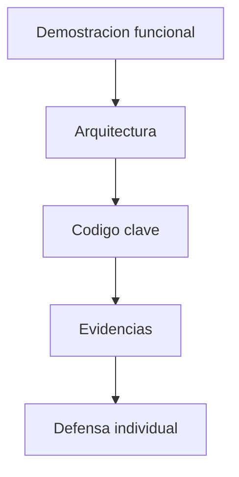

# S15 - Sustentacion del proyecto

## 1. Introduccion

Tiempo: 20 min.

### 1.1 Proposito

Sustentar el producto mediante una demostracion funcional y una explicacion tecnica clara.

### 1.2 Resultado de aprendizaje

El estudiante presenta el producto, explica su arquitectura, defiende decisiones de diseno y demuestra su aporte individual.

### 1.3 Producto de sesion

Sustentacion grupal del proyecto con defensa tecnica individual.

### 1.4 Motivacion de la sesion

Construir software tambien implica explicarlo. La sustentacion permite verificar que el estudiante entiende como funciona el sistema y que aporto.

Pregunta guia:

```text
Puedes explicar y defender tecnicamente el producto que construiste?
```

### 1.5 Ubicacion en el curso

- Unidad: U3.
- Avance de sesion: defensa tecnica del producto.

## 2. Explica

Tiempo: 20 min.

### 2.1 Elementos de la sustentacion

- Demostracion funcional.
- Arquitectura por capas.
- Entidades.
- Controladores.
- Servicios.
- DAO y persistencia.
- Validaciones.
- Ejecutable.
- Aporte individual.

### 2.2 Orden sugerido



## 3. Aplica: actividad practica guiada

Tiempo: 2h.

1. Ejecutar el producto.
2. Mostrar el flujo principal.
3. Explicar arquitectura por capas.
4. Mostrar entidades, servicios y DAO.
5. Mostrar persistencia en SQLite.
6. Explicar validaciones.
7. Presentar evidencias.
8. Responder preguntas individuales.

## 4. Crea: preparacion autonoma

Tiempo: 2h fuera del aula.

Prepara una sustentacion breve con:

- Guion de demostracion.
- Capturas o evidencias.
- Explicacion de tu aporte.
- Posibles preguntas y respuestas.

## 5. Cierre evaluativo

Tiempo: segun programacion.

### 5.1 Resultados esperados

- Producto ejecutable.
- Demostracion funcional.
- Explicacion tecnica clara.
- Aporte individual identificable.
- Respuestas coherentes a preguntas.

### 5.2 Preguntas de defensa

1. Que parte implementaste?
2. Como fluye una operacion desde la vista hasta la base de datos?
3. Que entidad es central en tu modulo?
4. Que error importante resolviste?
5. Que mejorarias con mas tiempo?
