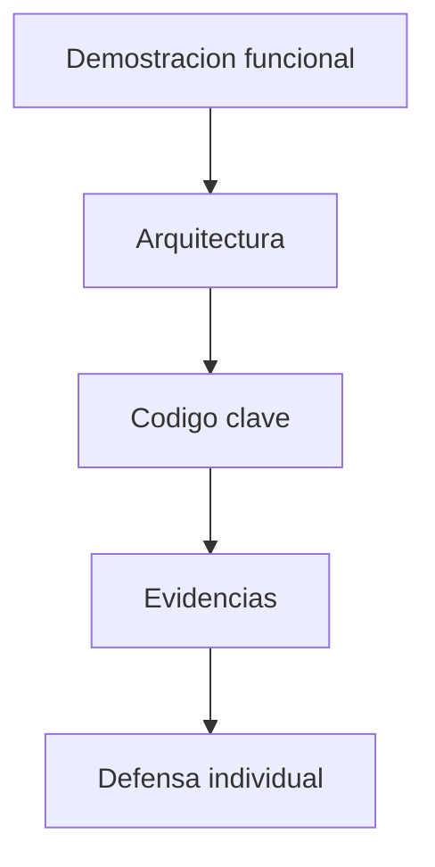

# S15 - Sistema orientado a objetos integrado (Evaluación U3)

## 1. Introducción

Tiempo: 20 min.

### 1.1 Propósito

Validar el Producto U3 mediante la sustentación de un sistema orientado a objetos integrado, con demostracion funcional y explicacion técnica clara de su arquitectura, modelo, persistencia y flujo principal.

### 1.2 Resultado de aprendizaje

El estudiante presenta el producto, explica su arquitectura, defiende decisiónes de diseño y demuestra su aporte individual.

### 1.3 Producto de sesión

Producto U3 validado: sistema orientado a objetos integrado, funcional, documentado y sustentado técnicamente.

### 1.4 Motivación de la sesión

Construir software también implica explicarlo. La sustentación permite verificar que el estudiante entiende cómo funciona el sistema y que aportó.

Pregunta guía:

```text
Puedes explicar y defender técnicamente el producto que construiste?
```

### 1.5 Ubicación en el curso

- Unidad: U3.
- Carpeta de trabajo: `comarket-desk`.
- Avance de sesión: defensa técnica del producto.

## 2. Explica

Tiempo: 20 min.

### 2.1 Elementos de la sustentación

- Demostracion funcional.
- Arquitectura por capas.
- `entity`.
- `controller`.
- `service`.
- `dao` y persistencia.
- Validaciones.
- Ejecutable.
- Aporte individual.

### 2.2 Orden sugerido



## 3. Aplica: actividad práctica guiada

Tiempo: 2h.

1. Ejecutar el producto.
2. Mostrar el flujo principal.
3. Explicar arquitectura por capas.
4. Mostrar `entity`, `service` y `dao`.
5. Mostrar persistencia en SQLite.
6. Explicar validaciones.
7. Presentar evidencias.
8. Responder preguntas individuales.

## 4. Crea: preparación autónoma

Fuera del aula, cada estudiante consolida su sustentación técnica y prepara una evidencia individual.

Tiempo: 2h fuera del aula.

### 4.1 Plantilla de evidencia individual

Entrega un PDF con el siguiente nombre:

```text
S15_Equipo##_ApellidoNombre.pdf
```

Ejemplo:

```text
S15_Equipo03_QuispeAna.pdf
```

El PDF debe usar esta estructura. La primera sección define el trabajo autónomo; completa las demás con tus evidencias.

#### 4.1.1 Datos del estudiante

- Nombre:
- Equipo:
- Sesión: S15 - Sistema orientado a objetos integrado (Evaluación U3)
- Rol o aporte realizado:
- Link de GitHub:

#### 4.1.2 Trabajo autónomo realizado

Completa y evidencia estas tareas:

1. Preparar un guion de demostración breve.
2. Definir el flujo principal que se mostrará.
3. Preparar una explicación de arquitectura por capas.
4. Identificar clases clave: `entity`, `controller`, `service` y `dao`.
5. Preparar evidencias de persistencia.
6. Preparar explicación del aporte individual.
7. Preparar respuestas a posibles preguntas de defensa.

#### 4.1.3 Evidencia técnica

Incluye capturas o contenido con una breve explicación debajo de cada evidencia:

- Guion de demostración.
- Capturas o evidencias.
- Explicación de tu aporte.
- Posibles preguntas y respuestas.
- Diagrama o captura de arquitectura usada en la defensa.
- Evidencia de persistencia o flujo principal.

#### 4.1.4 Error o hallazgo

Describe al menos un error, diferencia o hallazgo técnico que puedas defender:

- Qué ocurrió.
- Cómo lo diagnosticaste.
- Cómo lo corregiste o qué aprendiste.

Ejemplos válidos:

- Un error de GUI corregido antes de la demo.
- Un problema de persistencia detectado en pruebas.
- Una decisión de arquitectura que evitó duplicar lógica.
- Una validación agregada por error de usuario.

#### 4.1.5 Reflexión técnica breve

Responde en 5 a 8 líneas:

```text
Qué parte de tu aporte demuestra mejor que comprendes la arquitectura del producto?
```

### 4.2 Criterios mínimos de aceptación

La evidencia individual se considera completa si:

- El archivo respeta el nombre `S15_Equipo##_ApellidoNombre.pdf`.
- Incluye guion de demostración.
- Incluye explicación de arquitectura.
- Identifica aporte individual.
- Incluye posibles preguntas y respuestas.
- Muestra evidencias del flujo principal.
- No contiene solo pantallazos: cada evidencia tiene una descripción breve.

## 5. Cierre evaluativo

Tiempo: segun programación.

Esta sección conecta el resultado de aprendizaje de la sesión con la sustentación que debe realizar cada estudiante.

### 5.1 Resultados esperados

- Producto ejecutable.
- Demostración funcional.
- Explicación técnica clara.
- Aporte individual identificable.
- Respuestas coherentes a preguntas.

### 5.2 Evidencia del producto de sesión

Cada estudiante entrega un PDF individual siguiendo la plantilla de la sección 4.1.

Nombre del archivo:

```text
S15_Equipo##_ApellidoNombre.pdf
```

La evidencia debe demostrar:

- Guion de demostración.
- Arquitectura explicada.
- Aporte individual verificable.
- Preguntas de defensa preparadas.

La revisión se realiza con los criterios mínimos de aceptación de la sección 4.2 y la rúbrica de la sección 5.4.

### 5.3 Preguntas de defensa y reflexión

1. Qué parte implementaste?
2. Cómo fluye una operación desde la vista hasta la base de datos?
3. Qué entidad es central en tu módulo?
4. Qué error importante resolviste?
5. Qué mejorarías con más tiempo?
6. Qué evidencia demuestra tu aporte individual?

### 5.4 Rúbrica de evaluación

| Dimensión | Peso | 3 - Logro destacado | 2 - Logro | 1 - Proceso | 0 - Inicio | Puntuación obtenida |
|---|---:|---|---|---|---|---:|
| 1. Demostración funcional | 2 | Demuestra flujo claro, ordenado y sin bloqueos. | Demuestra flujo principal. | Demo parcial o poco clara. | No demuestra producto. | |
| 2. Arquitectura explicada | 2 | Explica `view`, `controller`, `service`, `entity`, `dao` y BD con precisión. | Explica capas principales. | Explicación incompleta. | No explica arquitectura. | |
| 3. Código clave | 2 | Muestra clases clave y justifica responsabilidades. | Muestra código relevante. | Código poco conectado a la explicación. | No muestra código clave. | |
| 4. Aporte individual | 2 | Aporte verificable y defendido con evidencia. | Aporte identificable. | Aporte general. | No identifica aporte. | |
| 5. Defensa técnica | 1 | Responde preguntas con criterio y claridad. | Responde adecuadamente. | Responde parcialmente. | No sustenta. | |
| 6. Orden y evidencias | 1 | Guion y evidencias ordenadas, legibles y suficientes. | Evidencias suficientes. | Evidencias incompletas. | No presenta evidencias. | |

Puntuación acumulada = suma de (`Peso` * `Puntuación obtenida`) = ____.

Nota final = (`Puntuación acumulada` / 30) * 20 = ____.

Para usar la rúbrica con IA, solicita:

```text
Evalúa el PDF usando la rúbrica de la sesión.
Para cada dimensión selecciona la puntuación obtenida usando la escala Inicio=0, Proceso=1, Logro=2, Logro destacado=3.
Justifica brevemente cada puntuación.
Calcula la puntuación acumulada con la fórmula: suma de (Peso * Puntuación obtenida).
Calcula la nota final sobre 20 con la fórmula: (Puntuación acumulada / 30) * 20.
Indica 2 fortalezas y 2 recomendaciones.
```

