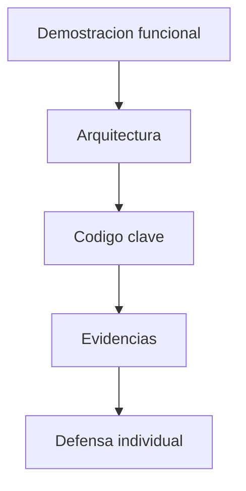

# S15 - Sustentación del proyecto

## 1. Introducción

Tiempo: 20 min.

### 1.1 Propósito

Sustentar el producto mediante una demostracion funcional y una explicacion técnica clara.

### 1.2 Resultado de aprendizaje

El estudiante presenta el producto, explica su arquitectura, defiende decisiónes de diseño y demuestra su aporte individual.

### 1.3 Producto de sesión

Sustentación grupal del proyecto con defensa técnica individual.

### 1.4 Motivación de la sesión

Construir software también implica explicarlo. La sustentación permite verificar qué el estudiante entiende cómo funcióna el sistema y qué aporto.

Pregunta guía:

```text
Puedes explicar y defender técnicamente el producto que construiste?
```

### 1.5 Ubicación en el curso

- Unidad: U3.
- Avance de sesión: defensa técnica del producto.

## 2. Explica

Tiempo: 20 min.

### 2.1 Elementos de la sustentación

- Demostracion funcional.
- Arquitectura por capas.
- Entidades.
- Controladores.
- Servicios.
- DAO y persistencia.
- Validaciones.
- Ejecutable.
- Aporte individual.

### 2.2 Orden sugerido



## 3. Aplica: actividad practica guíada

Tiempo: 2h.

1. Ejecutar el producto.
2. Mostrar el flujo principal.
3. Explicar arquitectura por capas.
4. Mostrar entidades, servicios y DAO.
5. Mostrar persistencia en SQLite.
6. Explicar validaciones.
7. Presentar evidencias.
8. Responder preguntas individuales.

## 4. Crea: preparación autónoma

Tiempo: 2h fuera del aula.

Prepara una sustentación breve con:

- Guion de demostracion.
- Capturas o evidencias.
- Explicacion de tu aporte.
- Posibles preguntas y respuestas.

## 5. Cierre evaluativo

Tiempo: segun programación.

### 5.1 Resultados esperados

- Producto ejecutable.
- Demostracion funcional.
- Explicacion técnica clara.
- Aporte individual identificable.
- Respuestas coherentes a preguntas.

### 5.2 Preguntas de defensa

1. Qué parte implementaste?
2. Cómo fluye una operación desde la vista hasta la base de datos?
3. Qué entidad es central en tu módulo?
4. Qué error importante resolviste?
5. Qué mejorarias con más tiempo?
