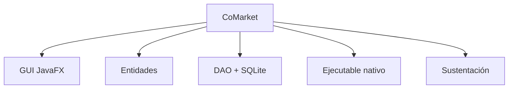

# S16 - Evaluación final del proyecto integrador

## 1. Introducción

Tiempo: según programación.

### 1.1 Propósito

Cerrar el curso verificando competencias pendientes, recuperando sustentaciones y consolidando observaciones finales.

### 1.2 Resultado de aprendizaje

El estudiante demuestra individualmente dominio del producto CoMarket y de los conceptos principales del curso.

### 1.3 Producto de sesión

Evaluación final, corrección de observaciones y cierre académico del proyecto.

### 1.4 Ubicación en el curso

- Cierre de U3.
- Cierre del producto del curso.

## 2. Explica

Tiempo: 20 min.

### 2.1 Criterios de cierre

- Proyecto ejecutable.
- Flujo principal funcionando.
- Persistencia operativa.
- GUI consistente.
- Evidencias completas.
- Defensa individual.
- Correcciones atendidas.

### 2.2 Producto final

## 3. Aplica: evaluación final

Tiempo: según programación.

El estudiante puede ser evaluado mediante:

1. Demostración individual.
2. Preguntas técnicas.
3. Corrección de observaciones.
4. Revisión de evidencias.
5. Recuperación de sustentación pendiente.

## 4. Crea: cierre de evidencias

Entrega final:

- Repositorio actualizado.
- Evidencias del producto.
- Ejecutable o evidencia de generación.
- Breve descripción del aporte individual.
- Correcciones realizadas.

## 5. Cierre evaluativo

### 5.1 Resultados esperados

- CoMarket se ejecuta correctamente.
- El estudiante entiende la arquitectura.
- El flujo principal está validado.
- La persistencia funciona.
- Las evidencias son suficientes.

### 5.2 Preguntas de defensa

1. ¿Qué aprendiste al pasar de consola a GUI?
2. ¿Qué cambió al pasar de memoria a SQLite?
3. ¿Qué responsabilidad tiene cada capa?
4. ¿Cómo validarías un error reportado por el usuario?
5. ¿Qué parte del proyecto demuestra mejor tu aprendizaje?

