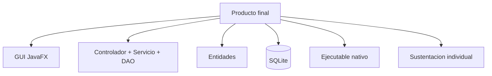

# S16 - Evaluacion final del proyecto integrador

## 1. Introduccion

Tiempo: segun programacion.

### 1.1 Proposito

Cerrar el curso verificando competencias pendientes, recuperando sustentaciones y consolidando observaciones finales del proyecto.

### 1.2 Resultado de aprendizaje

El estudiante demuestra individualmente dominio del producto y de los conceptos principales de Programacion Orientada a Objetos aplicados en una aplicacion de escritorio.

### 1.3 Producto de sesion

Evaluacion final, correccion de observaciones y cierre academico del proyecto.

### 1.4 Motivacion de la sesion

La evaluacion final no solo confirma que el producto abre. Confirma que el estudiante entiende el flujo, las capas, las entidades, la persistencia y las decisiones tomadas durante el desarrollo.

### 1.5 Ubicacion en el curso

- Cierre de U3.
- Cierre del producto del curso.

## 2. Explica

Tiempo: 20 min.

### 2.1 Criterios de cierre

- Proyecto ejecutable.
- Flujo principal funcionando.
- Persistencia operativa.
- GUI consistente.
- Validaciones y errores controlados.
- Evidencias completas.
- Defensa individual.
- Correcciones atendidas.

### 2.2 Producto final



### 2.3 Criterios minimos de aceptacion

- El proyecto se ejecuta.
- El flujo principal se puede demostrar.
- La base de datos conserva informacion.
- La arquitectura por capas se puede explicar.
- El estudiante identifica su aporte.
- Las evidencias estan ordenadas.

## 3. Aplica: evaluacion final

Tiempo: segun programacion.

El estudiante puede ser evaluado mediante:

1. Demostracion individual.
2. Preguntas tecnicas.
3. Correccion de observaciones.
4. Revision de evidencias.
5. Recuperacion de sustentacion pendiente.

### 3.1 Demostracion minima

La demostracion debe cubrir:

1. Abrir la aplicacion.
2. Ejecutar el flujo principal.
3. Registrar o actualizar datos.
4. Verificar persistencia.
5. Mostrar una validacion.
6. Explicar una clase clave.

## 4. Crea: cierre de evidencias

### 4.1 Plantilla de evidencia final

Entrega final sugerida:

```text
S16_Equipo##_ApellidoNombre.pdf
```

Incluye:

- Repositorio actualizado.
- Evidencias del producto.
- Ejecutable o evidencia de generacion.
- Breve descripcion del aporte individual.
- Correcciones realizadas.
- Reflexion tecnica final.

### 4.2 Reflexion tecnica final

Responde brevemente:

1. Que aprendiste al pasar de consola a GUI?
2. Que cambio al pasar de memoria a SQLite?
3. Que responsabilidad tiene cada capa?
4. Que parte del proyecto demuestra mejor tu aprendizaje?

## 5. Cierre evaluativo

### 5.1 Resultados esperados

- El producto se ejecuta correctamente.
- El estudiante entiende la arquitectura.
- El flujo principal esta validado.
- La persistencia funciona.
- Las evidencias son suficientes.

### 5.2 Preguntas de defensa

1. Que aprendiste al pasar de consola a GUI?
2. Que cambio al pasar de memoria a SQLite?
3. Que responsabilidad tiene cada capa?
4. Como validarias un error reportado por el usuario?
5. Que parte del proyecto demuestra mejor tu aprendizaje?

### 5.3 Rubrica de evaluacion final

| Dimension | Peso | 3 - Logro destacado | 2 - Logro | 1 - Proceso | 0 - Inicio | Puntuacion obtenida |
|---|---:|---|---|---|---|---:|
| 1. Producto ejecutable | 2 | Ejecuta y demuestra flujo completo sin bloqueos. | Ejecuta flujo principal. | Ejecuta parcialmente. | No ejecuta. | |
| 2. Arquitectura y codigo | 2 | Capas claras, responsabilidades coherentes y codigo defendible. | Arquitectura suficiente. | Mezclas o inconsistencias importantes. | No evidencia arquitectura. | |
| 3. Persistencia y validaciones | 2 | Persistencia y validaciones completas y verificables. | Persistencia y validaciones principales. | Funcionamiento parcial. | No evidencia persistencia. | |
| 4. Evidencias y correcciones | 2 | Evidencias completas, ordenadas y observaciones atendidas. | Evidencias suficientes. | Evidencias incompletas. | No entrega evidencias. | |
| 5. Aporte individual | 1 | Aporte claro, verificable y conectado al producto. | Aporte identificable. | Aporte general. | No identifica aporte. | |
| 6. Defensa tecnica | 1 | Responde con precision y criterio. | Responde adecuadamente. | Responde parcialmente. | No sustenta. | |

Puntuacion acumulada = suma de (`Peso` * `Puntuacion obtenida`) = ____.

Nota final = (`Puntuacion acumulada` / 30) * 20 = ____.
