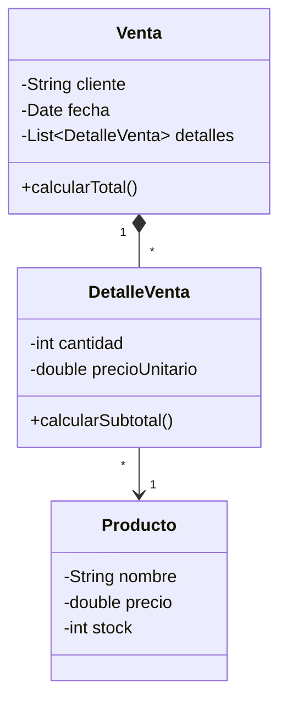

# Sílabo del curso de Programación Orientada a Objetos

## 1. Datos generales

**Curso:** Programación Orientada a Objetos  
**Abreviación:** POO  
**Carrera profesional:** Ingeniería de Sistemas  
**Institución:** UPeU  
**Duración:** 3 unidades y 16 sesiones teórico-prácticas  
**Entorno base:** IntelliJ IDEA con Maven  
**Lenguaje de trabajo:** Java

---

## 2. Descripción del curso

El curso orienta al estudiante en la construcción progresiva de una aplicación de escritorio mediante modelado orientado a objetos, organización modular, interfaz gráfica y persistencia de datos. La secuencia pedagógica parte de clases, objetos y relaciones, continúa con arquitectura, acceso a datos y GUI, y culmina con la integración de **CoMarket - Sistema Comercial Orientado a Objetos**.

---

## 3. Propósito formativo

Al finalizar el curso, el estudiante será capaz de diseñar, implementar y sustentar una aplicación de escritorio basada en objetos, integrando modelado del dominio, encapsulamiento, herencia, polimorfismo, persistencia con base de datos relacional, interfaz gráfica y organización modular del código.

### Producto final del curso

**CoMarket - Sistema Comercial Orientado a Objetos**

Incluye:

- Modelo de dominio orientado a objetos.
- Clases y relaciones implementadas.
- Encapsulamiento y herencia aplicados.
- Colecciones y operaciones CRUD.
- Arquitectura por capas.
- Persistencia mediante base de datos relacional.
- DAO para acceso a datos.
- Interfaz gráfica funcional.
- Integración entre GUI, lógica y persistencia.
- Evidencias de funcionamiento.
- Sustentación técnica del proyecto.

---

## 4. Enfoque metodológico

Cada sesión combina explicación breve, modelado del docente, práctica guiada, trabajo incremental sobre el proyecto y cierre con verificación. El patrón de trabajo del curso es:

```text
Analizar el caso -> modelar clases -> implementar -> probar -> integrar -> refinar
```

La unidad de avance no es un cuaderno aislado ni un entorno web embebido, sino la evolución continua de un proyecto JavaFX/Maven abierto y ejecutado en IntelliJ IDEA.

---

## 5. Evaluación del aprendizaje

La evaluación es continua y basada en evidencias de diseño, implementación, funcionamiento y sustentación técnica.

### Criterios generales

- Modela correctamente entidades, atributos y relaciones del dominio.
- Aplica encapsulamiento y responsabilidad de clase con criterio.
- Usa colecciones, herencia y polimorfismo donde corresponde.
- Organiza el código por capas o paquetes de forma coherente.
- Implementa operaciones CRUD en memoria y luego sobre base de datos.
- Integra GUI, lógica y persistencia sin romper el flujo principal.
- Documenta, prueba y explica decisiones técnicas del proyecto.

### Evidencias

- Avances del proyecto por unidad.
- Prácticas guiadas y retos de sesión.
- Evaluaciones de unidad.
- Presentación y sustentación del proyecto final.

---

## 6. Organización por unidades

### Unidad 1: Fundamentos de la Programación Orientada a Objetos

**Propósito:** modelar y construir objetos de software aplicando principios fundamentales de programación orientada a objetos, relaciones entre clases y estructuras de almacenamiento en memoria.

**Producto de unidad:** aplicación funcional en memoria con clases, relaciones entre objetos, colecciones y operaciones principales del dominio.

- S1. Clases, objetos, atributos, métodos, responsabilidad de clase y abstracción del dominio.
- S2. Encapsulamiento, constructores, modificadores de acceso, validación de atributos y control del estado interno.
- S3. Asociaciones, agregación, composición, modelado básico del dominio y navegación entre objetos.
- S4. Herencia, reutilización de código, sobrescritura de métodos, polimorfismo y jerarquías de clases.
- S5. Colecciones, generics, ArrayList, registro de objetos, búsqueda, ordenamiento y CRUD en memoria.
- S6. Evaluación de la unidad 1.

### Unidad 2: Aplicación de Escritorio con Persistencia de Datos

**Propósito:** construir aplicaciones de escritorio organizadas por capas, integrando persistencia de datos, acceso a información e interfaz gráfica mediante una arquitectura modular.

**Producto de unidad:** aplicación de escritorio funcional con arquitectura por capas, interfaz gráfica y persistencia en base de datos relacional.

- S7. Arquitectura por capas, separación de responsabilidades, persistencia, JDBC, conexión relacional y preparación para DAO.
- S8. Patrón DAO, acceso a datos y operaciones de registro, consulta, actualización y eliminación.
- S9. Formularios, componentes visuales, eventos, navegación entre pantallas e integración básica con la lógica de negocio.
- S10. Registro, consulta, edición, eliminación y flujo completo de operación desde la interfaz gráfica.
- S11. Validación de datos, integración GUI-lógica-persistencia, pruebas del flujo principal y corrección de errores funcionales.
- S12. Evaluación de la unidad 2.

### Unidad 3: Proyecto Integrador CoMarket

**Propósito:** integrar el modelo orientado a objetos, la interfaz gráfica, la persistencia de datos y la organización modular del código en una aplicación completa alineada al proyecto integrador del curso.

**Producto de unidad:** **CoMarket - Sistema Comercial Orientado a Objetos**.

Incluye:

- Modelo de dominio implementado.
- Arquitectura por capas.
- Persistencia funcional.
- Operaciones CRUD completas.
- Interfaz gráfica integrada.
- Validaciones.
- Evidencias de funcionamiento.
- Documentación técnica básica.

- S13. Integración del modelo de dominio, interfaz gráfica, persistencia y consolidación funcional del sistema.
- S14. Validación funcional, manejo de errores, refinamiento del diseño, corrección de observaciones y preparación para sustentación.
- S15. Demostración funcional, presentación de arquitectura, modelo de dominio, persistencia y defensa técnica del proyecto.
- S16. Evaluación individual, recuperación de sustentaciones pendientes, corrección de observaciones y cierre académico del proyecto.

---

## 7. Integración curricular

El producto final de este curso sirve como insumo directo para cursos y espacios formativos relacionados con análisis, datos, programación y proyecto de línea.

### Ingeniería de Requerimientos

- Identificación de actores.
- Reglas de negocio.
- Casos de uso.
- Modelado del dominio.

### Administración de Base de Datos I

- Entidades del dominio.
- Relaciones.
- Restricciones de negocio.
- Transformación al modelo de datos.

### Lenguaje de Programación I

- Arquitectura por capas.
- Persistencia de datos.
- Operaciones CRUD.
- Separación de responsabilidades.

### Proyecto Formativo de la Línea

- Base conceptual para el desarrollo de aplicaciones empresariales.
- Comprensión del dominio de negocio.
- Evolución hacia sistemas web y arquitecturas empresariales.

---

## 8. Stack tecnológico propuesto

1. Java como lenguaje orientado a objetos.
2. Maven para dependencias, compilación y ejecución.
3. IntelliJ IDEA como entorno base de trabajo.
4. JavaFX con FXML y controladores para interfaz gráfica.
5. Scene Builder para diseño visual de vistas FXML.
6. JDBC para acceso a datos.
7. SQLite como base de datos local.

> Para el desarrollo de la aplicación de escritorio, IntelliJ IDEA es el entorno recomendado del curso. Scene Builder se utiliza como apoyo para diseñar vistas FXML. VS Code puede servir para lectura o edición rápida de archivos, pero no reemplaza el flujo principal de trabajo con JavaFX, Maven y ejecución desde IntelliJ IDEA.

## 9. Modelo de referencia del proyecto integrador final

El siguiente diagrama se presenta como referencia del producto final del curso, una vez que el estudiante haya avanzado por modelado básico, encapsulamiento, colecciones, herencia, persistencia e interfaz gráfica.



Durante las primeras sesiones, el modelado debe comenzar con clases simples y cercanas, por ejemplo `Producto` con `Categoria`, o bien `Cliente`, `Proveedor` y `Usuario` como entidades independientes. La generalización con `Persona` y sus clases derivadas se introduce recién en la sesión de herencia.

## 10. Estructura base de carpetas

```text
comarket-poo/
├── pom.xml
├── data/
│   └── comarket.db
└── src/
    └── main/
        ├── java/
        │   └── app/
        │       ├── model/
        │       ├── controller/
        │       ├── dao/
        │       ├── service/
        │       └── util/
        └── resources/
            ├── view/
            ├── css/
            └── img/
```

## 11. Resultado esperado del curso

Al cierre del semestre, el estudiante debe contar con un proyecto ejecutable en IntelliJ IDEA, con modelo de dominio coherente, operaciones CRUD, interfaz gráfica funcional, conexión a base de datos relacional y documentación suficiente para presentar y sustentar **CoMarket**.
