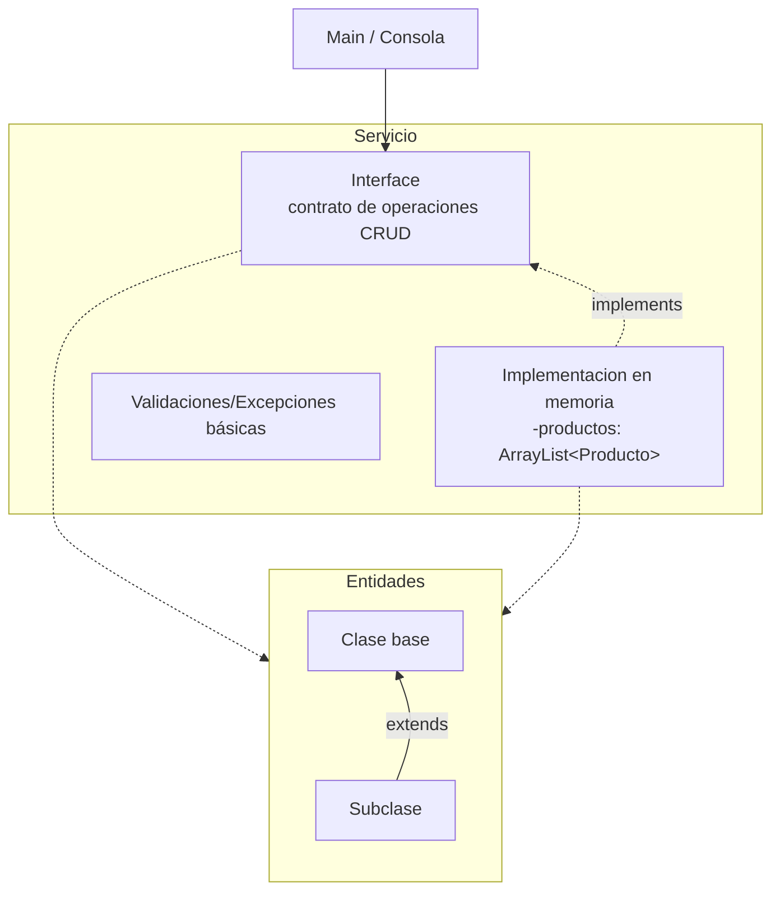
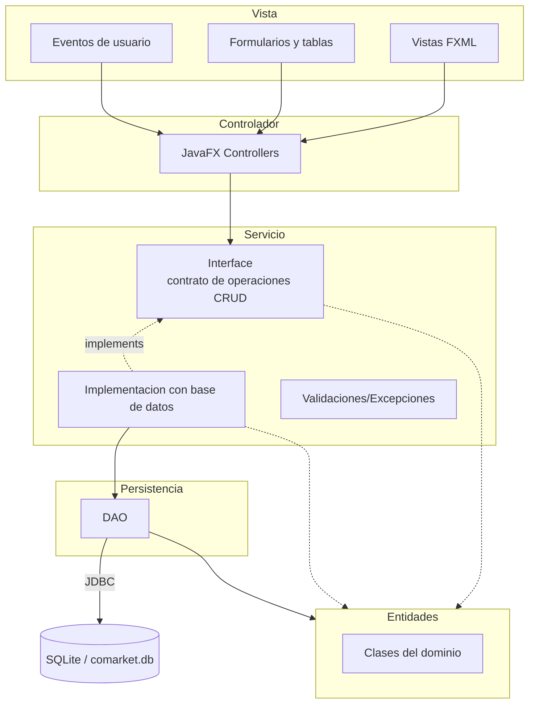
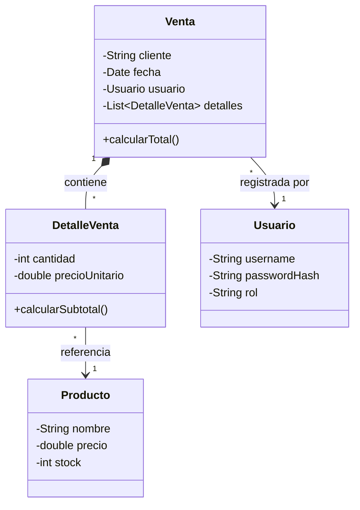

# Programación Orientada a Objetos 2026-2

Curso práctico de Programación Orientada a Objetos con Java, modelado de dominio, encapsulamiento, relaciones entre clases, herencia, polimorfismo, colecciones, arquitectura por capas, persistencia relacional, DAO, JavaFX y sustentación técnica del proyecto integrador.

[`comarket`](https://github.com/262poo/comarket.git) es un repositorio académico para guiar la construcción progresiva de **CoMarket - Sistema Comercial Orientado a Objetos**. La ruta inicia con una aplicación de consola en memoria usando Java y VS Code, avanza hacia una aplicación de escritorio con JavaFX, Scene Builder, DAO, JDBC y SQLite, y culmina con un producto integrado, documentado, ejecutable y sustentado técnicamente.

## Producto del curso

Producto del curso = Producto U3:

```text
CoMarket - Sistema Comercial Orientado a Objetos, con modelo de dominio,
operaciones CRUD, arquitectura por capas, persistencia relacional, interfaz
gráfica funcional, evidencias de funcionamiento y sustentación técnica.
```

Resultado esperado del curso:

Al finalizar el curso, el estudiante diseña, implementa y sustenta una aplicación de escritorio basada en objetos. La solución integra modelado del dominio, encapsulamiento, herencia, polimorfismo, colecciones, persistencia con base de datos relacional, DAO, interfaz gráfica y organización modular del código. El producto se presenta cómo avance de curso, pero cada estudiante evidencia y defiende su aporte técnico.

## Contenido

### U1: Fundamentos de la Programación Orientada a Objetos

Producto U1: aplicación de consola funcional en memoria con clases, relaciones entre objetos, colecciones, operaciones principales del dominio y preparación para ejecutable nativo.

Resultado esperado U1: el estudiante modela y construye objetos de software aplicando principios fundamentales de programación orientada a objetos, relaciones entre clases y estructuras de almacenamiento en memoria.

| Sesión | Tema | Producto de sesión |
|---|---|---|
| S1 | **Clases, objetos y responsabilidad de clase:**<br>Proyecto Java simple en VS Code, objetos tangibles cómo `Coche` y `Persona`, ejemplo puente con `Producto`, diferencia entre clase y objeto, atributos, métodos, estado, comportamiento, abstracción inicial y responsabilidad como características y acciones de una clase | Clases base del dominio con atributos, métodos y objetos instanciados desde `Main` |
| S2 | **Encapsulamiento, constructores y responsabilidad única:**<br>Modificadores de acceso, constructores, sobrecarga de constructores, getters/setters limpios, separacion básica con `ProductoService`, validaciones básicas y pruebas desde `Main` | `Producto` encapsulado y `ProductoService` inicial con operaciones sobre productos |
| S3 | **Asociación, agregación/composición y colecciones:**<br>Relaciones entre entidades, asociación, agregación, composición, colecciones de objetos, navegacion entre objetos y relaciones uno a muchos representadas dentro de las entidades | Modelo inicial con varias entidades relacionadas, multiplicidad y colecciones dentro del dominio |
| S4 | **Herencia y polimorfismo:**<br>Herencia con entidades usando `extends`, clase base abstracta, subclases, sobrescritura de métodos, polimorfismo con interface e `implements`, separacion de responsabilidades | Entidades con herencia y contrato polimorfico con dos implementaciones |
| S5 | **CRUD en memoria con ArrayList:**<br>Registro, listado, busqueda, actualizacion, eliminación, flujo Main-Interface-Implementacion en memoria-Entidades, `ArrayList` como atributo interno de la implementación, introducción a Maven y compilación nativa con GraalVM para la entrega | CRUD en memoria organizado con contrato, implementacion en memoria y entidades, preparado para ejecutable nativo |
| S6 | **Evaluación de la unidad 1:**<br>Clases del dominio, encapsulamiento, constructores, relaciones entre objetos, CRUD en memoria, busquedas, validaciones básicas y ejecución del producto | Producto U1 validado con modelo de dominio, CRUD en memoria y ejecución demostrable |

### U2: Aplicación de escritorio con persistencia de datos

Producto U2: aplicación de escritorio funcional con arquitectura por capas, interfaz gráfica y persistencia en base de datos relacional.

Resultado esperado U2: el estudiante construye aplicaciónes de escritorio organizadas por capas, integrando persistencia de datos, acceso a información e interfaz gráfica mediante una arquitectura modular.

| Sesión | Tema | Producto de sesión |
|---|---|---|
| S7 | **Interfaz gráfica y CRUD desde GUI en memoria:**<br>Aplicación de escritorio con JavaFX, FXML, Scene Builder, controladores, formularios, eventos, tablas y CRUD en memoria de una entidad ya trabajada en U1. Validación básica al cierre de la sesión | Flujo Vista-Controlador-Servicio-Entidades funcionando desde GUI con memoria |
| S8 | **Arquitectura por capas, patrón DAO y CRUD persistente desde GUI:**<br>Organización por capas, JDBC, SQLite, DAO, servicio persistente, formularios, tablas, operaciones CRUD persistentes y validación de datos de una tabla simple | CRUD persistente desde GUI con arquitectura por capas y DAO |
| S9 | **Operaciones persistentes con relación muchos a muchos:**<br>Modelo de dominio con cabecera, detalle y entidad relacionada; tabla intermedia con atributos, cálculo de subtotales/totales, control de stock, persistencia y validaciones del flujo | Flujo persistente con relación muchos a muchos y tabla intermedia |
| S10 | **Seguridad básica y relación uno a muchos:**<br>Usuario, autenticación básica, sesión activa, relación uno a muchos, operaciones persistentes asociadas al usuario, validaciones de acceso y manejo básico de errores | Seguridad básica y operaciones persistentes con relación uno a muchos |
| S11 | **Consultas integradas y pruebas del flujo principal:**<br>Búsquedas, filtros, consultas maestro-detalle, consultas por fecha/usuario, totales, verificación de consistencia, manejo de errores y pruebas funcionales por capas | Consultas integradas y flujo principal probado |
| S12 | **Evaluación de la unidad 2:**<br>GUI operativa, arquitectura por capas, DAO, SQLite, CRUD persistente, relación muchos a muchos, relación uno a muchos, seguridad básica, consultas, validaciones y pruebas | Producto U2 validado con interfaz gráfica, persistencia, relaciones y seguridad básica |

### U3: Proyecto Integrador CoMarket

Producto U3 / producto del curso: **CoMarket - Sistema Comercial Orientado a Objetos**.

Resultado esperado U3: el estudiante integra el modelo orientado a objetos, la interfaz gráfica, la persistencia de datos y la organización modular del código en una aplicación completa alineada al proyecto integrador del curso.

| Sesión | Tema | Producto de sesión |
|---|---|---|
| S13 | **Integración del sistema:**<br>Revisión de alcance, integración de módulos, consistencia entre paquetes, nombres, flujo, dependencias, recursos y preparación inicial para ejecutable nativo | Modelo, GUI, persistencia y funcionalidades principales ensambladas |
| S14 | **Validación, refinamiento y ejecutable nativo:**<br>Corrección de fallos, limpieza de código, organización final, mensajes, validaciones, consistencia visual, flujo crítico, ejecutable nativo y preparación para sustentación | Manejo de errores, corrección de observaciones, refinamiento del diseño, ejecutable nativo y preparación para sustentación |
| S15 | **Sustentación del proyecto:**<br>Demostracion funcional, arquitectura por capas, modelo de dominio, persistencia, defensa técnica del proyecto | Demostracion funcional, arquitectura, modelo de dominio, persistencia y defensa técnica |
| S16 | **Evaluación final del proyecto integrador:**<br>Proyecto ejecutable, flujo principal, persistencia operativa, GUI validada, documentacion mínima, sustentación técnica | Evaluación individual, recuperacion de sustentaciónes pendientes y cierre académico |

## Arquitectura U1: CoMarket en memoria

La arquitectura de la Unidad 1 se concentra en Programación Orientada a Objetos sin interfaz gráfica. El estudiante trabaja con una clase `Main` para probar desde consola, entidades del dominio, un contrato de servicio y una implementacion en memoria con colecciones. Al cierre de la unidad, el proyecto se organiza con Maven y se prepara un ejecutable nativo con GraalVM.



Nota métodológica: en U1 la separacion de responsabilidades se trabaja de forma progresiva. En S1, responsabilidad significa reconocer caracteristicas y acciones de una clase; no se exige SOLID todavía. Desde S2 se controla mejor el estado con encapsulamiento y se introduce la S de SOLID separando `Producto` de `ProductoService`. En S3 se modelan relaciones entre entidades, porque asociación, agregación, composición y multiplicidad pertenecen al dominio. Más adelante, la interface declara el contrato de operaciones CRUD y la implementacion en memoria ejecuta las operaciones sobre `ArrayList`. No se introducen interfaces en entidades porque pueden complicar el modelo sin aportar claridad en está etapa.

Stack tecnologico U1:

1. Java cómo lenguaje orientado a objetos.
2. VS Code cómo entorno inicial de edición y ejecución.
3. Proyecto Java simple para clases, objetos y pruebas desde `Main`.
4. Consola para verificar comportamiento y resultados.
5. ArrayList para almacenamiento en memoria.
6. Maven desde S5 para organizar compilación y preparación de entrega.
7. GraalVM desde S5 para generar ejecutable nativo.

Flujo de trabajo U1:

1. El estudiante crea un proyecto Java simple en VS Code.
2. Implementa entidades iniciales del dominio y las prueba desde `Main`.
3. Desde S2 controla mejor el estado con encapsulamiento e introduce `ProductoService`.
4. En S3 relaciona entidades y representa multiplicidad dentro del modelo del dominio.
5. En S4 refuerza el modelo con herencia cuándo el dominio lo justifica y aplica polimorfismo con interface e `implements`.
6. En S5 integra lo anterior en el flujo Main-Interface-Implementacion en memoria-Entidades, con `ArrayList` como atributo interno de la implementación, y prepara la compilación nativa con Maven/GraalVM.
7. En S6 presenta un producto de consola ejecutable, con modelo de dominio y CRUD en memoria.

## Arquitectura CoMarket POO: U2 y U3

La arquitectura final de CoMarket organiza la aplicación de escritorio en capas simples. La Vista contiene FXML, formularios y tablas; el Controlador atiende eventos de usuario; el Servicio conserva el contrato de operaciones CRUD trabajado desde U1, pero en U2-U3 se implementa contra base de datos; las Entidades representan los objetos principales del sistema; y la Persistencia gestiona el acceso mediante DAO y el conector JDBC.



Convencion del diagrama: las flechas muestran el flujo principal entre capas. El Controlador recibe acciones de la Vista y delega operaciones al contrato del Servicio. En U1 ese contrato se implementa en memoria con `ArrayList`; en U2-U3 se implementa contra base de datos mediante DAO y SQLite. Las Entidades se mantienen cómo las mismás clases del dominio; no se cambian por pasar de memoria a base de datos. El DAO trabaja con entidades para convertir datos relacionales en objetos y objetos en operaciones de persistencia; la comúnicacion con SQLite se realiza mediante JDBC.

Stack tecnologico U2:

1. Java cómo lenguaje orientado a objetos.
2. IntelliJ IDEA cómo entorno base de trabajo para JavaFX.
3. Maven para dependencias, compilación y ejecución.
4. JavaFX con FXML y controladores para interfaz gráfica.
5. Scene Builder para diseño visual de vistas FXML.
6. JDBC para acceso a datos.
7. SQLite cómo base de datos local.
8. MkDocs Material para documentacion y evidencias.

Stack tecnologico U3:

1. Java, Maven, JavaFX, Scene Builder, JDBC y SQLite integrados en el producto final.
2. GraalVM para generar el ejecutable nativo de CoMarket.
3. MkDocs Material para documentacion, evidencias y preparación de sustentación.

## Detalle del componente Entidades

El siguiente diagrama detalla el componente `Entidades` de la arquitectura CoMarket POO. Estas clases representan los objetos principales qué usan el Controlador y el DAO para ejecutar operaciones de interfaz, validación y persistencia.



En U2 y U3 este modelo se consolida alrededor del flujo comercial principal. La relación entre `Venta`, `DetalleVenta`, `Producto` y `Usuario` sirve cómo referencia para integrar interfaz gráfica, entidades, seguridad básica y persistencia relacional.

Flujo de trabajo U2-U3:

1. La Unidad 2 inicia un proyecto JavaFX/Maven en IntelliJ IDEA.
2. En S7 pasa de consola a GUI y reutiliza el servicio en memoria de una entidad simple.
3. En S8 incorpora arquitectura por capas, DAO, JDBC y SQLite con CRUD persistente para una tabla simple.
4. En S9 implementa operaciones persistentes con relación muchos a muchos mediante cabecera, detalle y tabla intermedia.
5. En S10 agrega seguridad básica y una relación uno a muchos asociada al usuario.
6. En S11 desarrolla consultas integradas, filtros, pruebas funcionales y correcciones por sesión.
7. La Unidad 3 integra pantallas, controladores, servicios, entidades, DAO, base de datos, documentacion y evidencias.
8. En S13 y S14 estabiliza el producto y genera el ejecutable nativo final con GraalVM.
9. En S15 y S16 sustenta y defiende técnicamente el producto.

## Enlaces

- [S1: Clases, objetos y responsabilidad](S01_Clases_Objetos.md)
- [S2: Encapsulamiento y constructores](S02_Encapsulamiento_Constructores.md)
- [S3: Asociacion, agregacion/composicion y colecciones](S03_Asociacion_Colecciones.md)
- [S4: Herencia y polimorfismo](S04_Herencia_Polimorfismo.md)
- [S5: CRUD en memoria con ArrayList](S05_CRUD_Memoria_ArrayList.md)
- [S6: Evaluacion unidad 1](S06_Evaluacion_Unidad_1.md)
- [S7: Interfaz grafica y CRUD desde GUI en memoria](S07_GUI_CRUD_Memoria.md)
- [S8: Arquitectura por capas, DAO y CRUD persistente desde GUI](S08_Arquitectura_DAO_CRUD_Persistente.md)
- [S9: Operaciones persistentes con relación muchos a muchos](S09_Operaciones_Persistentes_Muchos_Muchos.md)
- [S10: Seguridad básica y relación uno a muchos](S10_Seguridad_Relacion_Uno_Muchos.md)
- [S11: Consultas integradas y pruebas](S11_Consultas_Integradas_Pruebas.md)
- [S12: Evaluacion unidad 2](S12_Evaluacion_Unidad_2.md)
- [S13: Integracion del sistema](S13_Proyecto_Integrador_Ensamblaje.md)
- [S14: Validacion y refinamiento](S14_Proyecto_Integrador_Refinamiento.md)
- [S15: Sustentacion del proyecto](S15_Documentacion_Demo.md)
- [S16: Evaluacion final](S16_Evaluacion_Final.md)
- [Taller POO 01](POOTaller01.md)
