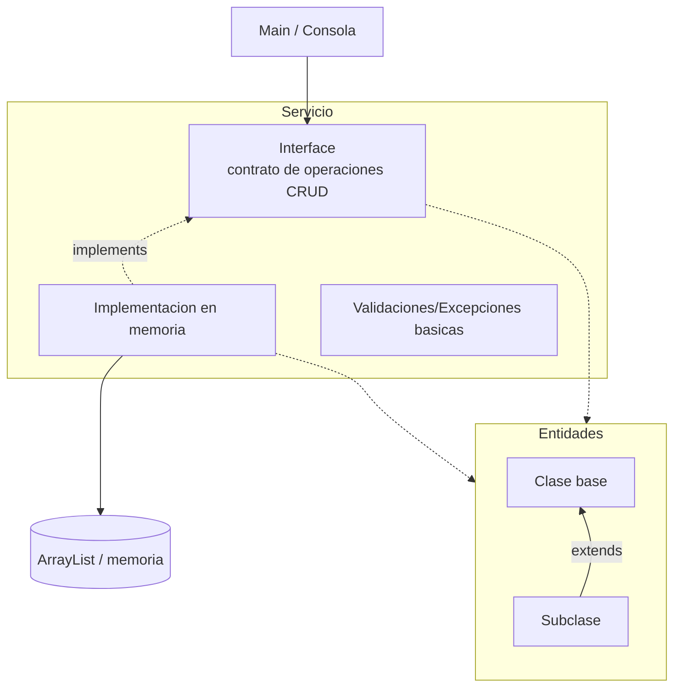
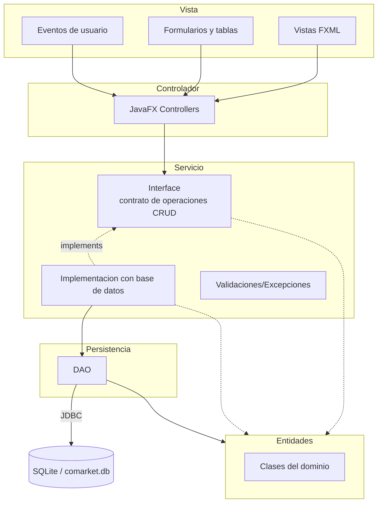
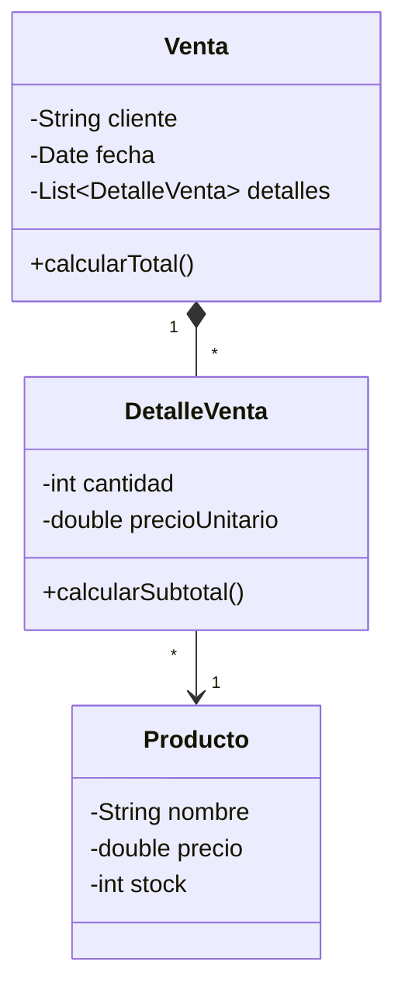

# Programacion Orientada a Objetos 2026-2

Curso practico de Programacion Orientada a Objetos con Java, modelado de dominio, encapsulamiento, relaciones entre clases, herencia, polimorfismo, colecciones, arquitectura por capas, persistencia relacional, DAO, JavaFX y sustentacion tecnica del proyecto integrador.

[`comarket`](https://github.com/262poo/comarket.git) es un repositorio academico para guiar la construccion progresiva de **CoMarket - Sistema Comercial Orientado a Objetos**. La ruta inicia con una aplicacion de consola en memoria usando Java y VS Code, avanza hacia una aplicacion de escritorio con JavaFX, Scene Builder, DAO, JDBC y SQLite, y culmina con un producto integrado, documentado, ejecutable y sustentado tecnicamente.

## Producto del curso

Producto del curso = Producto U3:

```text
CoMarket - Sistema Comercial Orientado a Objetos, con modelo de dominio,
operaciones CRUD, arquitectura por capas, persistencia relacional, interfaz
grafica funcional, evidencias de funcionamiento y sustentacion tecnica.
```

Resultado esperado del curso:

Al finalizar el curso, el estudiante disena, implementa y sustenta una aplicacion de escritorio basada en objetos. La solucion integra modelado del dominio, encapsulamiento, herencia, polimorfismo, colecciones, persistencia con base de datos relacional, DAO, interfaz grafica y organizacion modular del codigo. El producto se presenta como avance de curso, pero cada estudiante evidencia y defiende su aporte tecnico.

## Contenido

### U1: Fundamentos de la Programacion Orientada a Objetos

Producto U1: aplicacion de consola funcional en memoria con clases, relaciones entre objetos, colecciones, operaciones principales del dominio y preparacion para ejecutable nativo.

Resultado esperado U1: el estudiante modela y construye objetos de software aplicando principios fundamentales de programacion orientada a objetos, relaciones entre clases y estructuras de almacenamiento en memoria.

| Sesion | Tema | Producto de sesion |
|---|---|---|
| S1 | **Clases, objetos y responsabilidad de clase:**<br>Proyecto Java simple en VS Code, objetos tangibles como `Coche` y `Persona`, ejemplo puente con `Producto`, diferencia entre clase y objeto, atributos, metodos, estado, comportamiento, abstraccion inicial y responsabilidad como caracteristicas y acciones de una clase | Clases base del dominio con atributos, metodos y objetos instanciados desde `Main` |
| S2 | **Encapsulamiento, constructores y responsabilidad unica:**<br>Modificadores de acceso, constructores, sobrecarga de constructores, getters/setters limpios, separacion basica con `ProductoService`, validaciones basicas y pruebas desde `Main` | `Producto` encapsulado y `ProductoService` inicial con operaciones sobre productos |
| S3 | **Asociacion, agregacion/composicion y colecciones:**<br>Relaciones entre objetos, asociacion, agregacion, composicion, colecciones de objetos, navegacion entre objetos, relaciones uno a muchos y servicio inicial para administrar colecciones | Modelo inicial con varias entidades relacionadas, colecciones y servicio inicial |
| S4 | **Herencia y polimorfismo:**<br>Herencia con entidades usando `extends`, clase base abstracta, subclases, sobrescritura de metodos, polimorfismo con interface e `implements`, separacion de responsabilidades | Entidades con herencia y contrato polimorfico con dos implementaciones |
| S5 | **CRUD en memoria con ArrayList:**<br>Registro, listado, busqueda, actualizacion, eliminacion, flujo Main-Interface-Implementacion en memoria-Entidades-ArrayList, introduccion a Maven y compilacion nativa con GraalVM para la entrega | CRUD en memoria organizado con contrato, implementacion en memoria, entidades y ArrayList, preparado para ejecutable nativo |
| S6 | **Evaluacion de la unidad 1:**<br>Clases del dominio, encapsulamiento, constructores, relaciones entre objetos, CRUD en memoria, busquedas, validaciones basicas y ejecucion del producto | Producto U1 validado con modelo de dominio, CRUD en memoria y ejecucion demostrable |

### U2: Aplicacion de escritorio con persistencia de datos

Producto U2: aplicacion de escritorio funcional con arquitectura por capas, interfaz grafica y persistencia en base de datos relacional.

Resultado esperado U2: el estudiante construye aplicaciones de escritorio organizadas por capas, integrando persistencia de datos, acceso a informacion e interfaz grafica mediante una arquitectura modular.

| Sesion | Tema | Producto de sesion |
|---|---|---|
| S7 | **Interfaz grafica de usuario:**<br>Aplicacion de escritorio con JavaFX, FXML, Scene Builder, controladores, formularios, eventos y navegacion basica | Pantallas y controladores integrados con eventos de usuario |
| S8 | **CRUD desde GUI en memoria:**<br>Flujo Vista-Controlador-Servicio-Entidades-ArrayList, reutilizacion del contrato de operaciones CRUD, carga de datos en tablas, registro, consulta, edicion y eliminacion | Flujo completo de operacion desde formularios y tablas JavaFX usando memoria |
| S9 | **Arquitectura por capas y persistencia relacional:**<br>Organizacion por capas, clase de conexion, fundamentos de JDBC, base de datos relacional embebida | Proyecto preparado con paquetes, conexion relacional y separacion de responsabilidades |
| S10 | **Patron DAO y operaciones CRUD persistentes desde GUI:**<br>Flujo Vista-Controlador-Servicio-Entidades-DAO, carga de datos en tablas, registro, consulta, edicion, eliminacion, confirmacion de eliminacion y manejo inicial de excepciones | CRUD persistente funcional desde formularios y tablas JavaFX |
| S11 | **Validacion de datos y pruebas del flujo principal:**<br>Validaciones de formulario, mensajes al usuario, manejo de excepciones, pruebas manuales y correccion de errores funcionales | GUI y persistencia validadas con pruebas del flujo principal |
| S12 | **Evaluacion de la unidad 2:**<br>Conexion a base de datos, DAO funcional, GUI operativa, validaciones, manejo basico de errores, flujo funcional completo | Producto U2 validado con arquitectura, persistencia e interfaz grafica |

### U3: Proyecto Integrador CoMarket

Producto U3 / producto del curso: **CoMarket - Sistema Comercial Orientado a Objetos**.

Resultado esperado U3: el estudiante integra el modelo orientado a objetos, la interfaz grafica, la persistencia de datos y la organizacion modular del codigo en una aplicacion completa alineada al proyecto integrador del curso.

| Sesion | Tema | Producto de sesion |
|---|---|---|
| S13 | **Integracion del sistema:**<br>Revision de alcance, integracion de modulos, consistencia entre paquetes, nombres, flujo, dependencias, recursos y preparacion inicial para ejecutable nativo | Modelo, GUI, persistencia y funcionalidades principales ensambladas |
| S14 | **Validacion, refinamiento y ejecutable nativo:**<br>Correccion de fallos, limpieza de codigo, organizacion final, mensajes, validaciones, consistencia visual, flujo critico, ejecutable nativo y preparacion para sustentacion | Manejo de errores, correccion de observaciones, refinamiento del diseno, ejecutable nativo y preparacion para sustentacion |
| S15 | **Sustentacion del proyecto:**<br>Demostracion funcional, arquitectura por capas, modelo de dominio, persistencia, defensa tecnica del proyecto | Demostracion funcional, arquitectura, modelo de dominio, persistencia y defensa tecnica |
| S16 | **Evaluacion final del proyecto integrador:**<br>Proyecto ejecutable, flujo principal, persistencia operativa, GUI validada, documentacion minima, sustentacion tecnica | Evaluacion individual, recuperacion de sustentaciones pendientes y cierre academico |

## Arquitectura U1: CoMarket en memoria

La arquitectura de la Unidad 1 se concentra en Programacion Orientada a Objetos sin interfaz grafica. El estudiante trabaja con una clase `Main` para probar desde consola, entidades del dominio, un contrato de servicio y una implementacion en memoria con colecciones. Al cierre de la unidad, el proyecto se organiza con Maven y se prepara un ejecutable nativo con GraalVM.



Nota metodologica: en U1 la separacion de responsabilidades se trabaja de forma progresiva. En S1, responsabilidad significa reconocer caracteristicas y acciones de una clase; no se exige SOLID todavia. Desde S2 se controla mejor el estado con encapsulamiento y se introduce la S de SOLID separando `Producto` de `ProductoService`. Mas adelante, la interface declara el contrato de operaciones CRUD y la implementacion en memoria ejecuta las operaciones sobre `ArrayList`. No se introducen interfaces en entidades porque pueden complicar el modelo sin aportar claridad en esta etapa.

Stack tecnologico U1:

1. Java como lenguaje orientado a objetos.
2. VS Code como entorno inicial de edicion y ejecucion.
3. Proyecto Java simple para clases, objetos y pruebas desde `Main`.
4. Consola para verificar comportamiento y resultados.
5. ArrayList para almacenamiento en memoria.
6. Maven desde S5 para organizar compilacion y preparacion de entrega.
7. GraalVM desde S5 para generar ejecutable nativo.

Flujo de trabajo U1:

1. El estudiante crea un proyecto Java simple en VS Code.
2. Implementa entidades iniciales del dominio y las prueba desde `Main`.
3. Desde S2 controla mejor el estado con encapsulamiento e introduce `ProductoService`.
4. Desde S3 relaciona varias entidades y usa servicios iniciales para administrar colecciones.
5. En S4 refuerza el modelo con herencia cuando el dominio lo justifica y aplica polimorfismo con interface e `implements`.
6. En S5 integra lo anterior en el flujo Main-Interface-Implementacion en memoria-Entidades-ArrayList y prepara la compilacion nativa con Maven/GraalVM.
7. En S6 presenta un producto de consola ejecutable, con modelo de dominio y CRUD en memoria.

## Arquitectura CoMarket POO: U2 y U3

La arquitectura final de CoMarket organiza la aplicacion de escritorio en capas simples. La Vista contiene FXML, formularios y tablas; el Controlador atiende eventos de usuario; el Servicio conserva el contrato de operaciones CRUD trabajado desde U1, pero en U2-U3 se implementa contra base de datos; las Entidades representan los objetos principales del sistema; y la Persistencia gestiona el acceso mediante DAO y el conector JDBC.



Convencion del diagrama: las flechas muestran el flujo principal entre capas. El Controlador recibe acciones de la Vista y delega operaciones al contrato del Servicio. En U1 ese contrato se implementa en memoria con `ArrayList`; en U2-U3 se implementa contra base de datos mediante DAO y SQLite. Las Entidades se mantienen como las mismas clases del dominio; no se cambian por pasar de memoria a base de datos. El DAO trabaja con entidades para convertir datos relacionales en objetos y objetos en operaciones de persistencia; la comunicacion con SQLite se realiza mediante JDBC.

Stack tecnologico U2:

1. Java como lenguaje orientado a objetos.
2. IntelliJ IDEA como entorno base de trabajo para JavaFX.
3. Maven para dependencias, compilacion y ejecucion.
4. JavaFX con FXML y controladores para interfaz grafica.
5. Scene Builder para diseno visual de vistas FXML.
6. JDBC para acceso a datos.
7. SQLite como base de datos local.
8. MkDocs Material para documentacion y evidencias.

Stack tecnologico U3:

1. Java, Maven, JavaFX, Scene Builder, JDBC y SQLite integrados en el producto final.
2. GraalVM para generar el ejecutable nativo de CoMarket.
3. MkDocs Material para documentacion, evidencias y preparacion de sustentacion.

## Detalle del componente Entidades

El siguiente diagrama detalla el componente `Entidades` de la arquitectura CoMarket POO. Estas clases representan los objetos principales que usan el Controlador y el DAO para ejecutar operaciones de interfaz, validacion y persistencia.



En U2 y U3 este modelo se consolida alrededor del flujo comercial principal. La relacion entre `Venta`, `DetalleVenta` y `Producto` sirve como referencia para integrar interfaz grafica, entidades y persistencia relacional.

Flujo de trabajo U2-U3:

1. La Unidad 2 inicia un proyecto JavaFX/Maven en IntelliJ IDEA.
2. El estudiante disena vistas FXML con Scene Builder y conecta eventos mediante controladores.
3. Primero implementa CRUD desde GUI en memoria reutilizando el contrato de servicio y una implementacion basada en `ArrayList`.
4. Luego incorpora JDBC, DAO y SQLite agregando una implementacion persistente del mismo contrato de servicio.
5. Valida formularios, maneja excepciones, prueba el flujo principal y corrige errores funcionales.
6. La Unidad 3 integra pantallas, controladores, servicios, entidades, DAO, base de datos, documentacion y evidencias.
7. En S13 y S14 estabiliza el producto y genera el ejecutable nativo final con GraalVM.
8. En S15 y S16 sustenta y defiende tecnicamente CoMarket.

## Enlaces

- [S1: Clases, objetos y responsabilidad](S01_Clases_Objetos.md)
- [S2: Encapsulamiento y constructores](S02_Encapsulamiento_Constructores.md)
- [S3: Asociacion, agregacion/composicion y colecciones](S03_Modelado_Dominio_Colecciones.md)
- [S4: Herencia y polimorfismo](S04_Herencia_Polimorfismo.md)
- [S5: CRUD en memoria con ArrayList](S05_CRUD_Memoria_ArrayList.md)
- [S6: Evaluacion unidad 1](S06_Evaluacion_Unidad_1.md)
- [S7: Interfaz grafica de usuario](S07_Interfaz_Grafica_Usuario.md)
- [S8: CRUD desde GUI en memoria](S08_CRUD_GUI_Memoria.md)
- [S9: Arquitectura por capas y persistencia relacional](S09_Arquitectura_Persistencia.md)
- [S10: Patron DAO y operaciones CRUD persistentes desde GUI](S10_DAO_CRUD_GUI.md)
- [S11: Validacion de datos y pruebas](S11_Validacion_Integracion_Pruebas.md)
- [S12: Evaluacion unidad 2](S12_Evaluacion_Unidad_2.md)
- [S13: Integracion del sistema](S13_Proyecto_Integrador_Ensamblaje.md)
- [S14: Validacion y refinamiento](S14_Proyecto_Integrador_Refinamiento.md)
- [S15: Sustentacion del proyecto](S15_Documentacion_Demo.md)
- [S16: Evaluacion final](S16_Evaluacion_Final.md)
- [Taller POO 01](POOTaller01.md)
