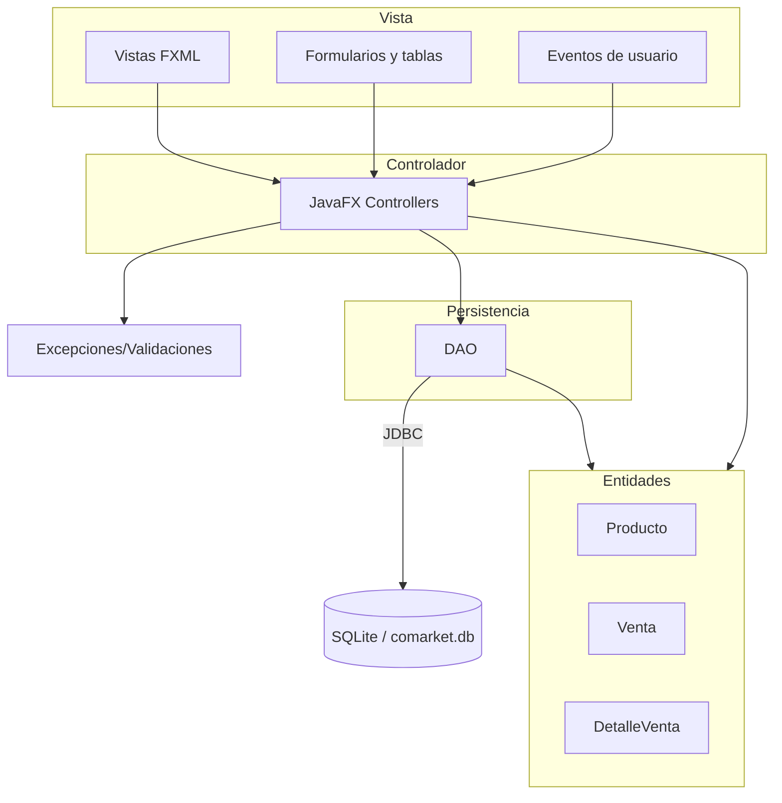
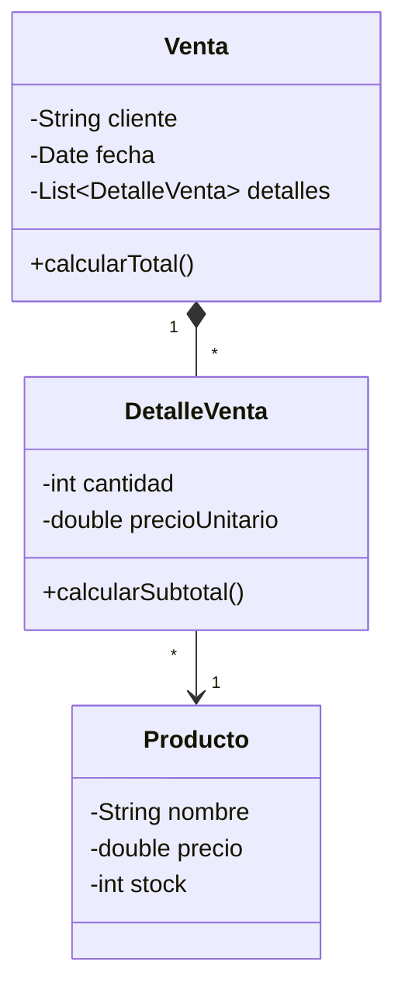

# Programación Orientada a Objetos 2026-2

Curso práctico de Programación Orientada a Objetos con Java, modelado de dominio, encapsulamiento, relaciones entre clases, herencia, polimorfismo, colecciones, arquitectura por capas, persistencia relacional, DAO, JavaFX y sustentación técnica del proyecto integrador.

[`comarket`](https://github.com/262poo/comarket.git) es un repositorio académico para guiar la construcción progresiva de **CoMarket - Sistema Comercial Orientado a Objetos**, una aplicación de escritorio desarrollada con Java, Maven, IntelliJ IDEA, JavaFX, Scene Builder, JDBC y SQLite. El proyecto organiza las sesiones, evidencias y entregables del curso para que cada estudiante o equipo construya una solución mantenible, modular e integrada.

## Producto del curso

Producto del curso = Producto U3:

```text
CoMarket - Sistema Comercial Orientado a Objetos, con modelo de dominio,
operaciones CRUD, arquitectura por capas, persistencia relacional, interfaz
gráfica funcional, evidencias de funcionamiento y sustentación técnica.
```

Resultado esperado del curso:

Al finalizar el curso, el estudiante diseña, implementa y sustenta una aplicación de escritorio basada en objetos. La solución integra modelado del dominio, encapsulamiento, herencia, polimorfismo, colecciones, persistencia con base de datos relacional, DAO, interfaz gráfica y organización modular del código. El producto se presenta como avance de curso, pero cada estudiante evidencia y defiende su aporte técnico.

## Contenido

### U1: Fundamentos de la Programación Orientada a Objetos

Producto U1: aplicación funcional en memoria con clases, relaciones entre objetos, colecciones y operaciones principales del dominio.

Resultado esperado U1: el estudiante modela y construye objetos de software aplicando principios fundamentales de programación orientada a objetos, relaciones entre clases y estructuras de almacenamiento en memoria.

| Sesión | Tema | Producto de sesión |
|---|---|---|
| S1 | **Clases, objetos y responsabilidad de clase:**<br>Diferencia entre clase y objeto, atributos, métodos, estado, responsabilidad de clase, primeras entidades del dominio | Clases base del dominio con atributos, métodos y objetos instanciados |
| S2 | **Encapsulamiento, constructores y control del estado:**<br>Modificadores de acceso, constructores, getters, setters, validaciones básicas, invariantes simples del dominio | Clases encapsuladas con constructores, modificadores de acceso y control de estado |
| S3 | **Modelado del dominio, asociaciones y colecciones:**<br>Asociación, agregación, composición, colecciones de objetos, navegación entre objetos, relaciones uno a muchos | Modelo inicial con asociaciones, agregación, composición y colecciones |
| S4 | **Herencia, reutilización y polimorfismo:**<br>Relación es-un, relación tiene-un, clase base, subclases, sobrescritura de métodos, polimorfismo aplicado | Jerarquías de clases con reutilización, sobrescritura y comportamiento polimórfico |
| S5 | **CRUD en memoria con ArrayList:**<br>Alta, consulta, actualización, eliminación, búsqueda por código o nombre, ordenamiento básico, separación entre modelo y operaciones | Operaciones de registro, búsqueda, actualización, eliminación y ordenamiento en memoria |
| S6 | **Evaluación de la unidad 1:**<br>Clases del dominio, encapsulamiento, constructores, relaciones entre objetos, CRUD en memoria, búsquedas y validaciones básicas | Producto U1 validado con modelo de dominio y CRUD en memoria |

### U2: Aplicación de escritorio con persistencia de datos

Producto U2: aplicación de escritorio funcional con arquitectura por capas, interfaz gráfica y persistencia en base de datos relacional.

Resultado esperado U2: el estudiante construye aplicaciones de escritorio organizadas por capas, integrando persistencia de datos, acceso a información e interfaz gráfica mediante una arquitectura modular.

| Sesión | Tema | Producto de sesión |
|---|---|---|
| S7 | **Arquitectura por capas y persistencia relacional:**<br>Organización por capas, clase de conexión, fundamentos de JDBC, base de datos relacional embebida | Proyecto preparado con paquetes, conexión relacional y separación de responsabilidades |
| S8 | **Patrón DAO y operaciones CRUD:**<br>Responsabilidad del DAO, mapeo objeto-relacional básico, consultas insert/select/update/delete, manejo inicial de excepciones | DAO funcional con registro, consulta, actualización y eliminación sobre base de datos |
| S9 | **Interfaz gráfica de usuario:**<br>Aplicación de escritorio con interfaz gráfica, FXML, separación vista-controlador, componentes de formularios, eventos y navegación básica | Pantallas y controladores integrados con eventos de usuario |
| S10 | **Registro, consulta, edición y eliminación desde GUI:**<br>Flujo Vista-Controlador-Entidades-DAO, carga de datos en tablas, edición de registros, confirmación de eliminación | Flujo completo de operación desde formularios y tablas JavaFX |
| S11 | **Validación de datos, integración y pruebas:**<br>Validaciones de formulario, mensajes al usuario, manejo de excepciones, pruebas manuales del flujo principal | GUI, lógica y persistencia integradas con validaciones y corrección de errores |
| S12 | **Evaluación de la unidad 2:**<br>Conexión a base de datos, DAO funcional, GUI operativa, validaciones, manejo básico de errores, flujo funcional completo | Producto U2 validado con arquitectura, persistencia e interfaz gráfica |

### U3: Proyecto Integrador CoMarket

Producto U3 / producto del curso: **CoMarket - Sistema Comercial Orientado a Objetos**.

Resultado esperado U3: el estudiante integra el modelo orientado a objetos, la interfaz gráfica, la persistencia de datos y la organización modular del código en una aplicación completa alineada al proyecto integrador del curso.

| Sesión | Tema | Producto de sesión |
|---|---|---|
| S13 | **Integración del sistema:**<br>Revisión de alcance, integración de módulos, consistencia entre paquetes, nombres y flujo, revisión de dependencias y recursos | Modelo, GUI, persistencia y funcionalidades principales ensambladas |
| S14 | **Validación y refinamiento:**<br>Corrección de fallos, limpieza de código, organización final, mensajes, validaciones, consistencia visual, flujo crítico, preparación para sustentación | Manejo de errores, corrección de observaciones, refinamiento del diseño y preparación para sustentación |
| S15 | **Sustentación del proyecto CoMarket:**<br>Demostración funcional, arquitectura, modelo de dominio, persistencia, defensa técnica del proyecto | Demostración funcional, arquitectura, modelo de dominio, persistencia y defensa técnica |
| S16 | **Evaluación final del proyecto integrador:**<br>Proyecto ejecutable, flujo principal, persistencia operativa, GUI validada, documentación mínima, sustentación técnica | Evaluación individual, recuperación de sustentaciones pendientes y cierre académico |

## Arquitectura CoMarket POO

La arquitectura final de CoMarket organiza la aplicación de escritorio en capas simples. La Vista contiene FXML, formularios y tablas; el Controlador atiende eventos de usuario, coordina validaciones y operaciones; las Entidades representan los objetos principales del sistema; y la Persistencia gestiona el acceso a la base de datos mediante DAO y el conector JDBC.



Convención del diagrama: las flechas muestran el flujo principal entre capas. El Controlador recibe acciones de la Vista, valida datos, arma entidades y coordina las operaciones CRUD. El DAO trabaja con entidades para convertir datos relacionales en objetos y objetos en operaciones de persistencia; la comunicación con SQLite se realiza mediante JDBC.

## 9. Modelo de referencia del proyecto integrador final

El siguiente diagrama se presenta como referencia del producto final del curso, una vez que el estudiante haya avanzado por modelado básico, encapsulamiento, colecciones, herencia, persistencia e interfaz gráfica.



Durante las primeras sesiones, el modelado debe comenzar con clases simples y cercanas, por ejemplo `Producto` con `Categoria`, o bien `Cliente`, `Proveedor` y `Usuario` como entidades independientes. La generalización con `Persona` y sus clases derivadas se introduce recién en la sesión de herencia.

## Flujo de trabajo

1. El alumno construye primero clases simples del dominio, por ejemplo `Producto`, `Categoria`, `Cliente`, `Proveedor` o `Usuario`.
2. Cada sesión agrega una pieza verificable al proyecto: encapsulamiento, relaciones, colecciones, herencia, CRUD, persistencia o interfaz gráfica.
3. El proyecto principal se desarrolla como aplicación JavaFX/Maven en IntelliJ IDEA.
4. La documentación MkDocs funciona como guía del curso, bitácora de evidencias y referencia de avance.
5. La Unidad 1 valida el modelo en memoria y las operaciones principales del dominio.
6. La Unidad 2 incorpora arquitectura por capas, JDBC, DAO, base de datos relacional e interfaz gráfica.
7. La Unidad 3 integra, estabiliza, documenta y prepara la sustentación técnica de CoMarket.
8. La evaluación considera evidencias de diseño, implementación, funcionamiento y defensa individual del aporte técnico.

## Stack tecnológico

1. Java como lenguaje orientado a objetos.
2. Maven para dependencias, compilación y ejecución.
3. IntelliJ IDEA como entorno base de trabajo.
4. JavaFX con FXML y controladores para interfaz gráfica.
5. Scene Builder para diseño visual de vistas FXML.
6. JDBC para acceso a datos.
7. SQLite como base de datos local.
8. MkDocs Material para documentación y evidencias.

## Enlaces

- [S1: Clases, objetos y responsabilidad](S01_Clases_Objetos.md)
- [S2: Encapsulamiento y constructores](S02_Encapsulamiento_Constructores.md)
- [S3: Modelado del dominio y colecciones](S03_Modelado_Dominio_Colecciones.md)
- [S4: Herencia y polimorfismo](S04_Herencia_Polimorfismo.md)
- [S5: CRUD en memoria con ArrayList](S05_CRUD_Memoria_ArrayList.md)
- [S6: Evaluacion unidad 1](S06_Evaluacion_Unidad_1.md)
- [S7: Arquitectura por capas y persistencia relacional](S07_JDBC_SQLite_Arquitectura.md)
- [S8: Patron DAO y operaciones CRUD](S08_DAO_CRUD.md)
- [S9: Interfaz grafica de usuario](S09_JavaFX_FXML_Eventos.md)
- [S10: CRUD desde GUI](S10_CRUD_GUI.md)
- [S11: Validacion e integracion](S11_Validacion_Integracion_Pruebas.md)
- [S12: Evaluacion unidad 2](S12_Evaluacion_Unidad_2.md)
- [S13: Integracion del sistema](S13_Proyecto_Integrador_Ensamblaje.md)
- [S14: Validacion y refinamiento](S14_Proyecto_Integrador_Refinamiento.md)
- [S15: Sustentacion del proyecto CoMarket](S15_Documentacion_Demo.md)
- [S16: Evaluacion final](S16_Evaluacion_Final.md)
- [Taller POO 01](POOTaller01.md)
