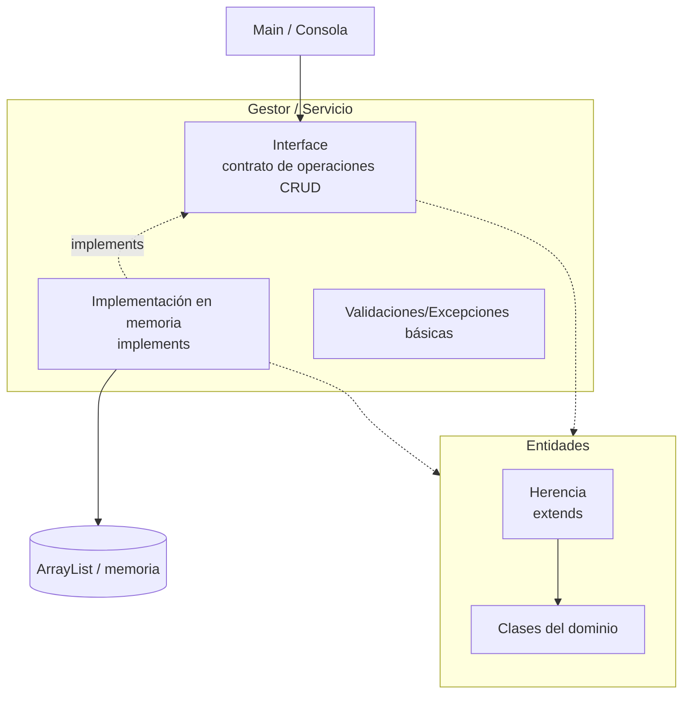
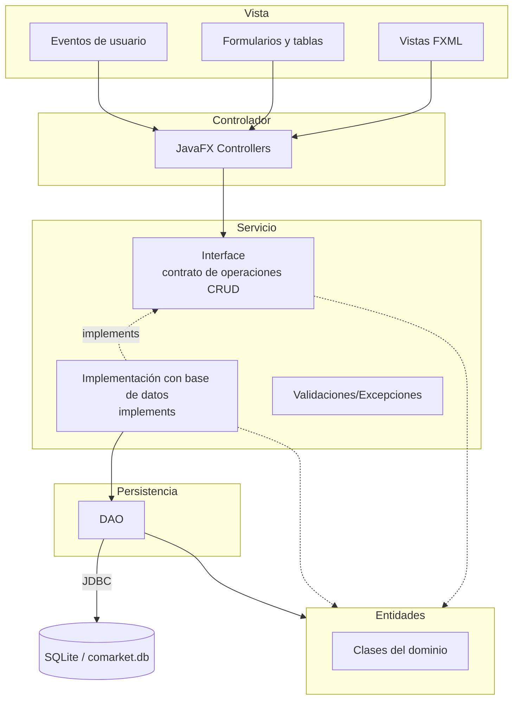
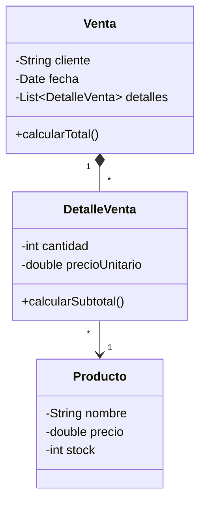

# Programación Orientada a Objetos 2026-2

Curso práctico de Programación Orientada a Objetos con Java, modelado de dominio, encapsulamiento, relaciones entre clases, herencia, polimorfismo, colecciones, arquitectura por capas, persistencia relacional, DAO, JavaFX y sustentación técnica del proyecto integrador.

[`comarket`](https://github.com/262poo/comarket.git) es un repositorio académico para guiar la construcción progresiva de **CoMarket - Sistema Comercial Orientado a Objetos**. La ruta inicia con una aplicación de consola en memoria usando Java y VS Code, avanza hacia una aplicación de escritorio con JavaFX, Scene Builder, DAO, JDBC y SQLite, y culmina con un producto integrado, documentado, ejecutable y sustentado técnicamente.

## Producto del curso

Producto del curso = Producto U3:

```text
CoMarket - Sistema Comercial Orientado a Objetos, con modelo de dominio,
operaciones CRUD, arquitectura por capas, persistencia relacional, interfaz
gráfica funcional, evidencias de funcionamiento y sustentación técnica.
```

Resultado esperado del curso:

Al finalizar el curso, el estudiante diseña, implementa y sustenta una aplicación de escritorio basada en objetos. La solución integra modelado del dominio, encapsulamiento, herencia, polimorfismo, colecciones, persistencia con base de datos relacional, DAO, interfaz gráfica y organización modular del código. El producto se presenta como avance de curso, pero cada estudiante evidencia y defiende su aporte técnico.

## Contenido

### U1: Fundamentos de la Programación Orientada a Objetos

Producto U1: aplicación de consola funcional en memoria con clases, relaciones entre objetos, colecciones, operaciones principales del dominio y preparación para ejecutable nativo.

Resultado esperado U1: el estudiante modela y construye objetos de software aplicando principios fundamentales de programación orientada a objetos, relaciones entre clases y estructuras de almacenamiento en memoria.

| Sesión | Tema | Producto de sesión |
|---|---|---|
| S1 | **Clases, objetos y responsabilidad de clase:**<br>Proyecto Java simple en VS Code, diferencia entre clase y objeto, atributos, métodos, estado, primeras entidades del dominio | Clases base del dominio con atributos, métodos y objetos instanciados desde `Main` |
| S2 | **Encapsulamiento, constructores y control del estado:**<br>Modificadores de acceso, constructores, getters, setters, validaciones básicas, invariantes simples, métodos de comportamiento y pruebas desde `Main` | Clases encapsuladas con constructores, validaciones y comportamiento propio |
| S3 | **Modelado del dominio, asociaciones y colecciones:**<br>Asociación, agregación, composición, colecciones de objetos, navegación entre objetos, relaciones uno a muchos, clase gestora inicial | Modelo inicial con entidades relacionadas y gestor básico sobre una colección |
| S4 | **Herencia y polimorfismo:**<br>Herencia con entidades usando `extends`, clase base, subclases, sobrescritura de métodos, polimorfismo con interface e `implements`, separación de responsabilidades | Entidades con herencia y primer contrato polimórfico implementado |
| S5 | **CRUD en memoria con ArrayList:**<br>Alta, consulta, actualización, eliminación, búsqueda, ordenamiento, flujo Main-Interface-Implementación en memoria-Entidades-ArrayList, introducción a Maven y compilación nativa con GraalVM para la entrega | CRUD en memoria organizado con contrato, implementación en memoria, entidades y ArrayList, preparado para ejecutable nativo |
| S6 | **Evaluación de la unidad 1:**<br>Clases del dominio, encapsulamiento, constructores, relaciones entre objetos, CRUD en memoria, búsquedas, validaciones básicas y ejecución del producto | Producto U1 validado con modelo de dominio, CRUD en memoria y ejecución demostrable |

### U2: Aplicación de escritorio con persistencia de datos

Producto U2: aplicación de escritorio funcional con arquitectura por capas, interfaz gráfica y persistencia en base de datos relacional.

Resultado esperado U2: el estudiante construye aplicaciones de escritorio organizadas por capas, integrando persistencia de datos, acceso a información e interfaz gráfica mediante una arquitectura modular.

| Sesión | Tema | Producto de sesión |
|---|---|---|
| S7 | **Interfaz gráfica de usuario:**<br>Aplicación de escritorio con JavaFX, FXML, Scene Builder, controladores, formularios, eventos y navegación básica | Pantallas y controladores integrados con eventos de usuario |
| S8 | **CRUD desde GUI en memoria:**<br>Flujo Vista-Controlador-Servicio-Entidades-ArrayList, reutilización del contrato de operaciones CRUD, carga de datos en tablas, registro, consulta, edición y eliminación | Flujo completo de operación desde formularios y tablas JavaFX usando memoria |
| S9 | **Arquitectura por capas y persistencia relacional:**<br>Organización por capas, clase de conexión, fundamentos de JDBC, base de datos relacional embebida | Proyecto preparado con paquetes, conexión relacional y separación de responsabilidades |
| S10 | **Patrón DAO y operaciones CRUD persistentes desde GUI:**<br>Flujo Vista-Controlador-Servicio-Entidades-DAO, carga de datos en tablas, registro, consulta, edición, eliminación, confirmación de eliminación y manejo inicial de excepciones | CRUD persistente funcional desde formularios y tablas JavaFX |
| S11 | **Validación de datos y pruebas del flujo principal:**<br>Validaciones de formulario, mensajes al usuario, manejo de excepciones, pruebas manuales y corrección de errores funcionales | GUI y persistencia validadas con pruebas del flujo principal |
| S12 | **Evaluación de la unidad 2:**<br>Conexión a base de datos, DAO funcional, GUI operativa, validaciones, manejo básico de errores, flujo funcional completo | Producto U2 validado con arquitectura, persistencia e interfaz gráfica |

### U3: Proyecto Integrador CoMarket

Producto U3 / producto del curso: **CoMarket - Sistema Comercial Orientado a Objetos**.

Resultado esperado U3: el estudiante integra el modelo orientado a objetos, la interfaz gráfica, la persistencia de datos y la organización modular del código en una aplicación completa alineada al proyecto integrador del curso.

| Sesión | Tema | Producto de sesión |
|---|---|---|
| S13 | **Integración del sistema:**<br>Revisión de alcance, integración de módulos, consistencia entre paquetes, nombres, flujo, dependencias, recursos y preparación inicial para ejecutable nativo | Modelo, GUI, persistencia y funcionalidades principales ensambladas |
| S14 | **Validación y refinamiento:**<br>Corrección de fallos, limpieza de código, organización final, mensajes, validaciones, consistencia visual, flujo crítico, ejecutable nativo y preparación para sustentación | Manejo de errores, corrección de observaciones, refinamiento del diseño, ejecutable nativo y preparación para sustentación |
| S15 | **Sustentación del proyecto CoMarket:**<br>Demostración funcional, arquitectura, modelo de dominio, persistencia, defensa técnica del proyecto | Demostración funcional, arquitectura, modelo de dominio, persistencia y defensa técnica |
| S16 | **Evaluación final del proyecto integrador:**<br>Proyecto ejecutable, flujo principal, persistencia operativa, GUI validada, documentación mínima, sustentación técnica | Evaluación individual, recuperación de sustentaciones pendientes y cierre académico |

## Arquitectura U1: CoMarket en memoria

La arquitectura de la Unidad 1 se concentra en Programación Orientada a Objetos sin interfaz gráfica. El estudiante trabaja con una clase `Main` para probar desde consola, entidades del dominio, un contrato de servicio y una implementación en memoria con colecciones. Al cierre de la unidad, el proyecto se organiza con Maven y se prepara un ejecutable nativo con GraalVM.



Nota metodológica: en U1 se trabaja una base elemental de separación de responsabilidades, alineada al principio de responsabilidad única de SOLID. `Main` coordina la ejecución, las entidades representan datos y comportamiento propio del dominio, la interface declara el contrato de operaciones CRUD y la implementación en memoria ejecuta las operaciones sobre `ArrayList`. No se introducen interfaces en entidades porque pueden complicar el modelo sin aportar claridad en esta etapa.

Stack tecnológico U1:

1. Java como lenguaje orientado a objetos.
2. VS Code como entorno inicial de edición y ejecución.
3. Proyecto Java simple para clases, objetos y pruebas desde `Main`.
4. Consola para verificar comportamiento y resultados.
5. ArrayList para almacenamiento en memoria.
6. Maven desde S5 para organizar compilación y preparación de entrega.
7. GraalVM desde S5 para generar ejecutable nativo.

Flujo de trabajo U1:

1. El estudiante crea un proyecto Java simple en VS Code.
2. Implementa entidades iniciales del dominio y las prueba desde `Main`.
3. Desde S2 mueve comportamiento y validaciones básicas hacia las clases.
4. Desde S3 introduce una clase gestora para administrar colecciones y reducir lógica en `Main`.
5. En S4 usa herencia en entidades cuando el dominio lo justifica y aplica polimorfismo con interface e `implements`.
6. En S5 formaliza el flujo Main-Interface-Implementación en memoria-Entidades-ArrayList y prepara la compilación nativa con Maven/GraalVM.
7. En S6 presenta un producto de consola ejecutable, con modelo de dominio y CRUD en memoria.

## Arquitectura CoMarket POO: U2 y U3

La arquitectura final de CoMarket organiza la aplicación de escritorio en capas simples. La Vista contiene FXML, formularios y tablas; el Controlador atiende eventos de usuario; el Servicio conserva el contrato de operaciones CRUD trabajado desde U1, pero en U2-U3 se implementa contra base de datos; las Entidades representan los objetos principales del sistema; y la Persistencia gestiona el acceso mediante DAO y el conector JDBC.



Convención del diagrama: las flechas muestran el flujo principal entre capas. El Controlador recibe acciones de la Vista y delega operaciones al contrato del Servicio. En U1 ese contrato se implementa en memoria con `ArrayList`; en U2-U3 se implementa contra base de datos mediante DAO y SQLite. Las Entidades se mantienen como las mismas clases del dominio; no se cambian por pasar de memoria a base de datos. El DAO trabaja con entidades para convertir datos relacionales en objetos y objetos en operaciones de persistencia; la comunicación con SQLite se realiza mediante JDBC.

Stack tecnológico U2:

1. Java como lenguaje orientado a objetos.
2. IntelliJ IDEA como entorno base de trabajo para JavaFX.
3. Maven para dependencias, compilación y ejecución.
4. JavaFX con FXML y controladores para interfaz gráfica.
5. Scene Builder para diseño visual de vistas FXML.
6. JDBC para acceso a datos.
7. SQLite como base de datos local.
8. MkDocs Material para documentación y evidencias.

Stack tecnológico U3:

1. Java, Maven, JavaFX, Scene Builder, JDBC y SQLite integrados en el producto final.
2. GraalVM para generar el ejecutable nativo de CoMarket.
3. MkDocs Material para documentación, evidencias y preparación de sustentación.

## Detalle del componente Entidades

El siguiente diagrama detalla el componente `Entidades` de la arquitectura CoMarket POO. Estas clases representan los objetos principales que usan el Controlador y el DAO para ejecutar operaciones de interfaz, validación y persistencia.



En U2 y U3 este modelo se consolida alrededor del flujo comercial principal. La relación entre `Venta`, `DetalleVenta` y `Producto` sirve como referencia para integrar interfaz gráfica, entidades y persistencia relacional.

Flujo de trabajo U2-U3:

1. La Unidad 2 inicia un proyecto JavaFX/Maven en IntelliJ IDEA.
2. El estudiante diseña vistas FXML con Scene Builder y conecta eventos mediante controladores.
3. Primero implementa CRUD desde GUI en memoria reutilizando el contrato de servicio y una implementación basada en `ArrayList`.
4. Luego incorpora JDBC, DAO y SQLite agregando una implementación persistente del mismo contrato de servicio.
5. Valida formularios, maneja excepciones, prueba el flujo principal y corrige errores funcionales.
6. La Unidad 3 integra pantallas, controladores, servicios, entidades, DAO, base de datos, documentación y evidencias.
7. En S13 y S14 estabiliza el producto y genera el ejecutable nativo final con GraalVM.
8. En S15 y S16 sustenta y defiende técnicamente CoMarket.

## Enlaces

- [S1: Clases, objetos y responsabilidad](S01_Clases_Objetos.md)
- [S2: Encapsulamiento y constructores](S02_Encapsulamiento_Constructores.md)
- [S3: Modelado del dominio y colecciones](S03_Modelado_Dominio_Colecciones.md)
- [S4: Herencia y polimorfismo](S04_Herencia_Polimorfismo.md)
- [S5: CRUD en memoria con ArrayList](S05_CRUD_Memoria_ArrayList.md)
- [S6: Evaluacion unidad 1](S06_Evaluacion_Unidad_1.md)
- [S7: Interfaz grafica de usuario](S07_Interfaz_Grafica_Usuario.md)
- [S8: CRUD desde GUI en memoria](S08_CRUD_GUI_Memoria.md)
- [S9: Arquitectura por capas y persistencia relacional](S09_Arquitectura_Persistencia.md)
- [S10: Patron DAO y operaciones CRUD persistentes desde GUI](S10_DAO_CRUD_GUI.md)
- [S11: Validacion de datos y pruebas](S11_Validacion_Integracion_Pruebas.md)
- [S12: Evaluacion unidad 2](S12_Evaluacion_Unidad_2.md)
- [S13: Integracion del sistema](S13_Proyecto_Integrador_Ensamblaje.md)
- [S14: Validacion y refinamiento](S14_Proyecto_Integrador_Refinamiento.md)
- [S15: Sustentacion del proyecto CoMarket](S15_Documentacion_Demo.md)
- [S16: Evaluacion final](S16_Evaluacion_Final.md)
- [Taller POO 01](POOTaller01.md)
