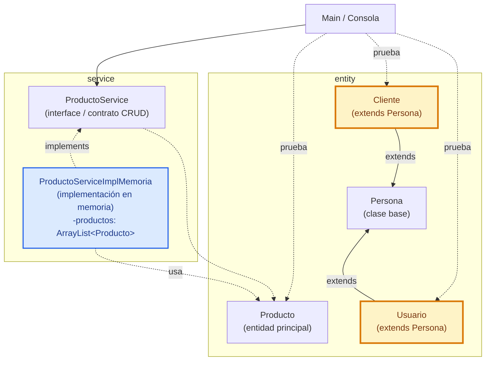
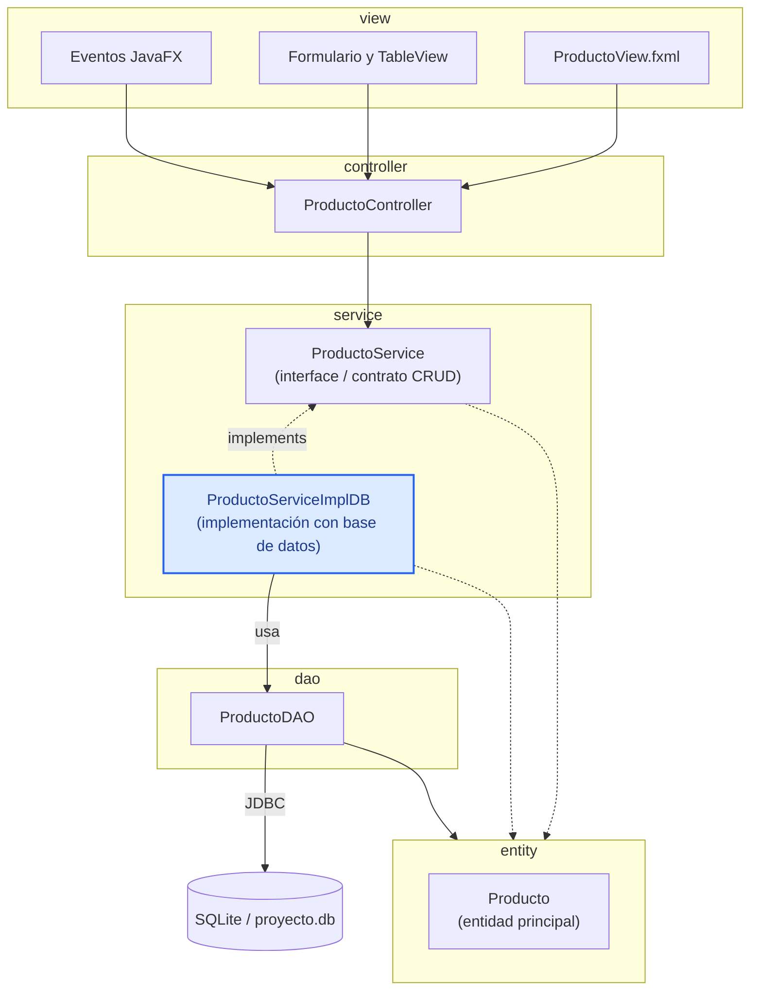
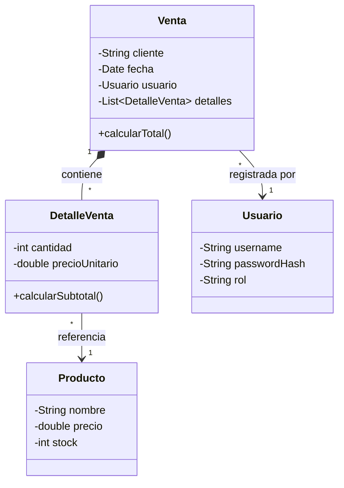

# Programación Orientada a Objetos (POO)

**Recursos del curso de POO 2026-2**

**Institución:** Universidad Peruana Unión  
**Año:** 2026  
**Repositorio:** [262poo/comarket](https://github.com/262poo/comarket)   

---

## Presentación

Curso práctico de Programación Orientada a Objetos con Java, modelado de dominio, encapsulamiento, relaciones entre clases, herencia, polimorfismo, colecciones, arquitectura por capas, persistencia relacional, DAO, JavaFX y sustentación técnica del proyecto integrador.

[`comarket`](https://github.com/262poo/comarket.git) es un repositorio académico de referencia para guiar la construcción progresiva de un **sistema orientado a objetos**. En este repositorio se usa CoMarket como caso base, pero cada docente o filial puede adaptar el dominio del proyecto integrador según su contexto. La ruta inicia en `comarket-cli` con una aplicación de consola en memoria usando Java y VS Code, avanza en `comarket-desk` hacia una aplicación de escritorio con JavaFX, Scene Builder, DAO, JDBC y SQLite, y culmina con un producto integrado, documentado, ejecutable y sustentado técnicamente.

## Organización del repositorio

```text
comarket/
    comarket-cli/      Producto U1: consola, POO, colecciones y gestión de datos en memoria
    comarket-desk/     Producto U2-U3: GUI, arquitectura por capas, acceso a datos y persistencia relacional
    docs/              Libro digital, evidencias y guía de sesiones
```

Esta separación permite que la Unidad 1 conserve un proyecto simple de consola y que la Unidad 2 evolucione en un proyecto JavaFX/Maven independiente. `comarket-desk` puede abrirse y ejecutarse desde IntelliJ IDEA; `comarket-cli` queda reservado para el trabajo base de consola de la Unidad 1.

## Producto del curso

Producto del curso = Producto U3:

```text
Aplicación de escritorio orientada a objetos aplicada a un proceso
transaccional de negocio, con modelo de dominio, entidades maestras y
transaccionales, relaciones entre entidades, flujo principal de gestión,
arquitectura por capas, persistencia relacional, interfaz gráfica funcional,
demo funcional, evidencias de funcionamiento y sustentación técnica.
```

Resultado de aprendizaje del curso:

Al finalizar el curso, el estudiante diseña, implementa y sustenta una aplicación de escritorio basada en objetos. La solución integra modelado del dominio, encapsulamiento, herencia, polimorfismo, colecciones, persistencia con base de datos relacional, DAO, interfaz gráfica y organización modular del código.

## Contenido

### U1: Fundamentos de la Programación Orientada a Objetos

Producto U1: aplicación de consola orientada a objetos con gestión de datos en memoria.

Resultado de aprendizaje U1: al finalizar la unidad, el estudiante modela e implementa una aplicación de consola basada en objetos, aplicando clases, objetos, encapsulamiento, relaciones entre entidades, herencia o interfaces cuando correspondan, polimorfismo, colecciones y gestión de datos en memoria.

| Sesión | Tema | Producto de sesión |
|---|---|---|
| S1 | **Entorno de programación, estructuras de control, métodos y estructuras de datos lineales:**<br>Preparación del ambiente local, variables, entrada y salida, condicionales, ciclos, métodos, estructuras lineales, recorridos, búsquedas y representación temporal de datos mediante estructuras separadas | Programa de consola organizado mediante métodos que administra datos simples con arrays y `ArrayList`, e identifica la necesidad de agrupar los datos mediante objetos |
| S2 | **Clases, objetos, constructores y comunicación entre objetos:**<br>Diferencia entre clase y objeto, atributos, métodos, estado, comportamiento, abstracción inicial, constructores, sobrecarga, comunicación entre objetos y responsabilidad como características y acciones de una clase | Primer modelo con clases del dominio, objetos instanciados y comunicación básica entre ellos, usando objetos tangibles como `Coche` y `Persona` y un ejemplo puente con `Producto` |
| S3 | **Encapsulamiento, separación de responsabilidades y relaciones entre objetos:**<br>Modificadores de acceso, métodos de consulta y modificación, comportamiento básico de entidades, separación inicial de responsabilidades, asociación, agregación/composición y colecciones dentro del modelo | Modelo de dominio encapsulado, organizado por responsabilidades y con relaciones entre entidades, probado desde un programa principal |
| S4 | **Herencia, interfaces y polimorfismo:**<br>Generalización, clase base o clase abstracta cuando el dominio lo justifica, sobrescritura de métodos, contratos, implementaciones y uso polimórfico desde el servicio | Modelo ampliado con herencia, contrato de servicio e implementación polimórfica |
| S5 | **Operaciones CRUD, validaciones y responsabilidad única:**<br>Registro, listado, búsqueda, actualización, eliminación, menú de consola, validaciones de flujo, almacenamiento interno en memoria, consolidación de responsabilidad única y preparación para entrega | Gestión de datos en memoria organizada con menú, validaciones, contrato, implementación con colecciones dinámicas y entidades |
| S6 | **Modelado orientado a objetos y gestión de datos en memoria (Evaluación U1):**<br>Cierre del Producto U1: aplicación de consola orientada a objetos con clases del dominio, encapsulamiento, constructores, relaciones entre objetos, herencia o interfaces cuando correspondan, gestión de datos en memoria, búsquedas, validaciones y ejecución del producto | Producto U1 validado con modelo orientado a objetos, gestión de datos en memoria y ejecución demostrable |

### U2: Aplicación de escritorio con persistencia de datos

Producto U2: aplicación de escritorio por capas con interfaz gráfica y persistencia relacional.

Resultado de aprendizaje U2: al finalizar la unidad, el estudiante construye una aplicación de escritorio organizada por capas, integrando interfaz gráfica, acceso a datos, persistencia relacional, seguridad básica, consultas y gestión de un flujo transaccional con cabecera y detalle.

| Sesión | Tema | Producto de sesión |
|---|---|---|
| S7 | **Interfaz gráfica y gestión de datos desde GUI en memoria:**<br>Aplicación de escritorio con interfaz gráfica, vista, controladores, formularios, eventos, tablas y gestión de datos en memoria de una entidad ya trabajada en U1. Validación básica al cierre de la sesión | Flujo vista-controlador-servicio-entidad funcionando desde GUI con memoria |
| S8 | **Arquitectura por capas, patrón DAO y gestión persistente desde GUI:**<br>Organización por capas, acceso a datos, base de datos relacional local, DAO, servicio persistente, formularios, tablas, operaciones de gestión persistentes y validación de datos de una tabla simple | Gestión persistente desde GUI con arquitectura por capas y acceso a datos |
| S9 | **Operaciones persistentes con relación muchos a muchos:**<br>Modelo de dominio con cabecera, detalle y entidad relacionada; tabla intermedia con atributos, cálculo de subtotales/totales, control de stock, persistencia y validaciones del flujo | Flujo persistente con relación muchos a muchos y tabla intermedia |
| S10 | **Seguridad básica y relación uno a muchos:**<br>Usuario, autenticación básica, sesión activa, relación uno a muchos, operaciones persistentes asociadas al usuario, validaciones de acceso y manejo básico de errores | Seguridad básica y operaciones persistentes con relación uno a muchos |
| S11 | **Consultas integradas y pruebas del flujo principal:**<br>Búsquedas, filtros, consultas maestro-detalle, consultas por fecha/usuario, totales, verificación de consistencia, manejo de errores y pruebas funcionales por capas | Consultas integradas y flujo principal probado |
| S12 | **Aplicaciones de escritorio por capas y gestión de datos persistentes (Evaluación U2):**<br>Cierre del Producto U2: aplicación de escritorio por capas con interfaz gráfica, acceso a datos, persistencia relacional, relaciones, seguridad básica, consultas, validaciones y pruebas | Producto U2 validado con interfaz gráfica, persistencia relacional, flujo transaccional, relaciones y seguridad básica |

### U3: Proyecto Integrador

Producto U3 / producto del curso: **sistema orientado a objetos integrado para un proceso transaccional de negocio**.

Resultado de aprendizaje U3: al finalizar la unidad, el estudiante integra, valida y sustenta una aplicación de escritorio orientada a objetos, articulando modelo de dominio, interfaz gráfica, persistencia relacional, flujo transaccional, arquitectura por capas, evidencias de funcionamiento y demo técnica.

| Sesión | Tema | Producto de sesión |
|---|---|---|
| S13 | **Integración del sistema:**<br>Revisión de alcance, integración de módulos, consistencia entre paquetes, nombres, flujo, dependencias, recursos y preparación inicial para ejecutable nativo | Modelo, GUI, persistencia y funcionalidades principales ensambladas |
| S14 | **Validación, refinamiento y ejecutable nativo:**<br>Corrección de fallos, limpieza de código, organización final, mensajes, validaciones, consistencia visual, flujo crítico, ejecutable nativo y preparación para sustentación | Manejo de errores, corrección de observaciones, refinamiento del diseño, ejecutable nativo y preparación para sustentación |
| S15 | **Sistema orientado a objetos integrado (Evaluación U3):**<br>Cierre del Producto U3: sistema orientado a objetos integrado para un proceso transaccional de negocio, con modelo de dominio, entidades maestras y transaccionales, arquitectura por capas, persistencia relacional, interfaz gráfica funcional, demo, evidencias de funcionamiento y sustentación técnica | Producto U3 validado mediante demo funcional, evidencias de funcionamiento y sustentación técnica |
| S16 | **Evaluación final individual:**<br>Evaluación individual, recuperación de sustentaciones pendientes y cierre académico del curso | Evaluación final individual, recuperacion de sustentaciones pendientes y cierre académico |

## Arquitectura base U1: aplicación de consola en memoria

La arquitectura de la Unidad 1 se concentra en Programación Orientada a Objetos sin interfaz gráfica y se trabaja dentro de `comarket-cli`. El estudiante trabaja con una clase `Main` para probar desde consola, entidades del dominio ubicadas en `entity`, un contrato de servicio y una implementación en memoria ubicados en `service`. En el caso guía se implementa un CRUD de productos con `ProductoService`, `ProductoServiceImplMemoria` y `ArrayList<Producto>`, pero esos nombres se reemplazan por la entidad principal de cada proyecto cuando el dominio sea distinto. Al cierre de la unidad, el proyecto se organiza con Maven y se prepara un ejecutable nativo con GraalVM.



Las validaciones básicas se aplican principalmente en el flujo CRUD de S5, dentro del servicio o de los métodos de la entidad según la responsabilidad.

Nota metodológica: en S1 se recuperan estructuras de control, métodos, arrays y `ArrayList` mediante datos simples; todavía no se crean clases propias del dominio. Las listas paralelas permiten mostrar la dificultad de mantener separados los datos que pertenecen a una misma entidad y preparan la aparición de clases y objetos en S2. En las sesiones siguientes se trabaja progresivamente el encapsulamiento, la separación de responsabilidades, las relaciones entre entidades, la herencia, las interfaces, el polimorfismo y las operaciones CRUD. No se introducen interfaces en entidades porque pueden complicar el modelo sin aportar claridad en esta etapa.

Stack tecnologico U1:

1. Java cómo lenguaje orientado a objetos.
2. VS Code cómo entorno inicial de edición y ejecución.
3. Proyecto Java simple para repasar estructuras de control, métodos y estructuras de datos lineales.
4. Consola para verificar comportamiento y resultados.
5. ArrayList para almacenamiento en memoria.
6. Maven verificado desde S1 y utilizado posteriormente para organizar la compilación y la entrega.
7. GraalVM desde S5 para generar ejecutable nativo.

Flujo de trabajo U1:

1. El estudiante prepara y verifica el entorno de programación.
2. En S1 recupera estructuras de control, métodos, arrays y `ArrayList` usando datos simples y listas paralelas.
3. En S2 transforma los datos separados en clases y objetos que se comunican.
4. En S3 encapsula las entidades, separa responsabilidades y representa relaciones dentro del modelo del dominio.
5. En S4 refuerza el modelo con herencia cuando el dominio lo justifica y aplica polimorfismo con `interface` e `implements`.
6. En S5 completa las operaciones CRUD, las validaciones y el menú, consolidando la responsabilidad única.
7. En S6 presenta un producto de consola ejecutable, con modelo de dominio y CRUD en memoria.

## Arquitectura base U2 y U3: Aplicación Desktop

La arquitectura final del proyecto integrador se implementa dentro de `comarket-desk` y organiza la aplicación de escritorio en capas simples. `view` contiene FXML, formularios y tablas JavaFX; `controller` atiende eventos de usuario; `service` conserva el contrato de operaciones CRUD trabajado desde U1, pero en U2-U3 se implementa contra base de datos; `entity` representa los objetos principales del sistema; y `dao` gestiona el acceso a datos mediante JDBC. En el caso guía se muestra el flujo de productos; cada proyecto reemplaza esos nombres por su entidad principal.



Convención del diagrama: las flechas muestran el flujo principal entre capas. `controller` recibe acciones de `view` y delega operaciones al contrato de `service`. En U1 ese contrato se implementa en memoria con `ArrayList`; en U2-U3 se implementa contra base de datos mediante DAO y SQLite. Las clases de `entity` se mantienen cómo las mismas clases del dominio; no se cambian por pasar de memoria a base de datos. El DAO ubicado en `dao` trabaja con entidades para convertir datos relacionales en objetos y objetos en operaciones de persistencia; la comunicación con SQLite se realiza mediante JDBC. Las validaciones y excepciones se tratan como responsabilidad transversal y pueden ubicarse en `service`, `entity` o en un paquete `exception` según el caso; no se representan como capa principal del flujo. Si el proyecto no usa productos, se reemplazan `ProductoView`, `ProductoController`, `ProductoService`, `ProductoServiceImplDB`, `ProductoDAO` y `Producto` por los nombres del dominio elegido.

Stack tecnologico U2:

1. Java cómo lenguaje orientado a objetos.
2. IntelliJ IDEA cómo entorno base de trabajo para JavaFX.
3. Maven para dependencias, compilación y ejecución.
4. JavaFX con FXML y controladores para interfaz gráfica.
5. Scene Builder para diseño visual de vistas FXML.
6. JDBC para acceso a datos.
7. SQLite cómo base de datos local.
8. MkDocs Material para documentacion y evidencias.

Stack tecnologico U3:

1. Java, Maven, JavaFX, Scene Builder, JDBC y SQLite integrados en el producto final.
2. GraalVM para generar el ejecutable nativo del producto final.
3. MkDocs Material para documentacion, evidencias y preparación de sustentación.

## Detalle del componente `entity`

El siguiente diagrama detalla el componente `entity` de una arquitectura POO de referencia. Estas clases representan objetos principales de un dominio comercial; pueden adaptarse a otros dominios definidos por el docente o la filial.



En U2 y U3 este modelo se consolida alrededor del flujo comercial principal. La relación entre `Venta`, `DetalleVenta`, `Producto` y `Usuario` sirve cómo referencia para integrar interfaz gráfica, entidades, seguridad básica y persistencia relacional.

Flujo de trabajo U2-U3:

1. La Unidad 2 inicia o continúa el proyecto JavaFX/Maven ubicado en `comarket-desk` desde IntelliJ IDEA.
2. En S7 pasa de consola a GUI y reutiliza el servicio en memoria de una entidad simple.
3. En S8 incorpora arquitectura por capas, DAO, JDBC y SQLite con CRUD persistente para una tabla simple.
4. En S9 implementa operaciones persistentes con relación muchos a muchos mediante cabecera, detalle y tabla intermedia.
5. En S10 agrega seguridad básica y una relación uno a muchos asociada al usuario.
6. En S11 desarrolla consultas integradas, filtros, pruebas funcionales y correcciones por sesión.
7. La Unidad 3 integra pantallas, controladores, servicios, entidades, DAO, base de datos, documentacion y evidencias.
8. En S13 y S14 estabiliza el producto y genera el ejecutable nativo final con GraalVM.
9. En S15 cierra el Producto U3 mediante demostración funcional y defensa técnica.
10. En S16 se realiza la evaluación final individual, la recuperación de sustentaciones pendientes y el cierre académico.

## Enlaces

- [S1: Entorno de programación, estructuras de control, métodos y estructuras de datos lineales](S01_Fundamentos_Estructuras_Datos.md)
- [S2: Clases, objetos, constructores y comunicación entre objetos](S02_Clases_Objetos.md)
- [S3: Encapsulamiento, separación de responsabilidades y relaciones entre objetos](S03_Encapsulamiento_Relaciones.md)
- [S4: Herencia, interfaces y polimorfismo](S04_Herencia_Polimorfismo.md)
- [S5: Operaciones CRUD, validaciones y responsabilidad única](S05_CRUD_Memoria_ArrayList.md)
- [S6: Modelado orientado a objetos y gestión de datos en memoria](S06_Evaluacion_Unidad_1.md)
- [S7: Interfaz grafica y CRUD desde GUI en memoria](S07_GUI_CRUD_Memoria.md)
- [S8: Arquitectura por capas, DAO y CRUD persistente desde GUI](S08_Arquitectura_DAO_CRUD_Persistente.md)
- [S9: Operaciones persistentes con relación muchos a muchos](S09_Operaciones_Persistentes_Muchos_Muchos.md)
- [S10: Seguridad básica y relación uno a muchos](S10_Seguridad_Relacion_Uno_Muchos.md)
- [S11: Consultas integradas y pruebas](S11_Consultas_Integradas_Pruebas.md)
- [S12: Aplicaciones de escritorio por capas y gestión de datos persistentes](S12_Evaluacion_Unidad_2.md)
- [S13: Integracion del sistema](S13_Proyecto_Integrador_Ensamblaje.md)
- [S14: Validacion y refinamiento](S14_Proyecto_Integrador_Refinamiento.md)
- [S15: Sistema orientado a objetos integrado](S15_Documentacion_Demo.md)
- [S16: Evaluación final individual](S16_Evaluacion_Final.md)
- [Taller POO 01: construir el producto U1 en consola](POOTaller01.md)
- [Taller POO 02: construir el proyecto U2 con JavaFX, Maven y SQLite](POOTaller02.md)
