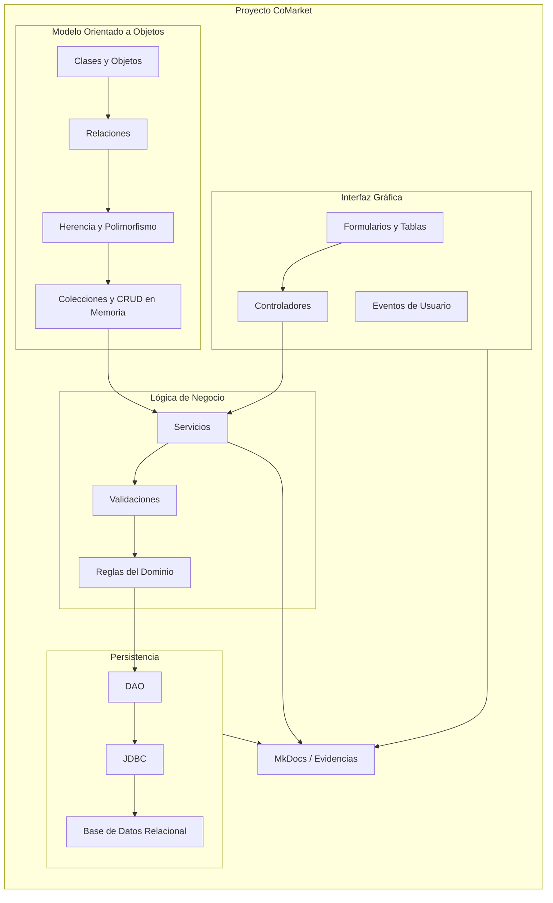

# Programación Orientada a Objetos 2026-2

# Proyecto Integrador del Curso

## CoMarket

[**CoMarket**](https://github.com/262poo/comarket.git) es el repositorio académico del curso para guiar la construcción de un sistema comercial de escritorio aplicando Programación Orientada a Objetos con Java, IntelliJ IDEA, arquitectura por capas, interfaz gráfica y persistencia relacional.

El proyecto organiza el curso de POO mediante una ruta incremental que parte del modelado de clases y objetos, continúa con colecciones, herencia, polimorfismo, persistencia y GUI, y culmina con una aplicación integrada, documentada y sustentada.

Por tratarse de una aplicación de escritorio con JavaFX, el desarrollo del proyecto se realiza en **IntelliJ IDEA**. Este repositorio no pretende ser un entorno de desarrollo embebido; funciona como base documental, guía clonable y referencia de estructura para que el estudiante cree y mantenga su proyecto Java en IntelliJ IDEA.

A diferencia de los proyectos integradores de ciclo que articulan varios cursos, este repositorio corresponde a **un solo curso**. Todo el avance, las evidencias y la sustentación se concentran en Programación Orientada a Objetos.

## Uso como Plantilla

Este repositorio funciona como **plantilla documental del curso**. Cada estudiante o equipo puede clonarlo o crear su propio repositorio a partir de él para conservar las guías, evidencias y estructura de trabajo, mientras desarrolla la aplicación de escritorio en IntelliJ IDEA.

```text
262poo/comarket
|-- repo base del curso
|-- documentación MkDocs
|-- sílabo
|-- sesiones de aprendizaje
`-- taller complementario
```

Cada grupo adapta su propio proyecto JavaFX en IntelliJ IDEA según su avance:

```text
comarket-grupo-01
|-- proyecto JavaFX/Maven en IntelliJ IDEA
|-- modelo en memoria
|-- persistencia relacional
`-- interfaz gráfica JavaFX

comarket-grupo-02
|-- proyecto JavaFX/Maven en IntelliJ IDEA
|-- modelo en memoria
|-- persistencia relacional
`-- interfaz gráfica JavaFX
```

---

# Arquitectura Inicial

La arquitectura inicial organiza el trabajo del curso en capas simples y conectadas: modelo de dominio, servicios, acceso a datos, interfaz gráfica y base de datos.



# Objetivo del Curso

Diseñar e implementar aplicaciones de escritorio aplicando principios de programación orientada a objetos, modelado del dominio, encapsulamiento, herencia, polimorfismo, persistencia de datos y organización modular del código.

El curso busca que el estudiante construya una solución mantenible, reutilizable e integrada entre interfaz gráfica, lógica de negocio y almacenamiento de información.

---

# Alcance del Proyecto

CoMarket se trabaja con una profundidad progresiva según la unidad académica del curso. Esta regla evita intentar construir todo el sistema desde el inicio y permite que cada sesión agregue una pieza verificable.

## Unidad 1: Fundamentos de POO

En la primera unidad se trabaja:

* Clases, objetos, atributos, métodos y responsabilidad de clase.
* Encapsulamiento, constructores, modificadores de acceso y validación de atributos.
* Asociaciones, agregación, composición y navegación entre objetos.
* Herencia, reutilización de código, sobrescritura de métodos y polimorfismo.
* Colecciones, generics, ArrayList, búsqueda, ordenamiento y CRUD en memoria.

### Producto

**Aplicación funcional en memoria con clases, relaciones entre objetos, colecciones y operaciones principales del dominio.**

---

## Unidad 2: Aplicación de Escritorio con Persistencia de Datos

En la segunda unidad se trabaja:

* Arquitectura por capas y separación de responsabilidades.
* Persistencia de datos con base de datos relacional.
* JDBC y conexión a base de datos.
* Patrón DAO y operaciones CRUD persistentes.
* Formularios, componentes visuales, eventos y navegación.
* Integración GUI, lógica de negocio y persistencia.
* Validación de datos y pruebas del flujo principal.

### Producto

**Aplicación de escritorio funcional con arquitectura por capas, interfaz gráfica y persistencia en base de datos relacional.**

---

## Unidad 3: Proyecto Integrador CoMarket

En la tercera unidad se trabaja:

* Integración del modelo de dominio.
* Integración de la interfaz gráfica.
* Integración de persistencia.
* Consolidación funcional del sistema.
* Validación, manejo de errores y refinamiento del diseño.
* Documentación técnica básica.
* Demostración funcional y sustentación técnica.

### Producto

**CoMarket - Sistema Comercial Orientado a Objetos.**

---

# Hitos del Curso

Los hitos coinciden con las sesiones de evaluación y sustentación, de modo que el avance de CoMarket se revise en momentos claros del curso.

## Hito 1 - Evaluación Unidad 1

### Sesión de evaluación

* POO: Sesión 6.

### Evidencia esperada

* Modelo de dominio implementado en memoria.
* Clases encapsuladas con constructores y validaciones.
* Relaciones entre objetos.
* Colecciones y operaciones CRUD en memoria.

---

## Hito 2 - Evaluación Unidad 2

### Sesión de evaluación

* POO: Sesión 12.

### Evidencia esperada

* Arquitectura por capas.
* DAO funcional.
* Persistencia en base de datos relacional.
* Interfaz gráfica con CRUD integrado.
* Validaciones y pruebas del flujo principal.

---

## Hito 3 - Sustentación del Proyecto

### Sesión de sustentación

* POO: Sesión 15.

### Evidencia esperada

* Demostración funcional de CoMarket.
* Presentación de la arquitectura.
* Presentación del modelo de dominio.
* Presentación de persistencia.
* Defensa técnica del proyecto.

---

## Cierre Final

### Sesión de cierre

* POO: Sesión 16.

### Evidencia esperada

* Evaluación individual.
* Recuperación de sustentaciones pendientes.
* Levantamiento o corrección de observaciones.
* Cierre académico del proyecto.

---

# Producto Final del Curso

**CoMarket - Sistema Comercial Orientado a Objetos.**

El producto final incluye modelo de dominio, clases y relaciones implementadas, encapsulamiento, herencia, polimorfismo, colecciones, CRUD, arquitectura por capas, persistencia relacional, DAO, interfaz gráfica funcional, evidencias de funcionamiento y sustentación técnica.
