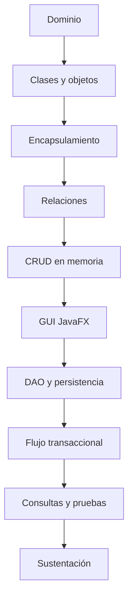

# Proyecto Sello de Programación Orientada a Objetos

## 1. Propósito

El Proyecto Sello integra las sesiones de **Programación Orientada a Objetos** alrededor de una misma aplicación que evoluciona desde consola hasta escritorio. Durante el semestre no se construyen ejercicios independientes; cada tema fortalece el mismo sistema hasta convertirlo en una solución orientada a objetos, persistente, integrada y sustentable.

```text
Dominio -> Clases -> Relaciones -> CRUD -> GUI -> Persistencia -> Integración -> Sustentación
```

## 2. El Proyecto

Durante el semestre desarrollarás una **aplicación de escritorio orientada a objetos** aplicada a un proceso transaccional de negocio.

El proyecto debe partir de un dominio claro, con entidades maestras y transaccionales, relaciones entre objetos, operaciones de gestión, interfaz gráfica, persistencia relacional y arquitectura por capas.

El proyecto debe cumplir estas condiciones:

- Modelar un dominio de negocio concreto.
- Definir entidades, atributos, comportamientos y relaciones.
- Aplicar encapsulamiento, responsabilidades, herencia, interfaces o polimorfismo cuando el dominio lo justifique.
- Evolucionar de consola en memoria hacia aplicación JavaFX con persistencia.
- Integrar arquitectura por capas, DAO, JDBC y SQLite.
- Ser sustentado técnicamente por todos los integrantes del equipo.

No se considera Proyecto Sello:

- Clases aisladas sin dominio común.
- Ejercicios de POO sin aplicación integrada.
- Un CRUD sin modelo de dominio ni relaciones.
- Una GUI desconectada de servicios, entidades o persistencia.
- Un proyecto que el estudiante no pueda explicar en código y ejecución.

## 3. Evolución del Proyecto

| Unidad | Temas principales | Evolución del proyecto |
|---|---|---|
| Unidad 1 | Clases, objetos, encapsulamiento, relaciones, herencia, interfaces, polimorfismo y colecciones. | Aplicación de consola orientada a objetos con gestión de datos en memoria. |
| Unidad 2 | JavaFX, arquitectura por capas, DAO, JDBC, SQLite, seguridad básica, relaciones y consultas. | Aplicación de escritorio por capas con interfaz gráfica y persistencia relacional. |
| Unidad 3 | Integración, validación, refinamiento, ejecutable y sustentación. | Sistema orientado a objetos integrado para un proceso transaccional de negocio. |



### Alineamiento por sesiones

Este alineamiento muestra cómo el proyecto evoluciona desde la comprensión del dominio hasta una aplicación de escritorio orientada a objetos integrada.

| Sesiones | Contenido central | Avance del proyecto |
|---|---|---|
| S1-S2 | Estructuras base, métodos, clases, objetos y constructores. | Brief del dominio, entidades iniciales, objetos instanciados y comunicación básica. |
| S3-S4 | Encapsulamiento, responsabilidades, relaciones, herencia, interfaces y polimorfismo. | Modelo de dominio organizado, relaciones entre objetos y decisiones POO justificadas. |
| S5-S6 | CRUD en memoria, validaciones y evaluación U1. | Aplicación de consola orientada a objetos con colecciones, menú y evidencias. |
| S7-S8 | JavaFX, controladores, arquitectura por capas, DAO y persistencia. | Paso de consola a escritorio con GUI, servicio y base de datos local. |
| S9-S10 | Relaciones persistentes, flujo transaccional y seguridad básica. | Cabecera-detalle o relación equivalente, control de acceso y consistencia de datos. |
| S11-S12 | Consultas, pruebas y evaluación U2. | Aplicación de escritorio por capas validada con consultas y evidencias. |
| S13-S14 | Integración, validación, refinamiento y ejecutable. | Sistema ensamblado, corregido y preparado para sustentación. |
| S15-S16 | Sustentación y evaluación final individual. | Producto POO integrado sustentado y cierre académico. |

## 4. Cronograma

| Hito | Momento | Producto esperado |
|---|---|---|
| S2 | Aprobación del brief | Dominio, entidades iniciales, responsabilidades, operaciones y alcance. |
| S6 | Producto U1 | Aplicación de consola orientada a objetos con clases, relaciones, CRUD en memoria y validaciones. |
| S12 | Producto U2 | Aplicación JavaFX por capas con persistencia relacional, seguridad básica, relaciones, consultas y pruebas. |
| S15 | Producto final | Sistema orientado a objetos integrado, validado, documentado y sustentado técnicamente. |
| S16 | Cierre individual | Evaluación final, recuperación de sustentaciones pendientes y cierre académico. |

## 5. Producto Final

### Repositorio académico y topics

Desde la primera presentación del proyecto, el repositorio debe estar creado y configurado con los topics académicos mínimos. Esta configuración es obligatoria porque permite identificar campus, semestre, línea, tipo de proyecto, curso, sección y grupo.

El detalle oficial del estándar se encuentra en [Estándar transversal de topics para repositorios académicos](https://upeuoficial.github.io/planb/anexos/estandar-topics-repositorios/).

Ejemplo base para POO:

```text
campus-juliaca
semestre-2026-2
linea-software
tipo-ps
poo
seccion-g1
grupo-<numero>-<nombre-proyecto>
```

Al finalizar el curso, la aplicación debe incorporar como mínimo:

- Modelo de dominio con entidades coherentes.
- Encapsulamiento y separación de responsabilidades.
- Relaciones entre objetos.
- Uso justificado de herencia, interfaces o polimorfismo.
- CRUD en memoria y persistente.
- Interfaz gráfica JavaFX con formularios, tablas y eventos.
- Arquitectura por capas: vista, controlador, servicio, entidad y DAO.
- Persistencia con JDBC y SQLite.
- Flujo transaccional con cabecera, detalle o relación equivalente.
- Seguridad básica, consultas, validaciones y manejo de errores.
- Evidencias de pruebas funcionales.
- Ejecutable o evidencia de ejecución final.

Artefactos mínimos:

- Código fuente organizado.
- Base de datos local y scripts o evidencia de estructura.
- Diagrama o explicación del modelo de dominio.
- Evidencia de arquitectura por capas.
- Casos de prueba básicos.
- Demo funcional y sustentación técnica.

## 6. Evaluación

Los criterios se organizan según una matriz común de evaluación de proyectos académicos: problema, funcionalidad, diseño o estructura, implementación, datos, integración, calidad, validación y sustentación. Cada criterio se adapta al enfoque de POO y se verifica mediante evidencias del producto, el repositorio y la demostración.

| Dimensión común | Criterio del PS | Qué se observa |
|---|---|---|
| Problema y alcance | Dominio y alcance | El sistema responde a un proceso de negocio claro y mantiene un alcance viable. |
| Requerimientos o funcionalidad esperada | Funcionalidad | El sistema permite gestionar datos, ejecutar el flujo principal y consultar información relevante. |
| Diseño, modelo o arquitectura | Modelado POO | Las clases, atributos, métodos y relaciones representan correctamente el dominio. |
| Implementación técnica | Aplicación de fundamentos POO | Se evidencia encapsulamiento, responsabilidades, herencia, interfaces o polimorfismo cuando corresponde. |
| Datos, persistencia o procesamiento | Persistencia | La aplicación guarda, recupera y consulta datos mediante DAO, JDBC y base relacional local. |
| Integración del producto | Arquitectura | La solución separa e integra vista, controlador, servicio, entidad y acceso a datos en un mismo producto. |
| Calidad técnica | Calidad del código | El código es legible, modular y consistente con buenas prácticas básicas. |
| Validación, pruebas o resultados | Pruebas y evidencias | Se presentan casos de prueba, capturas, datos de prueba y resultados verificables. |
| Sustentación técnica y profesional | Sustentación integral | Se evalúa mediante subaspectos de defensa técnica, comunicación, presentación personal, aporte individual, repositorio, documentación publicada y pitch/demo ejecutiva. |

### Subaspectos de la sustentación integral

La sustentación integral debe representar como mínimo el 30% de la evaluación del proyecto. Se revisa mediante los siguientes subaspectos:

| Subaspecto | Qué observa |
|---|---|
| Defensa técnica | Explicación del diseño, código, decisiones, limitaciones, funcionamiento y evidencias generadas. |
| Comunicación y orden | Claridad, estructura, tiempo y lenguaje técnico. |
| Presentación personal y actitud | Puntualidad, vestimenta limpia y adecuada, higiene, cabello ordenado y actitud profesional. |
| Aporte individual | Cada integrante demuestra lo que hizo. |
| Repositorio y estándares | Topics, organización, commits, documentación y reproducibilidad. |
| MkDocs o equivalente | Documentación publicada, navegable y alineada al producto. |
| Pitch/demo ejecutiva | Introducción clara del problema, solución y valor, seguida de una demo funcional. |

## 7. Sustentación

La sustentación debe demostrar que el equipo comprende el sistema y que cada integrante domina su aporte.

La sustentación inicia con un video pitch breve o introducción ejecutiva de 1 a 3 minutos para presentar el problema, la solución, el valor del producto y la participación del equipo o estudiante.

| Momento | Tiempo sugerido | Propósito |
|---|---:|---|
| Exposición técnica | 10 minutos | Presentar dominio, arquitectura, modelo de objetos, persistencia y evidencias. |
| Demostración en vivo | 5 minutos | Ejecutar el flujo principal, CRUD, consultas, persistencia y validaciones. |

Cada integrante debe mostrar en vivo la parte que desarrolló o explicar una sección concreta del código. Las diapositivas apoyan la explicación, pero la evidencia principal es el sistema ejecutándose.

## 8. Resultado Esperado

Al finalizar el curso, el estudiante debe demostrar que puede transformar un dominio de negocio en una aplicación de escritorio orientada a objetos, persistente y sustentable.

```text
Dominio -> Modelo POO -> CRUD -> GUI -> Persistencia -> Sistema integrado -> Sustentación
```

## Anexo. Secuencia sugerida de presentación

La presentación puede organizarse con una secuencia breve de apoyo visual. El video pitch o introducción ejecutiva abre la sustentación y no reemplaza la demo ni la defensa técnica.

| Orden | Slide o momento | Propósito |
|---:|---|---|
| 1 | Título del proyecto y equipo | Identificar el proyecto, integrantes y dominio elegido. |
| 2 | Video pitch o introducción ejecutiva | Presentar problema, solución, valor y participación del equipo. |
| 3 | Problema y alcance | Explicar el proceso de negocio y los límites del sistema. |
| 4 | Solución propuesta | Presentar la aplicación y sus flujos principales. |
| 5 | Modelo POO | Mostrar clases, atributos, métodos y relaciones. |
| 6 | Arquitectura | Explicar vista, controlador, servicio, entidad y acceso a datos. |
| 7 | Persistencia | Presentar DAO, JDBC, base local y consultas principales. |
| 8 | Calidad y pruebas | Mostrar casos de prueba, datos de prueba y evidencias. |
| 9 | Demo en vivo | Ejecutar el flujo principal del sistema. |
| 10 | Aporte individual | Indicar qué hizo cada integrante. |
| 11 | Repositorio y estándares | Mostrar repositorio, topics, estructura, documentación publicada en MkDocs o equivalente, y forma de ejecución. |
| 12 | Limitaciones y mejoras | Reconocer límites del producto y mejoras posibles. |
