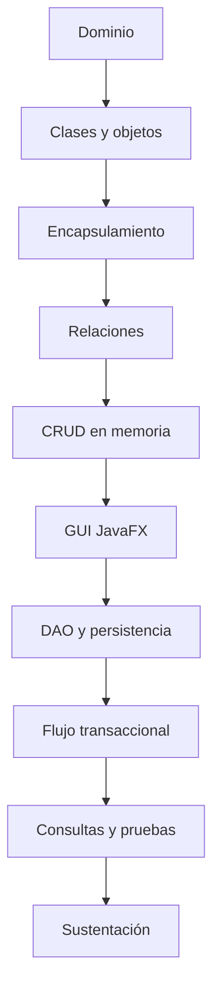

# Proyecto Sello de Programación Orientada a Objetos

## 1. Propósito

El Proyecto Sello integra las sesiones de **Programación Orientada a Objetos** alrededor de una misma aplicación que evoluciona desde consola hasta escritorio. Durante el semestre no se construyen ejercicios independientes; cada tema fortalece el mismo sistema hasta convertirlo en una solución orientada a objetos, persistente, integrada y sustentable.

### Competencia o capacidad del proyecto

Al finalizar el Proyecto Sello, el estudiante demuestra que puede modelar, implementar y defender una aplicación de escritorio orientada a objetos, aplicando clases, relaciones, responsabilidades, arquitectura por capas, persistencia relacional, validación, calidad básica y sustentación integral del producto.

### Competencias relacionadas

| Código | Competencia | Relación con el proyecto |
|---|---|---|
| CE023 | Programación | Evidencia desarrollo de una aplicación de escritorio funcional, modular y orientada a objetos. |
| CE022 | Ingeniería de la Información | Evidencia persistencia relacional, consultas y manejo estructurado de datos. |
| CE024 | Calidad de Software | Evidencia pruebas, organización del código, documentación, repositorio y sustentación integral. |

```text
Dominio -> Clases -> Relaciones -> CRUD -> GUI -> Persistencia -> Integración -> Sustentación
```

## 2. El Proyecto

Durante el semestre desarrollarás una **aplicación de escritorio orientada a objetos** aplicada a un proceso transaccional de negocio.

El proyecto debe partir de un dominio claro, con entidades maestras y transaccionales, relaciones entre objetos, operaciones de gestión, interfaz gráfica, persistencia relacional y arquitectura por capas.

El proyecto debe cumplir estas condiciones:

- Modelar un dominio de negocio concreto.
- Definir entidades, atributos, comportamientos y relaciones.
- Aplicar encapsulamiento, responsabilidades, herencia, interfaces o polimorfismo cuando el dominio lo justifique.
- Evolucionar de consola en memoria hacia aplicación JavaFX con persistencia.
- Integrar arquitectura por capas, DAO, JDBC y SQLite.
- Ser sustentado técnicamente por todos los integrantes del equipo.

No se considera Proyecto Sello:

- Clases aisladas sin dominio común.
- Ejercicios de POO sin aplicación integrada.
- Un CRUD sin modelo de dominio ni relaciones.
- Una GUI desconectada de servicios, entidades o persistencia.
- Un proyecto que el estudiante no pueda explicar en código y ejecución.

## 3. Evolución del Proyecto

| Unidad | Temas principales | Evolución del proyecto |
|---|---|---|
| Unidad 1 | Clases, objetos, encapsulamiento, relaciones, herencia, interfaces, polimorfismo y colecciones. | Aplicación de consola orientada a objetos con gestión de datos en memoria. |
| Unidad 2 | JavaFX, arquitectura por capas, DAO, JDBC, SQLite, seguridad básica, relaciones y consultas. | Aplicación de escritorio por capas con interfaz gráfica y persistencia relacional. |
| Unidad 3 | Integración, validación, refinamiento, ejecutable y sustentación. | Sistema orientado a objetos integrado para un proceso transaccional de negocio. |



### Alineamiento por sesiones

Este alineamiento muestra cómo el proyecto evoluciona desde la comprensión del dominio hasta una aplicación de escritorio orientada a objetos integrada.

| Sesiones | Contenido central | Avance del proyecto |
|---|---|---|
| S1-S2 | Estructuras base, métodos, clases, objetos y constructores. | Brief del dominio, entidades iniciales, objetos instanciados y comunicación básica. |
| S3-S4 | Encapsulamiento, responsabilidades, relaciones, herencia, interfaces y polimorfismo. | Modelo de dominio organizado, relaciones entre objetos y decisiones POO justificadas. |
| S5-S6 | CRUD en memoria, validaciones y evaluación U1. | Aplicación de consola orientada a objetos con colecciones, menú y evidencias. |
| S7-S8 | JavaFX, controladores, arquitectura por capas, DAO y persistencia. | Paso de consola a escritorio con GUI, servicio y base de datos local. |
| S9-S10 | Relaciones persistentes, flujo transaccional y seguridad básica. | Cabecera-detalle o relación equivalente, control de acceso y consistencia de datos. |
| S11-S12 | Consultas, pruebas y evaluación U2. | Aplicación de escritorio por capas validada con consultas y evidencias. |
| S13-S14 | Integración, validación, refinamiento y ejecutable. | Sistema ensamblado, corregido y preparado para sustentación. |
| S15-S16 | Sustentación y evaluación final individual. | Producto POO integrado sustentado y cierre académico. |

## 4. Cronograma

| Hito | Momento | Producto esperado |
|---|---|---|
| S2 | Aprobación del brief | Dominio, entidades iniciales, responsabilidades, operaciones y alcance. |
| S6 | Producto U1 | Aplicación de consola orientada a objetos con clases, relaciones, CRUD en memoria y validaciones. |
| S12 | Producto U2 | Aplicación JavaFX por capas con persistencia relacional, seguridad básica, relaciones, consultas y pruebas. |
| S15 | Producto final | Sistema orientado a objetos integrado, validado, documentado y sustentado técnicamente. |
| S16 | Cierre individual | Evaluación final, recuperación de sustentaciones pendientes y cierre académico. |

## 5. Producto Final

### Repositorio académico y topics

Desde la primera presentación del proyecto, el repositorio debe estar creado y configurado con los topics académicos mínimos. Esta configuración es obligatoria porque permite identificar campus, semestre, línea, tipo de proyecto, curso, sección y grupo.

El detalle oficial del estándar se encuentra en [Estándar transversal de topics para repositorios académicos](https://upeuoficial.github.io/planb/anexos/estandar-topics-repositorios/).

Ejemplo base para POO:

```text
campus-juliaca
semestre-2026-2
linea-software
tipo-ps
poo
seccion-g1
grupo-<numero>-<nombre-proyecto>
```

Al finalizar el curso, la aplicación debe incorporar como mínimo:

- Modelo de dominio con entidades coherentes.
- Encapsulamiento y separación de responsabilidades.
- Relaciones entre objetos.
- Uso justificado de herencia, interfaces o polimorfismo.
- CRUD en memoria y persistente.
- Interfaz gráfica JavaFX con formularios, tablas y eventos.
- Arquitectura por capas: vista, controlador, servicio, entidad y DAO.
- Persistencia con JDBC y SQLite.
- Flujo transaccional con cabecera, detalle o relación equivalente.
- Seguridad básica, consultas, validaciones y manejo de errores.
- Evidencias de pruebas funcionales.
- Ejecutable o evidencia de ejecución final.

Artefactos mínimos:

- Código fuente organizado.
- Base de datos local y scripts o evidencia de estructura.
- Diagrama o explicación del modelo de dominio.
- Evidencia de arquitectura por capas.
- Casos de prueba básicos.
- Demo funcional y sustentación técnica.

## 6. Evaluación por competencias

Los criterios se organizan según una matriz común de evaluación de proyectos académicos: problema, funcionalidad, diseño o estructura, implementación, datos, integración y calidad, validación y sustentación. Cada criterio se adapta al enfoque de POO y se verifica mediante evidencias del producto, el repositorio y la demostración.

| Dimensión común | Criterio del PS | Capacidad evaluada | Evidencias esperadas |
|---|---|---|---|
| 1. Problema y alcance | Dominio y alcance | Delimita un problema de negocio y lo expresa como dominio orientado a objetos. | Brief, entidades del dominio, alcance y reglas principales. |
| 2. Requerimientos o funcionalidad esperada | Funcionalidad esperada | Define operaciones verificables para la aplicación POO. | Casos de uso, flujos CRUD, reglas y criterios de aceptación. |
| 3. Diseño, modelo o arquitectura | Modelado POO | Diseña clases, relaciones, responsabilidades y capas de la solución. | Diagrama de clases, paquetes, capas, entidades, servicios y controladores. |
| 4. Implementación técnica | Aplicación de POO | Implementa encapsulamiento, herencia, polimorfismo, interfaces, colecciones y manejo de excepciones cuando corresponda. | Código organizado por clases, paquetes y responsabilidades. |
| 5. Datos, persistencia o procesamiento | Persistencia y datos | Gestiona datos del dominio mediante archivos, colecciones o persistencia según el alcance. | Datos de prueba, almacenamiento, carga, consulta y actualización. |
| 6. Integración del producto y calidad técnica | Integración y calidad técnica | Integra capas y responsabilidades en una aplicación organizada, mantenible y reproducible. | Vista, controlador, servicio, entidad y acceso a datos funcionando como un solo producto; documentación y ejecución reproducible. |
| 7. Validación, pruebas o resultados | Pruebas y evidencias | Verifica que los flujos principales funcionen con datos y casos concretos. | Casos de prueba, capturas, datos de prueba, resultados y corrección de errores. |
| 8. Sustentación técnica y profesional | Sustentación integral | Defiende técnica y profesionalmente el producto POO, evidenciando autoría, comprensión y responsabilidad académica. | Pitch, demo, defensa técnica, aporte individual, repositorio, topics y MkDocs o equivalente. |

### Rúbrica

| Criterios | % | A (20) | B (15) | C (10) | D (5) |
|---|---:|---|---|---|---|
| 1. Problema y alcance | 10% | Problema claro, viable y bien delimitado; el alcance responde al contexto y está justificado. | Problema y alcance comprensibles, con algunos límites o justificaciones por precisar. | Problema poco delimitado o alcance parcialmente viable. | Problema confuso, sin alcance definido o sin relación clara con el producto. |
| 2. Requerimientos o funcionalidad esperada | 10% | Funcionalidades o requerimientos completos, coherentes y verificables según la necesidad planteada. | Funcionalidades principales cubiertas, con detalles menores pendientes o poco precisos. | Funcionalidades incompletas o parcialmente alineadas al problema. | Funcionalidades ausentes, inconexas o sin relación verificable con la necesidad. |
| 3. Diseño, modelo o arquitectura | 10% | Diseño, modelo o arquitectura coherente, aplicado y alineado al producto; muestra estructura y decisiones claras. | Diseño funcional con limitaciones menores o decisiones parcialmente justificadas. | Diseño poco claro, incompleto o aplicado de forma parcial. | No presenta diseño, modelo o arquitectura verificable. |
| 4. Implementación técnica | 10% | Implementación correcta, funcional y alineada a los contenidos centrales del curso. | Implementación funcional con detalles técnicos menores por corregir. | Implementación parcial, con errores o uso limitado de los contenidos del curso. | Implementación insuficiente, no funcional o no relacionada con los contenidos del curso. |
| 5. Datos, persistencia o procesamiento | 10% | Los datos se gestionan, almacenan, consultan o procesan correctamente según el tipo de proyecto. | Gestión de datos funcional con detalles menores de consistencia, estructura o procesamiento. | Gestión de datos parcial, limitada o con errores relevantes. | No hay manejo de datos verificable o este impide el funcionamiento del producto. |
| 6. Integración del producto y calidad técnica | 10% | El producto funciona como sistema integrado, ordenado, documentado y reproducible. | Integración funcional con detalles menores de organización, documentación o reproducibilidad. | Integración parcial; existen componentes aislados, desorden o evidencias incompletas. | Componentes desconectados, sin organización técnica ni evidencia reproducible. |
| 7. Validación, pruebas o resultados | 10% | Presenta pruebas, evidencias o resultados claros que comprueban el funcionamiento y el valor del producto. | Presenta evidencias suficientes, con algunos casos o resultados por completar. | Evidencias limitadas, poco claras o con validación parcial. | No presenta pruebas, evidencias ni resultados verificables. |
| 8. Sustentación técnica y profesional | 30% | Explica y defiende el producto con solvencia; demuestra aporte individual, dominio técnico, comunicación clara, repositorio, documentación y actitud profesional. | Sustentación clara y funcional, con detalles menores en defensa técnica, evidencias, comunicación o documentación. | Sustentación parcial; dominio, evidencias, comunicación o aporte individual insuficientemente demostrados. | No sustenta adecuadamente, no demuestra autoría o no presenta evidencias mínimas del producto. |

### Subaspectos de la sustentación integral

La sustentación integral debe representar como mínimo el 30% de la evaluación del proyecto. Se revisa mediante los siguientes subaspectos:

| Subaspecto | Qué observa |
|---|---|
| 1. Defensa técnica | Explicación del diseño, código, decisiones, limitaciones, funcionamiento y evidencias generadas. |
| 2. Comunicación y orden | Claridad, estructura, tiempo y lenguaje técnico. |
| 3. Presentación personal y actitud | Puntualidad, vestimenta limpia y adecuada, higiene, cabello ordenado, actitud profesional, respeto, honestidad y coherencia con los valores y principios cristianos de la institución. |
| 4. Aporte individual | Cada integrante demuestra lo que hizo. |
| 5. Repositorio y estándares | Topics, organización, commits, documentación y reproducibilidad. |
| 6. MkDocs o equivalente | Documentación publicada, navegable y alineada al producto. |
| 7. Pitch/demo ejecutiva | Introducción clara del problema, solución y valor, seguida de una demo funcional. |

La sustentación profesional forma parte de la evaluación porque el producto final no solo debe funcionar; también debe ser presentado, explicado y defendido con responsabilidad académica, ética, respeto, honestidad y coherencia con los valores y principios cristianos de la institución.

## 7. Sustentación

La sustentación debe demostrar que el equipo comprende el sistema y que cada integrante domina su aporte.

La sustentación inicia con un video pitch breve o introducción ejecutiva de 1 a 3 minutos para presentar el problema, la solución, el valor del producto y la participación del equipo o estudiante.

| Momento | Tiempo sugerido | Propósito |
|---|---:|---|
| Exposición técnica | 10 minutos | Presentar dominio, arquitectura, modelo de objetos, persistencia y evidencias. |
| Demostración en vivo | 5 minutos | Ejecutar el flujo principal, CRUD, consultas, persistencia y validaciones. |

Cada integrante debe mostrar en vivo la parte que desarrolló o explicar una sección concreta del código. Las diapositivas apoyan la explicación, pero la evidencia principal es el sistema ejecutándose.

## 8. Resultado Esperado

Al finalizar el curso, el estudiante debe demostrar que puede transformar un dominio de negocio en una aplicación de escritorio orientada a objetos, persistente y sustentable.

```text
Dominio -> Modelo POO -> CRUD -> GUI -> Persistencia -> Sistema integrado -> Sustentación
```

## Anexo. Secuencia sugerida de presentación

La presentación puede organizarse con una secuencia breve de apoyo visual. El video pitch o introducción ejecutiva abre la sustentación y no reemplaza la demo ni la defensa técnica.

| Orden | Slide o momento | Propósito | Competencia evidenciada |
|---:|---|---|---|
| 1 | Título del proyecto y equipo | Identificar el proyecto, integrantes y dominio elegido. | CE024 |
| 2 | Video pitch o introducción ejecutiva | Presentar problema, solución, valor y participación del equipo. | CE024 |
| 3 | 1. Problema y alcance | Explicar el proceso de negocio y los límites del sistema. | CE023 |
| 4 | Solución propuesta | Presentar la aplicación y sus flujos principales. | CE023 |
| 5 | Modelo POO | Mostrar clases, atributos, métodos y relaciones. | CE023 |
| 6 | Arquitectura | Explicar vista, controlador, servicio, entidad y acceso a datos. | CE023 + CE024 |
| 7 | Persistencia | Presentar DAO, JDBC, base local y consultas principales. | CE022 |
| 8 | Calidad y pruebas | Mostrar casos de prueba, datos de prueba y evidencias. | CE024 |
| 9 | Demo en vivo | Ejecutar el flujo principal del sistema. | CE023 + CE022 |
| 10 | 4. Aporte individual | Indicar qué hizo cada integrante. | CE024 |
| 11 | 5. Repositorio y estándares | Mostrar repositorio, topics, estructura, documentación publicada en MkDocs o equivalente, y forma de ejecución. | CE024 |
| 12 | Limitaciones y mejoras | Reconocer límites del producto y mejoras posibles. | CE024 |

## Anexo. Plantilla mínima de documentación MkDocs o equivalente

La documentación publicada no reemplaza al informe. Su función es permitir que otra persona comprenda, ejecute, revise y verifique el producto desde el repositorio.

| Página o sección | Contenido mínimo | Evidencia esperada |
|---|---|---|
| Inicio | Nombre del proyecto, problema, solución, curso o cursos, integrantes y enlace al repositorio. | Presentación clara del producto. |
| Instalación o ejecución | Requisitos, dependencias, configuración y comandos para ejecutar el proyecto. | Instrucciones reproducibles. |
| Uso del sistema | Flujo principal, pantallas, comandos, endpoints, notebooks o casos de uso según corresponda. | Guía breve para probar el producto. |
| Arquitectura o estructura | Diagrama, componentes, carpetas principales y decisiones técnicas. | Vista técnica comprensible. |
| Módulos o funcionalidades | Descripción de las funciones principales del producto. | Relación entre funcionalidades y problema. |
| Datos | Modelo, archivos, base de datos, datasets, fuentes o estructura de almacenamiento según el curso. | Evidencia de gestión de datos. |
| Pruebas y evidencias | Casos de prueba, capturas, resultados, métricas, validaciones o salidas generadas. | Verificación del funcionamiento. |
| Equipo y aporte individual | Integrantes, responsabilidades, aportes y evidencias de participación. | Autoría verificable. |
| 5. Repositorio y estándares | Topics académicos, estructura, commits, ramas si aplica y criterios de reproducibilidad. | Cumplimiento de estándares técnicos. |
| Limitaciones y mejoras | Restricciones del producto y mejoras futuras priorizadas. | Cierre reflexivo y realista. |

La documentación debe estar disponible desde las primeras presentaciones y crecer con el proyecto. Para FP puede ser una documentación sencilla; para proyectos integradores y cursos avanzados debe ser más completa y técnica.
## Anexo. Plantilla sugerida de informe del proyecto

El informe debe documentar el producto de manera breve, verificable y alineada a las competencias evaluadas. No reemplaza la demo ni la sustentación; organiza las evidencias del proyecto.

| Sección | Contenido mínimo | Evidencia esperada |
|---|---|---|
| Portada | Nombre del proyecto, curso, sección, integrantes, docente y semestre. | Datos completos del equipo o estudiante. |
| Resumen del proyecto | Problema, solución de escritorio y valor del producto. | Síntesis de 8 a 12 líneas. |
| Competencia y alcance | Competencia/capacidad del proyecto y competencias relacionadas. | CE023, CE022 y CE024 vinculadas al producto. |
| Dominio y requisitos | Proceso de negocio, entidades, operaciones y límites. | Descripción del dominio y alcance validado. |
| Modelo POO | Clases, atributos, métodos, relaciones y responsabilidades. | Diagrama o tabla de clases. |
| Arquitectura | Capas, vista, controlador, servicios, entidades y acceso a datos. | Diagrama o descripción de componentes. |
| Implementación | Funcionalidades, GUI, servicios y lógica principal. | Capturas, código relevante y explicación breve. |
| Persistencia | DAO, JDBC, base local, consultas y datos de prueba. | Scripts, capturas y registros. |
| Validación y pruebas | Casos de prueba, resultados y correcciones. | Tabla de pruebas y evidencias. |
| Repositorio y documentación | Repositorio, topics, estructura, instrucciones y documentación publicada. | URL del repositorio y MkDocs o equivalente. |
| 4. Aporte individual | Responsabilidad de cada integrante. | Tabla de tareas, commits o evidencias por integrante. |
| Limitaciones y mejoras | Límites actuales y mejoras posibles. | Lista priorizada y realista. |


