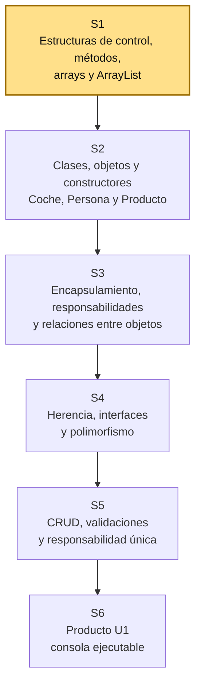

# S1 - Entorno de programación, estructuras de control, métodos y estructuras de datos lineales

## 1. Introducción

Tiempo: 1h 30min (40 min de contexto y propósito + 50 min de presentación del curso y del sílabo).

### 1.1 Presentación de la sesión

Antes de organizar el código en clases y objetos, hace falta dominar lo que esos objetos van a contener por dentro: variables, condicionales, ciclos, métodos y colecciones. Esta sesión prepara el entorno (Java 21, VS Code), organiza un programa mediante métodos, y evidencia —con listas paralelas de productos— el problema que las clases resuelven desde la próxima sesión.

Al ser la primera sesión del curso, no hay trabajo de una sesión anterior que revisar; en su lugar, los 50 min adicionales de esta sección se usan para la presentación del curso y del sílabo (docente, evaluación, cronograma de unidades, Proyecto Sello como cierre del semestre). Desde S2, este mismo bloque de tiempo se dedica a revisar el trabajo autónomo de la sesión anterior.

### 1.2 Índice

1. Estructuras de control y métodos (repaso).
2. Arrays y `ArrayList`.
3. Operaciones principales de `ArrayList`.
4. Limitación de representar una entidad mediante datos separados.

### 1.3 Propósito de aprendizaje

Al concluir la clase, estarás en condiciones de:

- **Configurar y verificar** tu entorno, y **organizar** un programa mediante métodos, condicionales, ciclos, arrays y `ArrayList` para registrar, recorrer, buscar, actualizar y eliminar datos simples.

### 1.4 Producto de sesión

Programa de consola organizado mediante métodos que administra datos simples con arrays y `ArrayList`, e identifica las limitaciones de representar una entidad mediante datos separados.

### 1.5 Metodología

**Tabla 1. Metodología de la sesión**

| Actividades a Realizar en el Periodo | Orientaciones generales (Orientaciones Metodológicas) | Material de estudio recomendado |
|---|---|---|
| Revisión previa individual | Instalar y verificar Java 21 LTS y VS Code. Trabajo individual, antes de clase; traer evidencia de `java -version` funcionando. | Guía de instalación (3.1). |
| Clase presencial | Explicación guiada de conceptos (arrays, `ArrayList`, métodos) y desarrollo guiado de los ejercicios prácticos. Trabajo individual en la propia laptop, siguiendo al docente paso a paso; consulta inmediata ante errores de compilación o de índice. | Enunciados de los ejercicios, VS Code, terminal. |
| Evaluación formativa | Verificación en clase de la ejecución del menú y de las operaciones sobre `ArrayList`; inicio del informe de evidencia individual. La evidencia se completa y sustenta de forma individual, fuera del aula, según los criterios mínimos de la sección 4.4. | Indicaciones del informe (4.3), rúbrica de evaluación (4.6). |

### 1.6 Motivación de la sesión

#### 1.6.1 Caso: la primera colección de datos

Los estudiantes llegan al curso después de trabajar variables, condicionales, ciclos, métodos y arrays. Antes de iniciar la Programación Orientada a Objetos, se recuperan esos conocimientos usando una estructura dinámica: `ArrayList`.

En esta sesión todavía no se crean clases propias del dominio. Primero se observa cómo se administran datos simples y qué dificultades aparecen cuando los datos que representan una misma entidad quedan separados.

**Preguntas de análisis**

**Activación de conocimientos previos**

1. ¿Qué ocurre si eliminas un dato de una lista, pero olvidas eliminarlo de las demás listas paralelas?
2. ¿Por qué cuatro listas paralelas deben conservar siempre el mismo tamaño y el mismo orden?
3. ¿Cómo podríamos mantener juntos el código, nombre, precio y stock que pertenecen a un mismo producto?

**Comprensión de estructuras de datos**

1. ¿Cómo organizamos y procesamos varios datos cuando la cantidad de elementos puede cambiar durante la ejecución del programa?

### 1.7 Ubicación en el curso

- Unidad: U1 - Fundamentos de la Programación Orientada a Objetos.
- Producto de unidad: aplicación de consola en memoria con entidades, relaciones, colecciones y operaciones CRUD.
- Producto del curso: Proyecto Sello - aplicación de escritorio orientada a objetos, con persistencia relacional (Unidad III).
- Carpeta de trabajo: `comarket-cli`.
- Avance de sesión: entorno preparado y fundamentos recuperados mediante estructuras de datos lineales.

Roadmap para elaborar el producto de la unidad:

**Figura 1. Roadmap de la Unidad 1**



## 2. Explica

Tiempo: 50 min.

### 2.1 Conceptos clave

**Tabla 2. Conceptos clave de la sesión**

| Concepto | Idea central | Ejemplo |
|---|---|---|
| Variable | Almacena un dato durante la ejecución. | `int stock = 10;` |
| Condicional | Permite decidir según una condición. | `if`, `else`, `switch` |
| Ciclo | Repite instrucciones mientras se cumpla una condición. | `for`, `while` |
| Método | Agrupa instrucciones para resolver una tarea. | `buscarProducto()` |
| Array | Estructura lineal de tamaño fijo. | `String[] nombres` |
| Colección | Estructura que administra varios elementos. | Lista de nombres |
| `ArrayList` | Lista dinámica que puede crecer o disminuir. | `ArrayList<String>` |
| Índice | Posición de un elemento dentro de una estructura lineal. | `nombres.get(0)` |

### 2.2 Arrays y `ArrayList`

Un array tiene un tamaño definido al crearse:

```java
String[] nombres = new String[3];
```

Un `ArrayList` permite agregar y eliminar elementos durante la ejecución:

```java
ArrayList<String> nombres = new ArrayList<>();
nombres.add("Teclado");
nombres.add("Mouse");
```

Comparación:

**Tabla 3. Comparación entre array y `ArrayList`**

| Característica | Array | `ArrayList` |
|---|---|---|
| Tamaño | Fijo | Dinámico |
| Acceso por índice | Sí | Sí |
| Agregar elementos | Limitado al tamaño creado | `add()` |
| Actualizar elementos | Asignación por índice | `set()` |
| Eliminar elementos | Requiere reorganización manual | `remove()` |
| Cantidad de elementos | `length` | `size()` |

### 2.3 Operaciones principales de `ArrayList`

```java
ArrayList<String> nombres = new ArrayList<>();

nombres.add("Teclado");
nombres.add("Mouse");

String primero = nombres.get(0);
nombres.set(1, "Mouse inalámbrico");
nombres.remove(0);
int cantidad = nombres.size();
boolean existe = nombres.contains("Mouse inalámbrico");
```

En esta sesión se usan datos simples:

- `String`
- `Integer`
- `Double`

Las colecciones de objetos se trabajarán desde S2, después de definir clases y crear objetos.

### 2.4 Organización mediante métodos

El programa debe separar las operaciones principales:

```text
mostrarMenu()
registrar()
listar()
buscar()
actualizar()
eliminar()
```

Todavía no se aplican capas ni clases propias del dominio. El objetivo es recuperar la descomposición de problemas mediante métodos.

### 2.5 Limitación de los datos separados

Un producto podría representarse temporalmente mediante listas paralelas:

```java
ArrayList<String> codigos = new ArrayList<>();
ArrayList<String> nombres = new ArrayList<>();
ArrayList<Double> precios = new ArrayList<>();
ArrayList<Integer> stocks = new ArrayList<>();
```

Los datos de un producto dependen de conservar el mismo índice:

```text
codigos[0]  nombres[0]  precios[0]  stocks[0]
```

Si una lista se modifica incorrectamente, los datos dejan de corresponder. Esta limitación prepara la necesidad de clases y objetos en S2.

### 2.6 Errores frecuentes y diagnóstico

**Tabla 4. Errores frecuentes y diagnóstico**

| Problema | Causa probable | Solución |
|---|---|---|
| `IndexOutOfBoundsException` | Se accede a una posición inexistente | Verificar el índice con `size()` |
| El ciclo no termina | La condición no cambia | Revisar la variable de control |
| La búsqueda no encuentra el texto | Se comparan cadenas con `==` | Usar `equals()` o `equalsIgnoreCase()` |
| Los datos quedan desalineados | Se modificó una lista paralela y otra no | Aplicar la operación en todas las listas |
| El menú repite una opción incorrecta | La lectura de datos quedó desordenada | Revisar el uso de `Scanner` |
| Todo está dentro de `main` | No se descompuso el problema | Crear métodos para cada operación |

### 2.7 Metodología para resolver problemas

1. Comprender el problema: ¿qué operación necesito realizar?
2. Identificar los datos: ¿qué variables o estructuras necesito?
3. Diseñar el proceso: ¿qué método o métodos resolverán la tarea?
4. Definir la salida: ¿qué debe mostrar o devolver el programa?
5. Diseñar pruebas: ¿con qué casos comprobaré que funciona, incluyendo posiciones límite del índice?
6. Escribir, compilar, ejecutar y corregir el código.

En cada ejercicio de este curso se aplican estos pasos antes de programar.

## 3. Aplica: actividad práctica guiada

Tiempo: 3h 20min (4 horas académicas de 50 min, en laboratorio).

**Actividad:** organización de un menú de consola con métodos, arrays, `ArrayList` y listas paralelas en Java.

**Propósito de la actividad:** recuperar estructuras de control, métodos, arrays y `ArrayList` organizando un menú con operaciones CRUD sobre datos simples, y evidenciar la limitación de representar una entidad mediante listas paralelas.

**Orientaciones metodológicas:** en el laboratorio, el docente guía la preparación del entorno (Java 21, VS Code) y la creación del menú con estructuras de control, seguida de la organización mediante métodos y las operaciones sobre `ArrayList`, paso a paso frente a la clase; los estudiantes replican cada paso en su propio equipo, verificando la compilación y ejecución antes de avanzar al siguiente, hasta llegar a las listas paralelas que evidencian la limitación que motiva las clases y objetos de S2.

**Actividades para realizar:**

- **3.1** Preparar ambiente local: Java 21 LTS y VS Code.
- **3.2** Crear y ejecutar un programa Java simple.
- **3.3** Repasar estructuras de control.
- **3.4** Comparar un array con un `ArrayList`.
- **3.5** Organizar operaciones mediante métodos.
- **3.6** Completar operaciones sobre datos simples.
- **3.7** Representar productos mediante listas paralelas.
- **3.8** Identificar la necesidad de agrupar datos.

### 3.1 Preparar ambiente local: Java 21 LTS y VS Code

**Producto del paso:** ambiente local con Java 21 LTS y VS Code verificados, listo para crear y ejecutar programas Java desde consola.

Herramientas necesarias:

- Java 21 LTS.
- VS Code.
- Extension Pack for Java.
- Terminal integrada de VS Code.

En esta sesión se usa un proyecto Java simple, compilado y ejecutado directo con `javac`/`java` — no hace falta Maven todavía. Cuando el curso lo necesite, llega mediante el **wrapper** del propio proyecto (`mvnw`/`mvnw.cmd`, incluido en el repositorio), no como una instalación global — mismo criterio que ya usa LP2.

Se recomienda Eclipse Temurin 21, una distribución OpenJDK de soporte
prolongado, instalada con el gestor de paquetes nativo de cada sistema
operativo (evita instaladores manuales y mantiene el JDK actualizable).

**Windows** — PowerShell como usuario normal:

```powershell
winget install --id EclipseAdoptium.Temurin.21.JDK --exact
```

**macOS** (Homebrew no viene preinstalado en ningún Mac; una vez instalado,
el comando de Temurin es el mismo para Intel y para Apple Silicon
M1/M2/M3/M4 — Homebrew detecta la arquitectura automáticamente):

```bash
# 1. Instalar Homebrew (si no lo tiene)
/bin/bash -c "$(curl -fsSL https://raw.githubusercontent.com/Homebrew/install/HEAD/install.sh)"

# 2. Solo en Apple Silicon (M1/M2/M3/M4): agregar Homebrew al PATH.
#    Se instala en /opt/homebrew (no en /usr/local como en Intel), y el
#    propio instalador lo pide como paso obligatorio, no opcional.
echo 'eval "$(/opt/homebrew/bin/brew shellenv)"' >> ~/.zprofile
eval "$(/opt/homebrew/bin/brew shellenv)"

# 3. Instalar Temurin 21
brew install --cask temurin@21
```

**Linux (Ubuntu/Debian)** — repositorio oficial de Adoptium vía `apt`:

```bash
sudo apt install -y wget apt-transport-https gpg
wget -qO - https://packages.adoptium.net/artifactory/api/gpg/key/public | gpg --dearmor | sudo tee /etc/apt/trusted.gpg.d/adoptium.gpg > /dev/null
echo "deb https://packages.adoptium.net/artifactory/deb $(awk -F= '/^VERSION_CODENAME/{print$2}' /etc/os-release) main" | sudo tee /etc/apt/sources.list.d/adoptium.list
sudo apt update
sudo apt install -y temurin-21-jdk
```

**Linux (Fedora/RHEL)** — repositorio oficial de Adoptium vía `dnf`:

```bash
sudo tee /etc/yum.repos.d/adoptium.repo > /dev/null <<'EOF'
[Adoptium]
name=Adoptium
baseurl=https://packages.adoptium.net/artifactory/rpm/$(. /etc/os-release; echo $ID)/$releasever/$basearch
enabled=1
gpgcheck=1
gpgkey=https://packages.adoptium.net/artifactory/api/gpg/key/public
EOF
sudo dnf install -y temurin-21-jdk
```

Al finalizar, cierre y vuelva a abrir la terminal. Verifique la instalación:

```bash
java -version
javac -version
```

**NOTA:** Ambas comprobaciones deben mostrar Java 21. Si conserva una versión anterior, configure `JAVA_HOME` con la ruta del JDK 21, asegure que su carpeta `bin` tenga prioridad en `Path` y abra una terminal nueva.

#### 3.1.1 Instalar VS Code y extensiones

**Producto del paso:** VS Code instalado con la extensión necesaria para el resto de la sesión.

El curso usa **VS Code** como editor por defecto.

**Windows** — con `winget` (viene instalado en Windows 10/11):

```powershell
winget install -e --id Microsoft.VisualStudioCode
```

**macOS** (con Homebrew, ya instalado en el paso anterior):

```bash
brew install --cask visual-studio-code
```

**Linux (Ubuntu/Debian)** — con `snap` (viene instalado en Ubuntu):

```bash
sudo snap install --classic code
```

En cualquier sistema también puede descargarse el instalador desde <https://code.visualstudio.com/download>.

Al finalizar, instale la extensión de Java desde la terminal:

```bash
code --install-extension vscjava.vscode-java-pack
```

### 3.2 Crear y ejecutar un programa Java simple

**Producto del paso:** programa Java ejecutado correctamente desde VS Code.

1. Crea la carpeta del proyecto. En este ejemplo se usa `comarket-cli`; tu equipo la nombra según su propio proyecto, pero mantiene esta misma estructura interna (`src/` con los `.java`):

```bash
mkdir comarket-cli
cd comarket-cli
mkdir src
```

2. Abre la carpeta del proyecto en VS Code:

```bash
code .
```

   (o desde VS Code: **Archivo → Abrir carpeta...** y selecciona `comarket-cli`.)

3. Dentro de `src`, crea el archivo `Main.java` (clic derecho sobre `src` en el explorador de VS Code → **Nuevo archivo...** → escribe `Main.java`) con este contenido:

```java
public class Main {
    public static void main(String[] args) {
        System.out.println("Repaso de Fundamentos de Programación");
    }
}
```

4. Abre una terminal integrada en VS Code (**Terminal → Nueva terminal**), ubícate dentro de `src` y compila/ejecuta:

```bash
cd src
javac Main.java
java Main
```

Debe imprimir `Repaso de Fundamentos de Programación`. Los pasos 3.3, 3.5 y 3.6 siguen modificando este mismo `Main.java`; los pasos 3.4 y 3.7 crean archivos nuevos, independientes, dentro de la misma carpeta `src`.

### 3.3 Repasar estructuras de control

**Producto del paso:** menú repetitivo controlado mediante condicionales y ciclos.

Reemplaza el contenido del método `main()` en tu `Main.java` (el `println` de 3.2 ya no hace falta) y agrega `import java.util.Scanner;` como primera línea del archivo, antes de `public class Main`:

```java
Scanner scanner = new Scanner(System.in);
int opcion;

do {
    System.out.println("1. Registrar");
    System.out.println("2. Listar");
    System.out.println("3. Salir");
    opcion = scanner.nextInt();

    switch (opcion) {
        case 1:
            System.out.println("Registrar");
            break;
        case 2:
            System.out.println("Listar");
            break;
        case 3:
            System.out.println("Fin");
            break;
        default:
            System.out.println("Opción inválida");
    }
} while (opcion != 3);
```

### 3.4 Comparar un array con un `ArrayList`

**Producto del paso:** evidencia de la diferencia entre tamaño fijo y tamaño dinámico.

Este es un archivo nuevo e independiente de `Main.java`. Crea `ComparacionArrayArrayList.java` dentro de `src` con este contenido completo:

```java
import java.util.ArrayList;

public class ComparacionArrayArrayList {
    public static void main(String[] args) {
        String[] nombresArray = new String[3];
        nombresArray[0] = "Teclado";
        nombresArray[1] = "Mouse";

        ArrayList<String> nombres = new ArrayList<>();
        nombres.add("Teclado");
        nombres.add("Mouse");
        nombres.add("Monitor");
        nombres.add("Audífonos");

        System.out.println("Array (tamaño fijo " + nombresArray.length + "):");
        for (String nombre : nombresArray) {
            System.out.println(nombre);
        }

        System.out.println("ArrayList (tamaño dinámico " + nombres.size() + "):");
        for (String nombre : nombres) {
            System.out.println(nombre);
        }
    }
}
```

Compila y ejecuta igual que en 3.2, pero con este archivo (`javac ComparacionArrayArrayList.java` y `java ComparacionArrayArrayList`). Nota que `nombresArray[2]` nunca se asigna: al imprimirlo, Java muestra `null` — evidencia directa de que el array reservó tamaño fijo desde su creación, tenga o no todos los valores asignados.

### 3.5 Organizar operaciones mediante métodos

**Producto del paso:** programa dividido en operaciones pequeñas.

Sigues en `Main.java`. Primero agrega `import java.util.ArrayList;` junto al `import java.util.Scanner;` del inicio del archivo. Luego agrega estos tres métodos **dentro de la clase `Main`, pero fuera de `main()`** (después de la llave que cierra `main`, antes de la llave que cierra la clase):

```java
public static void registrar(ArrayList<String> nombres, Scanner scanner) {
    System.out.print("Nombre: ");
    String nombre = scanner.nextLine();
    nombres.add(nombre);
}

public static void listar(ArrayList<String> nombres) {
    for (int i = 0; i < nombres.size(); i++) {
        System.out.println(i + " - " + nombres.get(i));
    }
}

public static int buscar(ArrayList<String> nombres, String nombreBuscado) {
    for (int i = 0; i < nombres.size(); i++) {
        if (nombres.get(i).equalsIgnoreCase(nombreBuscado)) {
            return i;
        }
    }
    return -1;
}
```

Para que el menú los use, dentro de `main()` declara la lista justo antes del `do`:

```java
ArrayList<String> nombres = new ArrayList<>();
```

y reemplaza el `case 1` y `case 2` del `switch` de 3.3, que hoy solo imprimen texto, para que llamen a los métodos:

```java
case 1:
    registrar(nombres, scanner);
    break;
case 2:
    listar(nombres);
    break;
```

(`buscar()` se conecta recién en 3.6, junto con `actualizar()` y `eliminar()`.)

### 3.6 Completar operaciones sobre datos simples

**Producto del paso:** registro, listado, búsqueda, actualización y eliminación sobre un `ArrayList`.

**Problema:** el menú de 3.3 y los métodos de 3.5 cubren registrar, listar y buscar; falta completar actualizar y eliminar para tener el CRUD mínimo sobre datos simples.

**Resolución guiada:**

1. **Comprender**: cada operación del menú debe delegar en un método propio, siguiendo el mismo patrón de `registrar`, `listar` y `buscar`.
2. **Entradas**: posición (índice) o nombre a actualizar/eliminar, y el nuevo valor cuando corresponda.
3. **Procesos**:
   - `actualizar`: localizar la posición con `buscar()` y reemplazar el valor con `set()`.
   - `eliminar`: localizar la posición con `buscar()` y quitar el valor con `remove()`.
   - validar que la posición exista (`buscar()` distinto de `-1`) antes de operar.
4. **Salidas**: lista actualizada, mensaje de confirmación o de error si el dato no existe.
5. **Pruebas**:
   - caso normal: actualizar y eliminar un nombre existente.
   - caso límite: intentar actualizar o eliminar un nombre que no está en la lista.
6. **Código**: completa `actualizar(ArrayList<String> nombres, Scanner scanner)` y `eliminar(ArrayList<String> nombres, Scanner scanner)` siguiendo el estilo de los métodos de 3.5, y agrégalos a la clase `Main` igual que en 3.5.

Con `actualizar()` y `eliminar()` ya escritos, completa el `switch` de `main()`: agrega `case 3` para llamar a `buscar()` (mostrando la posición encontrada o un aviso si devuelve `-1`), `case 4` para llamar a `actualizar()`, y `case 5` para llamar a `eliminar()` — siguiendo el mismo patrón que ya usaste en 3.5 para `case 1` y `case 2`. Ajusta también las opciones del menú impreso en el `do` para que el número 6 ("Salir") quede después de "Actualizar" y "Eliminar".

Operaciones mínimas del menú completo:

1. Registrar un nombre.
2. Listar nombres.
3. Buscar un nombre.
4. Actualizar un nombre por posición.
5. Eliminar un nombre.
6. Salir.

En esta sesión estas operaciones sirven para recuperar estructuras de control y métodos. El CRUD organizado por capas se desarrollará en S5.

### 3.7 Representar productos mediante listas paralelas

**Producto del paso:** datos de productos registrados sin utilizar clases propias.

Otro archivo nuevo e independiente. Crea `ProductosListasParalelas.java` dentro de `src` con este contenido completo:

```java
import java.util.ArrayList;

public class ProductosListasParalelas {
    public static void main(String[] args) {
        ArrayList<String> codigos = new ArrayList<>();
        ArrayList<String> nombres = new ArrayList<>();
        ArrayList<Double> precios = new ArrayList<>();
        ArrayList<Integer> stocks = new ArrayList<>();

        codigos.add("P001");
        nombres.add("Teclado");
        precios.add(80.0);
        stocks.add(10);

        for (int i = 0; i < codigos.size(); i++) {
            System.out.println(
                    codigos.get(i) + " - " +
                    nombres.get(i) + " - S/ " +
                    precios.get(i) + " - Stock: " +
                    stocks.get(i)
            );
        }
    }
}
```

Compila y ejecuta igual que en 3.2 y 3.4, con este archivo (`javac ProductosListasParalelas.java` y `java ProductosListasParalelas`).

### 3.8 Identificar la necesidad de agrupar datos

**Producto del paso:** explicación del problema que será resuelto en S2.

Responder:

1. ¿Qué ocurre si se elimina un nombre, pero no su código, precio y stock?
2. ¿Por qué las cuatro listas deben conservar el mismo tamaño?
3. ¿Qué representa el índice `i`?
4. ¿Cómo podríamos mantener juntos los datos de cada producto?

Conclusión:

```text
Las listas paralelas permiten repasar programación, pero resultan frágiles
cuando varios datos representan una sola entidad.

En S2 se definirá la clase Producto y cada producto se representará
mediante un objeto.
```

## 4. Crea: actividad autónoma

Tiempo: 2h fuera del aula.

### 4.1 Actividad

Completar y documentar, de forma individual, el ambiente de desarrollo y el programa de consola con métodos, arrays, `ArrayList` y listas paralelas trabajado en el laboratorio.

Completa y evidencia estas tareas:

1. Verificar Java 21 y VS Code.
2. Crear un menú con `do-while` y `switch`.
3. Separar las operaciones mediante métodos.
4. Utilizar un array de tamaño fijo.
5. Utilizar un `ArrayList` de datos simples.
6. Registrar, listar, buscar, actualizar y eliminar elementos.
7. Representar al menos tres productos mediante listas paralelas.
8. Explicar dos limitaciones de las listas paralelas.

### 4.2 Propósito

Que cada estudiante demuestre, de forma individual y fuera del aula, que puede reproducir el patrón construido en clase sin el acompañamiento del docente.

En esta sesión, esa reproducción incluye completar por su cuenta las operaciones de actualización y eliminación, y explicar con sus propias palabras por qué las listas paralelas dejan de ser una representación confiable a medida que el programa crece.

### 4.3 Indicaciones

Entrega un PDF con el siguiente nombre:

```text
S01_Equipo##_ApellidoNombre.pdf
```

Cada captura de pantalla del informe debe mostrar, sin recortar, el reloj del sistema (fecha y hora) y tu usuario o foto de perfil (Windows, VS Code o navegador) visibles en pantalla — es lo que permite verificar que la evidencia es tuya y que corresponde al momento real de tu trabajo.

#### 4.3.1 Estructura del informe

**Datos del estudiante**

- Nombre:
- Equipo:
- Sesión: S01 - Entorno de programación, estructuras de control, métodos y estructuras de datos lineales
- Rol o aporte realizado:
- Link de GitHub:

**Evidencia técnica**

Incluye capturas o salidas con una breve explicación debajo de cada una, organizadas en los mismos 5 bloques de la rúbrica (4.6) — así queda claro qué evidencia corresponde a cada criterio evaluado:

1. *Entorno y ejecución*
    - Capturas de `java -version` y de la ejecución del programa.
2. *Estructuras de control*
    - Código del menú (`do-while` + `switch`) y captura de su ejecución.
3. *Métodos*
    - Código de los métodos `registrar`, `listar`, `buscar`, `actualizar` y `eliminar`.
4. *Arrays y `ArrayList`*
    - Código y salida de la comparación entre array y `ArrayList`.
    - Código de las listas paralelas con al menos tres productos registrados.
5. *Operaciones y análisis*
    - Salida de registro, búsqueda, actualización y eliminación sobre el `ArrayList`.
    - Explicación escrita de dos limitaciones de las listas paralelas.

**Error o hallazgo**

Describe:

- Qué ocurrió.
- Cómo lo diagnosticaste.
- Cómo lo corregiste o qué aprendiste.

**Reflexión técnica breve**

Responde en 5 a 8 líneas:

```text
¿Por qué representar productos mediante listas paralelas puede producir
errores cuando el programa crece?
```

### 4.4 Criterios mínimos de aceptación

La evidencia individual se considera completa si:

- El archivo respeta el nombre `S01_Equipo##_ApellidoNombre.pdf`.
- El ambiente local está verificado.
- El programa utiliza estructuras de control.
- Las operaciones están separadas mediante métodos.
- Se evidencia el uso de un array.
- Se evidencia el uso de `ArrayList`.
- Se realizan recorridos y búsquedas.
- Se muestran listas paralelas con datos de productos.
- Se explican sus limitaciones.
- No se utilizan todavía clases propias del dominio.
- Cada captura de la evidencia técnica muestra el reloj del sistema y el usuario/perfil visible, sin recortar.
- Las fechas y horas de las capturas son coherentes con el historial de commits de su repositorio en GitHub.
- Incluye un error o hallazgo técnico diagnosticado.
- Incluye la reflexión técnica breve solicitada.

### 4.5 Preguntas de defensa

1. ¿Cuál es la diferencia entre una estructura de control y una estructura de datos?
2. ¿Qué diferencia existe entre un array y un `ArrayList`?
3. ¿Para qué sirve `size()`?
4. ¿Por qué una búsqueda puede devolver `-1`?
5. ¿Qué ventaja aporta separar las operaciones mediante métodos?
6. ¿Qué problema presentan las listas paralelas?
7. ¿Por qué todavía no usamos `ArrayList<Producto>`?
8. ¿Qué contenido de S2 permitirá agrupar los datos de un producto?

### 4.6 Rúbrica de evaluación

**Tabla 5. Rúbrica de evaluación**

| Criterio | Peso (%) | A (20 pts) | B (15 pts) | C (10 pts) | D (5 pts) | Nivel obtenido |
|---|---:|---|---|---|---|---:|
| 1. Entorno y ejecución* | 20 | Verifica Java 21 y VS Code, y ejecuta el programa sin errores, con evidencia clara de cada verificación. | Verifica las herramientas y ejecuta el programa correctamente, con evidencia parcial. | Ejecuta el programa con dificultades de configuración o evidencia incompleta. | No logra ejecutar el programa o no presenta evidencia de la verificación. | |
| 2. Estructuras de control* | 20 | El menú usa condicionales y ciclos con flujo claro, controlado y sin errores. | El menú usa condicionales y ciclos funcionales, con algún detalle menor. | Uso parcial o con errores de las estructuras de control. | No evidencia el uso de estructuras de control. | |
| 3. Métodos* | 20 | Descompone todas las operaciones del menú en métodos, con parámetros y retornos claros. | Organiza las operaciones principales mediante métodos, con separación adecuada. | La separación mediante métodos es parcial o inconsistente. | Todo el código permanece dentro de `main`. | |
| 4. Arrays y `ArrayList`* | 20 | Compara correctamente array y `ArrayList`, y representa las listas paralelas de productos sin errores. | Utiliza array, `ArrayList` y listas paralelas correctamente, con comparación básica. | Uso incompleto o confuso de las estructuras lineales o de las listas paralelas. | No evidencia el uso de array, `ArrayList` o listas paralelas. | |
| 5. Operaciones y análisis* | 20 | Registra, lista, busca, actualiza y elimina datos correctamente, y explica con claridad las limitaciones de las listas paralelas. | Implementa las operaciones principales y explica la limitación principal de las listas paralelas. | Operaciones incompletas o explicación superficial de las limitaciones. | No administra los datos ni identifica el problema de las listas paralelas. | |

\* Agregado manual.

Nota final = suma de (`Peso` / 100 × `Puntos del nivel obtenido`) = ____ / 20.

Para usar la rúbrica con IA, solicita:

```text
Evalúa el PDF usando la rúbrica de la sesión.
Para cada criterio selecciona el nivel obtenido usando la escala A=20, B=15, C=10, D=5 puntos.
Justifica brevemente cada nivel asignado.
Verifica que cada captura muestre reloj del sistema y usuario/perfil visible, y que las fechas sean coherentes con el historial de commits de GitHub. Si falta esta evidencia o hay inconsistencias, indícalo explícitamente antes de calificar.
Calcula la nota final con la fórmula: suma de (Peso/100 × Puntos del nivel obtenido), directamente sobre 20.
Indica 2 fortalezas y 2 recomendaciones.
```

## 5. Cierre

Tiempo: 5 min.

**Resumen breve:** hoy se recuperaron estructuras de control, métodos, arrays y `ArrayList`, y se evidenció la limitación de representar un producto mediante listas paralelas.

**Dinámica participativa:** cada estudiante comparte en una frase la limitación de las listas paralelas que le resultó más clara al construir `ProductosListasParalelas.java`.

**Metacognición:** cada estudiante responde en voz alta o por escrito: ¿qué parte de la sesión te costó más entender, y cómo la resolviste?

**Proyección:** en S2 se define la clase `Producto` y cada producto pasa a representarse mediante un objeto, reemplazando las listas paralelas de hoy; en un entorno profesional, esta misma decisión (agrupar datos relacionados en una estructura propia en vez de mantenerlos en colecciones separadas y sincronizadas a mano) es la que evita errores de integridad en cualquier sistema que crezca más allá de un prototipo.

## Bibliografía

- Eclipse Adoptium. (s. f.). *Temurin releases*. https://adoptium.net/temurin/releases/
- Oracle. (s. f.). *Class ArrayList\<E\>*. Java SE 21 Documentation. https://docs.oracle.com/en/java/javase/21/docs/api/java.base/java/util/ArrayList.html
- Visual Studio Code. (s. f.). *Java in Visual Studio Code*. Microsoft. https://code.visualstudio.com/docs/languages/java
