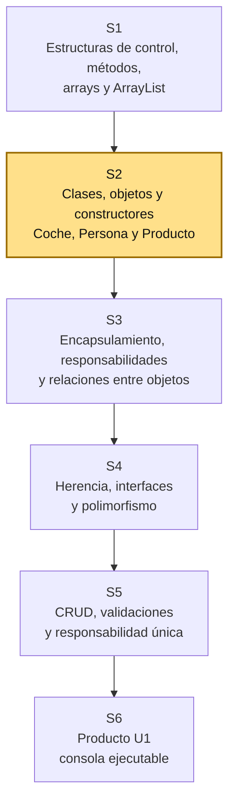
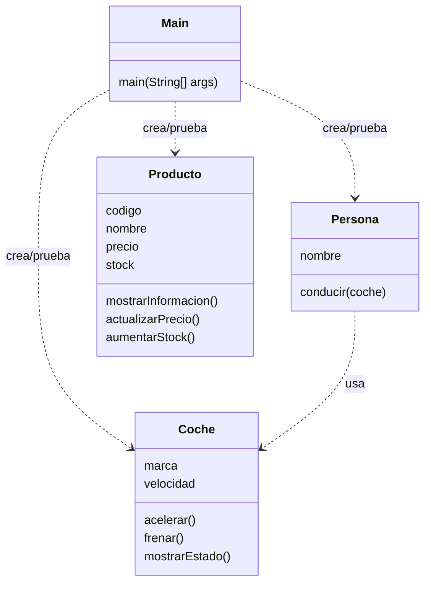

# S2 - Clases, objetos, constructores y comunicación entre objetos

## 1. Introducción

Tiempo: 1h 30min (40 min de contexto y propósito + 50 min de revisión del trabajo autónomo de S1).

### 1.1 Presentación de la sesión

Los datos que ayer vivían sueltos en listas paralelas hoy se agrupan por primera vez dentro de una clase — el paso que la Programación Orientada a Objetos existe para dar. Esta sesión define atributos, constructores (con sobrecarga) y métodos, crea los primeros objetos, y observa cómo colaboran entre sí desde una aplicación de consola.

Los 50 min adicionales de esta sección se usan para revisar el trabajo autónomo de S1: el menú con estructuras de control, las operaciones sobre `ArrayList` y la explicación de las limitaciones de las listas paralelas.

### 1.2 Índice

1. Clase y objeto.
2. Atributos, métodos, estado y comportamiento.
3. Constructores y sobrecarga.
4. Comunicación entre objetos y responsabilidad inicial.

### 1.3 Propósito de aprendizaje

Al concluir la clase, estarás en condiciones de:

- **Construir** clases simples del dominio, **crear** objetos mediante constructores (incluida su sobrecarga), reconocer su estado y comportamiento, y observar la comunicación básica entre objetos desde una aplicación de consola.

### 1.4 Producto de sesión

Proyecto Java simple con clases del dominio, objetos instanciados mediante constructores (con al menos un caso de sobrecarga), comunicación básica entre objetos y salida por consola.

### 1.5 Metodología

**Tabla 1. Metodología de la sesión**

| Actividades a Realizar en el Periodo | Orientaciones generales (Orientaciones Metodológicas) | Material de estudio recomendado |
|---|---|---|
| Revisión previa individual | Repasar el proyecto de S1 (menú, métodos, `ArrayList`) y traer evidencia de que compila y ejecuta. Trabajo individual, antes de clase. | Proyecto de S1. |
| Clase presencial | Explicación guiada de clase, objeto, atributos, métodos, constructores y sobrecarga; desarrollo guiado de `Coche`, `Persona` y `Producto`. Trabajo individual en la propia laptop, siguiendo al docente paso a paso; consulta inmediata ante errores. | Enunciados de los ejercicios, VS Code, terminal. |
| Evaluación formativa | Verificación en clase de la ejecución de los objetos creados desde `Main`; inicio de la evidencia individual. La evidencia se completa y sustenta de forma individual, fuera del aula, según los criterios mínimos de la sección 4.4. | Indicaciones de entrega (4.3), rúbrica de evaluación (4.6). |

### 1.6 Motivación de la sesión

#### 1.6.1 Caso: sistema de dominio inicial

Una organización necesita ordenar la información de un proceso de negocio. Puede tratarse de ventas, biblioteca, reservas, inventario, matrículas, atención de clientes u otro contexto definido por el docente.

Antes de construir pantallas, base de datos o reportes, el sistema necesita representar objetos del dominio. En POO, esos objetos nacen a partir de clases.

En esta sesión se retoman las estructuras trabajadas en S1 y se reorganizan como objetos del dominio, probándolos desde consola.

**Preguntas de análisis**

**Activación de conocimientos previos**

1. ¿Qué objetos reales aparecen en el dominio elegido?
2. ¿Qué datos necesita guardar uno de esos objetos?

**Comprensión de clases y objetos**

1. ¿Qué comportamiento podría tener ese objeto?
2. ¿Por qué no conviene escribir todo directamente en `Main`?

### 1.7 Ubicación en el curso

- Unidad: U1 - Fundamentos de la Programación Orientada a Objetos.
- Producto de unidad: aplicación de consola en memoria con entidades, relaciones, colecciones y CRUD.
- Producto del curso: Proyecto Sello - aplicación de escritorio orientada a objetos, con persistencia relacional (Unidad III).
- Carpeta de trabajo: `comarket-cli`.
- Avance del producto en esta sesión: primeras clases del dominio, constructores (con sobrecarga) y comunicación básica entre objetos probadas desde `Main`.

Roadmap para elaborar el producto de la unidad:

**Figura 1. Roadmap de la Unidad 1**



Hoy se trabaja con objetos tangibles del mundo real: `Coche` y `Persona`. Luego se usa `Producto` como ejemplo puente hacia el dominio de CoMarket. La ruta principal avanza hacia encapsulamiento, separación de responsabilidades, relaciones entre objetos y CRUD en memoria. La herencia, las interfaces y el polimorfismo se trabajan después, cuando el modelo ya tenga más contexto.

## 2. Explica

Tiempo: 50 min.

### 2.1 Conceptos clave

Una clase es un molde para crear objetos. Un objeto es una instancia concreta que tiene estado y comportamiento.

Ejemplo base: `Coche` y `Persona` permiten iniciar desde objetos tangibles. Un coche tiene marca y velocidad; una persona tiene nombre y puede conducir. Luego se usa `Producto` para observar cambios naturales de estado como precio y stock, preparando el trabajo de encapsulamiento y relaciones de S3.

Conceptos de la sesión:

- Clase como molde.
- Objeto como instancia.
- Atributos como estado.
- Métodos como comportamiento.
- Constructores como forma inicial de crear objetos con datos.
- Sobrecarga de constructores: más de una forma de crear el mismo tipo de objeto.
- Abstracción inicial del dominio.
- Responsabilidad de clase.
- Comunicación entre objetos.
- `Main` como punto de prueba inicial.
- Salida por consola como evidencia de ejecución.

Alcance metodológico de S2:

```text
En S2 se llega hasta clase, objeto, atributos, métodos, constructores,
sobrecarga de constructores, estado, comportamiento, abstracción inicial,
responsabilidad de clase y comunicación básica entre objetos.

El encapsulamiento formal, las validaciones internas y la separación
por responsabilidades se desarrollan en S3.
```

### 2.2 Arquitectura de la sesión

**Figura 2. Clases y colaboración de la sesión**



Convención del diagrama: cada clase muestra sus atributos y métodos principales; `..>` indica dependencia o uso temporal desde la prueba.

Regla práctica:

- `Main` se usa para probar.
- La clase representa características y acciones de un objeto del mundo real.
- Los objetos son instancias concretas de la clase.
- Los atributos guardan estado.
- Los métodos muestran o procesan comportamiento propio del objeto.
- La abstracción consiste en elegir solo los datos y comportamientos necesarios para esta primera versión.

### 2.3 Constructores y sobrecarga

Un constructor inicializa el estado de un objeto en el momento de crearlo. Una clase puede tener **más de un constructor**, siempre que se distingan por la cantidad o el tipo de sus parámetros; esto se llama **sobrecarga**.

```java
public class Coche {
    String marca;
    int velocidad;

    Coche(String marca, int velocidadInicial) {
        this.marca = marca;
        this.velocidad = velocidadInicial;
    }

    Coche(String marca) {
        this(marca, 0);
    }
}
```

`this(marca, 0)` invoca al otro constructor de la misma clase para no repetir la asignación de `marca`. Se usa cuando falta un dato al crear el objeto y existe un valor inicial razonable por defecto (en este caso, velocidad 0).

**Error frecuente**: repetir toda la lógica de asignación en cada constructor en vez de reutilizar uno desde el otro con `this(...)` — duplica código y facilita que ambos constructores queden desincronizados si se modifica un atributo.

### 2.4 Flujo de trabajo

1. Retomar el proyecto Java simple preparado en S1.
2. Abstraer objetos tangibles del mundo real.
3. Definir la responsabilidad inicial de la clase.
4. Elegir atributos y métodos coherentes con sus características y acciones.
5. Crear constructores para inicializar objetos, sobrecargando cuando falte un dato con valor por defecto razonable.
6. Crear `Coche` y `Persona` para observar colaboración simple.
7. Crear `Producto` como ejemplo puente hacia el dominio.
8. Ejecutar el programa por consola.
9. Registrar evidencia y explicar responsabilidades.

### 2.5 Errores frecuentes y diagnóstico

**Tabla 2. Errores frecuentes y diagnóstico**

| Problema | Causa probable | Solución |
|---|---|---|
| No ejecuta `Main` | Falta método `public static void main` | Revisar firma del método |
| No reconoce la clase | Archivo, clase o paquete no coincide | Revisar nombre de archivo y paquete |
| Los datos salen en cero o `null` | No se asignaron valores al objeto | Inicializar atributos antes de imprimir |
| Todo está en `Main` | No se separó la responsabilidad | Mover datos y comportamiento a una clase |
| Salida poco clara | `Main` no imprime datos suficientes | Mejorar la salida desde `Main` sin meter consola en la entidad |
| La clase tiene métodos de muchas cosas | No se identificaron bien sus características y acciones | Volver a la abstracción inicial del objeto |
| Ambigüedad entre constructores sobrecargados | Dos constructores con parámetros del mismo tipo y cantidad | Los constructores deben distinguirse por cantidad o tipo de parámetros |
| Se usan `private`, getters/setters o validaciones complejas antes de tiempo | Se adelantó contenido de S3 | En S2 usar constructores simples; el encapsulamiento formal queda para S3 |

### 2.6 Metodología para resolver problemas

1. Comprender el problema: ¿qué objeto del dominio necesito representar?
2. Identificar sus características (atributos) y acciones (métodos).
3. Diseñar el constructor: ¿qué datos necesita al crearse? ¿necesita más de una forma de crearse (sobrecarga)?
4. Definir qué debe mostrar o devolver cada método.
5. Diseñar pruebas: crear el objeto, ejecutar sus métodos y verificar el estado antes y después.
6. Escribir, compilar, ejecutar y corregir el código.

En cada ejercicio de este curso se aplican estos pasos antes de programar.

## 3. Aplica: actividad práctica guiada

Tiempo: 3h 20min (4 horas académicas de 50 min, en laboratorio).

**Actividad:** creación guiada de las primeras clases del dominio (`Coche`, `Persona`, `Producto`), con atributos, constructores (incluida su sobrecarga) y métodos, probadas desde `Main`.

**Propósito de la actividad:** construir clases simples que agrupen datos y comportamiento, crear objetos mediante constructores sobrecargados, y observar la comunicación básica entre objetos, verificando cada incremento por consola antes de continuar.

**Orientaciones metodológicas:** en el laboratorio, el docente guía la creación de `Coche`, `Persona` y `Producto` paso a paso frente a la clase, probando cada clase desde `Main` antes de avanzar a la siguiente; los estudiantes replican cada paso en su propio equipo, verificando la compilación y la salida por consola antes de continuar.

**Actividades para realizar:**

- **3.1** Retomar el proyecto Java simple.
- **3.2** Abstraer objetos tangibles: Coche y Persona.
- **3.3** Crear la clase Coche, con constructor sobrecargado.
- **3.4** Crear la clase Persona.
- **3.5** Crear objetos desde Main.
- **3.6** Identificar estado, comportamiento y responsabilidad inicial.
- **3.7** Ejemplo 2: Producto como puente hacia el dominio.

### 3.1 Retomar el proyecto Java simple

**Producto del paso:** carpeta de trabajo con estructura inicial.

1. Crear una carpeta para el proyecto.
2. Abrir la carpeta en VS Code.
3. Crear una carpeta `src`.
4. Crear el archivo `Main.java`.
5. Ejecutar un mensaje simple para comprobar el entorno.

Ejemplo:

```java
public class Main {
    public static void main(String[] args) {
        System.out.println("Proyecto iniciado");
    }
}
```

### 3.2 Abstraer objetos tangibles: Coche y Persona

**Producto del paso:** dos clases candidatas identificadas desde el mundo real.

Antes de escribir código, observar objetos tangibles. Para iniciar, se usan `Coche` y `Persona` porque permiten distinguir características, acciones y colaboración entre objetos.

Completar una tabla de abstracción inicial:

**Tabla 3. Abstracción inicial de Coche y Persona**

| Clase | Características | Acciones |
|---|---|---|
| `Coche` | marca, velocidad | acelerar, frenar, mostrar estado |
| `Persona` | nombre | conducir |

En S2, responsabilidad de clase no significa responsabilidad legal, vial o moral. Significa identificar qué características y qué acciones le corresponden a una clase dentro del programa.

Ejemplo:

```text
La Persona decide conducir.
El Coche ejecuta acelerar o frenar y cambia su propia velocidad.
```

Nota metodológica:

```text
En S2 todavía no se aplica SOLID de manera formal.
Tampoco se trabaja encapsulamiento como tema fuerte.

El objetivo es entender clase, objeto, atributos, métodos, estado,
comportamiento, constructores (con sobrecarga), responsabilidad
inicial y abstracción.
```

### 3.3 Crear la clase Coche

**Producto del paso:** clase tangible con atributos, estado, métodos y un constructor sobrecargado.

Crear `Coche.java`:

```java
public class Coche {
    String marca;
    int velocidad;

    Coche(String marca, int velocidadInicial) {
        this.marca = marca;
        this.velocidad = velocidadInicial;
    }

    Coche(String marca) {
        this(marca, 0);
    }

    void acelerar() {
        velocidad = velocidad + 10;
    }

    void frenar() {
        velocidad = velocidad - 10;
    }

    void mostrarEstado() {
        System.out.println(marca + " - Velocidad: " + velocidad);
    }
}
```

En este punto ya aparecen los primeros conceptos:

**Tabla 4. Conceptos POO en el código de Coche**

| Elemento del código | Concepto POO |
|---|---|
| `public class Coche` | Clase |
| `marca`, `velocidad` | Atributos |
| `Coche(String marca, int velocidadInicial)` | Constructor |
| `Coche(String marca)` | Constructor sobrecargado (velocidad por defecto) |
| Valor actual de `velocidad` | Estado |
| `acelerar()` y `frenar()` | Métodos |
| Cambiar la velocidad | Comportamiento |

### 3.4 Crear la clase Persona

**Producto del paso:** segunda clase tangible que usa un objeto `Coche`.

Crear `Persona.java`:

```java
public class Persona {
    String nombre;

    Persona(String nombre) {
        this.nombre = nombre;
    }

    void conducir(Coche coche) {
        System.out.println(nombre + " conduce el coche");
        coche.acelerar();
        coche.frenar();
    }
}
```

Lectura metodológica:

```text
Persona no cambia directamente la velocidad.
Persona usa acciones disponibles del Coche.
Coche modifica su propio estado.
```

La idea de pedales o volante puede usarse como analogía: la persona no manipula todo el motor; interactúa mediante acciones visibles. La interfaz formal de Java se trabajará después, en S4.

### 3.5 Crear objetos desde Main

**Producto del paso:** objetos `coche1`, `coche2` y `persona1` instanciados y visibles por consola.

Actualizar `Main.java`:

```java
public class Main {
    public static void main(String[] args) {
        Coche coche1 = new Coche("Toyota", 0);
        Coche coche2 = new Coche("Kia");
        Persona persona1 = new Persona("Ana");

        coche1.mostrarEstado();
        coche2.mostrarEstado();
        persona1.conducir(coche1);
        coche1.mostrarEstado();
    }
}
```

En este punto se observa la diferencia entre clase y objeto, y entre los dos constructores:

**Tabla 5. Diferencia entre clase y objeto en el ejemplo**

| Elemento | Explicación |
|---|---|
| `Coche` | Molde o definición general |
| `coche1` | Objeto creado desde la clase `Coche` con el constructor de dos parámetros |
| `coche2` | Objeto creado desde la clase `Coche` con el constructor sobrecargado (velocidad 0 por defecto) |
| `Persona` | Molde o definición general |
| `persona1` | Objeto creado desde la clase `Persona` mediante constructor |
| Estado de `coche1` | Toyota, velocidad actual |

### 3.6 Identificar estado, comportamiento y responsabilidad inicial

**Producto del paso:** explicación de cómo los objetos guardan datos, ejecutan acciones y colaboran.

Analizar el código creado:

```text
El estado de coche1 cambia cuando se ejecuta acelerar o frenar.
El comportamiento está en los métodos de cada clase.
La responsabilidad inicial se entiende como características y acciones
que le corresponden a cada clase.
```

Completar:

**Tabla 6. Responsabilidad inicial de Coche y Persona**

| Clase | Sabe | Puede |
|---|---|---|
| `Coche` | marca, velocidad | acelerar, frenar, mostrar estado |
| `Persona` | nombre | conducir un coche |

### 3.7 Ejemplo 2: Producto como puente hacia el dominio

**Producto del paso:** clase `Producto` simple con constructor, estado cambiante y comportamiento propio.

Ahora se usa `Producto` como segundo ejemplo porque conecta los objetos tangibles con el dominio comercial de CoMarket.

Crear `Producto.java`:

```java
public class Producto {
    String codigo;
    String nombre;
    double precio;
    int stock;

    Producto(String codigo, String nombre, double precio, int stock) {
        this.codigo = codigo;
        this.nombre = nombre;
        this.precio = precio;
        this.stock = stock;
    }

    void mostrarInformacion() {
        System.out.println(codigo + " - " + nombre + " - S/ " + precio + " - Stock: " + stock);
    }

    void actualizarPrecio(double nuevoPrecio) {
        precio = nuevoPrecio;
    }

    void aumentarStock(int cantidad) {
        stock = stock + cantidad;
    }
}
```

Probar desde `Main`:

```java
Producto producto1 = new Producto("P001", "Teclado", 80.0, 10);

producto1.mostrarInformacion();
producto1.actualizarPrecio(75.0);
producto1.aumentarStock(5);
producto1.mostrarInformacion();
```

Lectura esperada:

```text
producto1 sigue siendo el mismo objeto.
Lo que cambió fue su estado: precio y stock.
En S3 se controlará mejor este cambio con encapsulamiento,
validaciones e invariantes simples.
```

## 4. Crea: actividad autónoma

Tiempo: 2h fuera del aula.

### 4.1 Actividad

Creación autónoma de un par de clases propias del dominio elegido por el equipo, con atributos, constructores (incluida su sobrecarga) y métodos, probadas desde `Main`, documentada en evidencia individual.

Completa y evidencia estas tareas:

1. Crear otro par de clases tangibles que colaboren entre sí, por ejemplo `Estudiante` y `Cuaderno`, `Jugador` y `Pelota`, o `Vendedor` y `Pedido`.
2. Crear una clase simple similar a `Producto` que pueda prepararse para encapsulamiento en S3.
3. Sobrecargar el constructor de al menos una de tus clases.
4. Instanciar objetos desde `Main`, incluyendo un objeto creado con cada constructor sobrecargado.
5. Mostrar por consola el estado inicial de al menos un objeto.
6. Ejecutar métodos que cambien o muestren comportamiento.
7. Explicar qué datos y acciones pertenecen a cada clase.
8. Explicar qué parte del código demuestra abstracción inicial.

### 4.2 Propósito

Que cada estudiante demuestre, de forma individual y fuera del aula, que puede reproducir el patrón de clases, objetos y constructores construido en clase sin el acompañamiento del docente.

Cada estudiante consolida el aprendizaje creando clases propias del dominio y preparando una evidencia individual.

### 4.3 Indicaciones

Entrega un PDF con el siguiente nombre:

```text
S02_Equipo##_ApellidoNombre.pdf
```

Cada captura de pantalla del informe debe mostrar, sin recortar, el reloj del sistema (fecha y hora) y tu usuario o foto de perfil (Windows, VS Code o navegador) visibles en pantalla — es lo que permite verificar que la evidencia es tuya y que corresponde al momento real de tu trabajo.

#### 4.3.1 Estructura del informe

**Datos del estudiante**

- Nombre:
- Equipo:
- Sesión: S02 - Clases, objetos, constructores y comunicación entre objetos
- Rol o aporte realizado:
- Link de GitHub:

**Evidencia técnica**

Incluye capturas o salidas de consola con una breve explicación debajo de cada una, organizadas en los mismos 4 bloques de la rúbrica (4.6) — así queda claro qué evidencia corresponde a cada criterio evaluado:

1. *Clases y objetos*
    - Código de tus dos clases tangibles propias que colaboran entre sí.
    - Código de la instanciación de sus objetos desde `Main`.
2. *Constructores y sobrecarga*
    - Código del constructor sobrecargado, con un objeto creado desde cada versión.
3. *Responsabilidad y abstracción*
    - Tabla breve con clase, atributos, métodos y responsabilidad inicial (igual que la Tabla 6 de la sesión).
    - Explicación de qué datos y comportamientos dejaste fuera por abstracción.
4. *Prueba desde Main*
    - Código de la clase puente similar a `Producto`.
    - Salida de consola antes y después de ejecutar un método que cambie el estado de un objeto.

**Error o hallazgo**

Describe al menos un error, diferencia o hallazgo técnico: el archivo no coincidía con el nombre de la clase, `Main` no encontraba una clase, un atributo salía `null` o `0` por no inicializarlo, un método no cambiaba el estado esperado, o dos constructores quedaron ambiguos por tener parámetros del mismo tipo.

**Reflexión técnica breve**

Responde en 5 a 8 líneas:

```text
¿Por qué una clase no debe ser solo una lista de variables?
```

**Anexo: Feedback de la sesión**

Pega esta página como la última hoja del PDF, con tus respuestas.

1. ¿Cuál es el aprendizaje más importante que te llevas de la clase de hoy?
2. ¿Qué punto de la clase te resultó más confuso o te dejó con dudas?
3. ¿Tienes alguna pregunta que te gustaría que sea respondida la siguiente clase?
4. Sobre tu nivel de comprensión de la clase de hoy, marca una opción:
    - ¡Entendido! - Lo domino y podría explicarlo.
    - Más o menos. - Entendí la idea general, pero tengo dudas.
    - Necesito ayuda. - Me siento perdido/a con este tema.
5. ¿Cómo puedo ayudarte a comprender mejor el tema?
6. Pensando en tu participación y esfuerzo en la clase de hoy, ¿cómo te autoevaluarías? Marca una opción:
    - Muy Comprometido/a: Me esforcé al máximo.
    - Comprometido/a: Sé que podría haberme esforzado un poco más.
    - Poco Comprometido/a: Hoy no di mi mejor esfuerzo.
7. Mi satisfacción con la clase fue... (califica del 1 al 10, donde 1 es insatisfecho y 10 es muy satisfecho).

### 4.4 Criterios mínimos de aceptación

La evidencia individual se considera completa si:

- El archivo respeta el nombre `S02_Equipo##_ApellidoNombre.pdf`.
- Muestra al menos dos clases tangibles propias que colaboran entre sí.
- Muestra una clase puente similar a `Producto`, preparada para S3.
- Muestra al menos un constructor sobrecargado en uso, con un objeto creado desde cada versión.
- Muestra objetos creados desde `Main`, con salida de consola.
- Explica responsabilidad inicial, estado y comportamiento de cada clase.
- No usa atributos `private`, getters/setters ni validaciones complejas como tema central — eso queda para S3.
- Cada captura de la evidencia técnica muestra el reloj del sistema y el usuario/perfil visible, sin recortar.
- Las fechas y horas de las capturas son coherentes con el historial de commits de su repositorio en GitHub.
- Incluye un error o hallazgo técnico diagnosticado.
- Incluye la reflexión técnica breve solicitada.
- Incluye el Anexo de feedback de la sesión respondido, como última página del PDF.

### 4.5 Preguntas de defensa

1. ¿Cuál es la diferencia entre clase y objeto?
2. ¿Qué representa el estado de un objeto?
3. ¿Qué significa responsabilidad de clase en S2?
4. ¿Qué método representa comportamiento en tu clase?
5. ¿Qué datos dejaste fuera por abstracción inicial?
6. ¿Qué características y acciones identificaste en tu clase?
7. ¿Por qué sobrecargaste un constructor y qué valor por defecto elegiste?
8. ¿Qué responsabilidad tiene `Main` en esta sesión?
9. ¿Qué cambiará en S3 cuando aparezca encapsulamiento?

### 4.6 Rúbrica de evaluación

**Tabla 7. Rúbrica de evaluación**

| Criterio | Peso (%) | A (20 pts) | B (15 pts) | C (10 pts) | D (5 pts) | Nivel obtenido |
|---|---:|---|---|---|---|---:|
| 1. Clases y objetos* | 25 | Define clases claras, con atributos y métodos que representan correctamente estado y comportamiento; crea objetos y explica la diferencia con precisión. | Define clases y crea objetos funcionales, con atributos y métodos coherentes. | Presenta clases incompletas, confunde clase con objeto, o tiene atributos/métodos poco claros. | No evidencia clases y objetos funcionales. | |
| 2. Constructores y sobrecarga* | 25 | Usa al menos dos constructores sobrecargados de forma correcta y justificada, sin ambigüedad entre ellos. | Usa un constructor sobrecargado funcional. | Sobrecarga incompleta o con errores de ambigüedad. | No evidencia sobrecarga de constructores. | |
| 3. Responsabilidad y abstracción* | 25 | Explica con claridad qué pertenece a cada clase y qué se dejó fuera por abstracción. | Explica responsabilidad básica de las clases. | Explicación parcial o confusa. | No explica responsabilidad ni abstracción. | |
| 4. Prueba desde Main* | 25 | `Main` crea objetos, ejecuta métodos y muestra una salida clara del estado antes y después. | `Main` prueba el flujo principal, con salida comprensible. | Prueba incompleta o salida poco clara. | No hay prueba desde `Main`. | |

\* Agregado manual.

Nota final = suma de (`Peso` / 100 × `Puntos del nivel obtenido`) = ____ / 20.

Para usar la rúbrica con IA, solicita:

```text
Evalúa el PDF usando la rúbrica de la sesión.
Para cada criterio selecciona el nivel obtenido usando la escala A=20, B=15, C=10, D=5 puntos.
Justifica brevemente cada nivel asignado.
Verifica que cada captura muestre reloj del sistema y usuario/perfil visible, y que las fechas sean coherentes con el historial de commits de GitHub. Si falta esta evidencia o hay inconsistencias, indícalo explícitamente antes de calificar.
Calcula la nota final con la fórmula: suma de (Peso/100 × Puntos del nivel obtenido), directamente sobre 20.
Indica 2 fortalezas y 2 recomendaciones.
```

## 5. Cierre

Tiempo: 5 min.

**Resumen breve:** hoy los datos que en S1 vivían en listas paralelas se agruparon por primera vez dentro de una clase — atributos como estado, métodos como comportamiento, constructores (con sobrecarga) para crear objetos, y una primera comunicación básica entre ellos, probada desde `Main`.

**Dinámica participativa:** cada estudiante comparte en una frase qué par de clases propias eligió para su actividad autónoma y por qué colaboran entre sí.

**Metacognición:** cada estudiante responde en voz alta o por escrito: ¿qué parte de la sesión te costó más entender, y cómo la resolviste?

**Proyección:** en S3 estas mismas clases reciben encapsulamiento formal (`private`, getters/setters, validaciones) y se organizan por responsabilidades y relaciones entre objetos; en un entorno profesional, esta misma decisión de agrupar datos y comportamiento en una clase propia —en vez de mantenerlos sueltos— es la base de cualquier diseño orientado a objetos que necesite crecer más allá de un prototipo.

## Bibliografía

- Eclipse Adoptium. (s. f.). *Temurin releases*. https://adoptium.net/temurin/releases/
- Oracle. (s. f.). *Classes*. The Java Tutorials. https://docs.oracle.com/javase/tutorial/java/javaOO/classes.html
- Oracle. (s. f.). *Providing Multiple Constructors for Your Classes*. The Java Tutorials. https://docs.oracle.com/javase/tutorial/java/javaOO/moreconstructors.html
